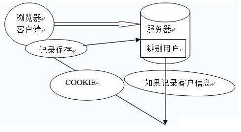

# 随便聊聊

## 不要熬夜

今天看了bilibili的视频，感触很深。

## 联觉


## 明白一个道理

这事评论起来很简单，那就是不要相信大V。你比如像我这样的，看着平时说话还有点道理，分析行业好像还人模狗样的。其实做到这样很简单，只要博文广记，道听途说，有一定的总结能力和个人语言风格，你压根看不出来我都揉吧的哪里的观点。我说话有道理，是因为我能把有价值的信息总结到一块，我有耐心去收集信息，但我其实是没有产生价值的能力的。所以你们这些小孩子，相信点啥不好，相信一个自媒体大v很牛逼。不然和我一样，做一个娱乐博主，娱乐大众，没事老把自己包装得好像很懂一样干嘛。我打个很简单的比喻，自我膨胀的大V就像看了后宫小说之后，觉得自己可以纵横职场，玩弄权势，戏耍精英男的初中梦幻小女生一样。小女生这样是可爱，一大男人这样是丢人。


## mac安装ffmpeg

```bash
brew install ffmpeg
FFmpeg -i video.m4s -i audio.m4s -codec copy senorita.mp4
```

## 身体保护和大脑保护

## 戴建业讲唐朝

## 如无必要，勿增实体


## 构建python环境

```bash
jupyter lab
```

## 编程网址

https://www.cyber-dojo.org/

## 不要把别人的经验不当回事

之前一直特立独行，认为自己有别人更高明的方法，体现在，解题方法之类的。其实，每一个经验就是别人的总结，能写到教科书上的都是多少年的经验，尽量去模仿和掌握教科书上的解法，而不是自己独创一些解法，这样不但漏解，而且可能耽误时间。

正确的学习方法，应该找一种权威的解法，掌握透彻，然后化为己用。

## 如何显得自己高明

有一种显得自己特别高明的方法：无论什么时候，先否定别人，也就是说，无论别人讲什么东西，都尽快找出别人的错误点，这样就可以显得自己非常高明。

这是我一个有名的数学家那里学到的。事情是这样的，有个有名的数学家，他基础扎实，思考深入。很多求学者慕名求教，每次有新的东西，都会尽力解释，但这个数学家在听取别人研究几年的成果时，却往往能在讲授的过程中，指出对方的问题。很多人奇怪，难道你有神仙本领，别人研究好几年的成果，还比不过你顷刻的思考？

后来他解释道，我只是在听取他的理论时，尝试简化，并用简单的或极端的例子去验证，往往有意想不到的结论，因为很多理论必须保证其严密性，那么在适当的条件下，满足这些是可以的。否则就是谬论。

这个数学家凭借这一方法，获取了很多人的称赞，当然，这和他自己本身成就是分不开的。

## 囫囵吞枣

一个人对朋友抱怨道，最近看了一本书，梨子咀嚼对牙齿健康，吃的多则会伤害脾胃；枣子对脾胃有益，吃多了却会损害牙齿。

朋友笑道，何不吃梨子时，细细地嚼，但不咽下去，吃枣子时，不要嚼，直接吞下去，这样不就完美了吗？

这个人骂道，这样整个枣子吞下去，不经过口腔地咀嚼，连枣核也一块吃了下去，不是更加伤害脾胃嘛！

## 如何面对不想工作和学习的时候

有时一个人总会处于什么事情都不想做的状态，即使有很多事情要做。

我个人思考的结果就是，回忆以前的知识，温故而知新。

## 关于人类认识盲区

人是有认识短板的，就像人的两条腿，蒙上眼在荒漠中走，会在一个圈内不断画圆，知识也一样。

## 关于积累和知识爆炸

学习是一个持续过程，需要不断的回忆和储存，我们需要不断将知识结构化，集腋成裘，聚沙成塔。

很多时候，用的知识只是你学习的很少一部分，而且由于环境的固化，可能长期处于某一类单词高频出现。所以，我们只需穷举出你学习的所有知识，然后记录下来即可。

## 对于游戏的思考

一个对于游戏有深刻了解过的人，应该明白，无论做任何事情，在绝对实力面前，你或许能云淡风轻，但我们并不是总能压制别人。在日常对决过程中，尤其是竞争中，我们应该全力以赴，精于算计，把握每一分每一秒。

此外，必要的训练，必须足够的训练，投入巨大的热情，才能完成好一件事，就像完成一件艺术品一样。

希望能在有一天，多学一些军事，和谋略相关的知识。

当然，最重要的是韧性和坚定的意志力。

## 语言特性

### 不要纠结于工具，语言特性远远比这个重要

这个其实很好理解，要想尽快学习一门编程语言，最好的方法是不断的练习，实现某个项目，掌握其语言特性，而非花费大量时间在ide的学习上，除非这种ide是唯一的，或是不可替代的。

### 做比较，找异性和共性

对于编程语言来讲，我们学习的过程是不断深化认识语言特性的过程，虽然不应该把大量时间放到语言特性的学习上。
实际上，语言特性的重要性远远小于数据结构和算法。但是我不应该忽略的是，语言特性本身是和数据结构以及算法结合产生的，后者的抽象层次较高，一味的学习高层次的知识不符合我们的认知规律。
对于学习多种语言时，最好的途径应该是做比较。共性大多是高层次的，例如对某个数据结构的实现是大致相同的，异性是低层次的，例如对具体的语法和语义，不同语言采用不同的符号实现。这就表明，同样的逻辑，实现不同，在共性中深化数据结构的认识

## 语法教材

English grammar in use

初级，中级，高级几个版本。

## python打包程序

推荐PyInstaller项目[www.pyinstaller.org](https://link.zhihu.com/?target=http%3A//www.pyinstaller.org/)

 

> 安装方法：
> 先跑pip install pywin32再跑pip install pyinstaller即可


可用一句命令打包：pyinstaller -F -w -i manage.ico app.py

 

> -F：打包为单文件
> -w：Windows程序，不显示命令行窗口
> -i：是程序图标
>
> app.py是你要打包的py文件

## 理科生的悲哀

什么叫市场。有人得到，有人失去，就叫市场。

什么叫企业家。这局输了，赶紧想办法下一局，叫企业家。

把修改规则的任务，交给政客。把筹划明天，把握于自己

你们要习惯一个事情，那就是时代变了。这已经不是一个都不能少的时代了。引入了竞争机制，之后就需要你们发挥主体性，具有张维迎教授说的企业家精神。别跟客观环境讨价还价，因为在你花时间试图修改规则的时候，已经有人起跑100米了。

无声的世界，多么可怕。

我很同情理工科同学，真的。

你只是一个拆包装的。

每一个实验，每一个题目，都是奔向不是自然界的必然真理，而不是奔向内心的自由。

基本是一直在做机械劳动，一直要压制自己摆脱必然性的冲动。

你的冲动和诗性，不能带来什么，你若能发现的，必然是潜藏在外界的必然。

我旁边有理科生的博士，经常要工作一整天。

当我看到一个理工博士，工作十几小时，晚上再洗手间洗漱，累的那个样子，但又帮不了他什么。

我会感觉技术理性的统治是如此严重，会有一些激进。激进，进而无奈。诗意，加重枷锁的重量。

如果我们只能去发现外部世界的规律，那么我们的主体性到底何在。

有的理论家将规律的基础，归结为人的心理活动的必然性，但这样同样抹杀了自由意志。

你看，你理科生，你要多体会社会。

我虽然是文科生，但工具理性同样也统治在我身上。

星座，等等，在我看，是偶然性的东西。为了打破必然性，一定程度上需要这些偶然性。

我解散了你们的群，还跟你们瞎侃了那么多星座，现在要牺牲读50页书的时间，做点回应，就是我的代价。

所以，你触碰了一个很重要的问题，那就是空间归谁所有。

时间啊同学们，时间是人类社会最后的稀缺资源。

我觉得一个很好的课题，已经摆在面前：《论原子理论发现历程中德谟克利特猜想的推动作用》。

所以，有一种可能：人在出生的时候，环境的作用，会赋予人一种“初始属性”。这种初始设置，会让人有一定的行为倾向性。人出生时的环境作用，和一个人的性特征，有没有联系，这你还别说，说不定真有一定研究价值。

刚刚纪念完的福柯，他最后一本书是《性经验史》，这让人很受启发。性会不会连着人和环境的密码？哲学家的探知边界，需要你们理科生的探索支撑哇。

福柯的理论有很大局限性。只有解释，没有连续性的揭示。

标准，规则，这些东西，其实一体两面。

我也不是一个旧式家长。我长于市场经济的丛林，存活于美帝的自由竞争。不能跟我提旧式圣贤的要求标准。

人是一种很奇妙的动物。按照那些自由民主法治国家的状况，你们至少有一半学生会负担不起顶级高校的学费。而我，按照自由民主法治国家的状况，会拿现在大约7-8倍的助教费。所以我最不喜欢老有人跟我讲这讲那的！

之所以会出现现在这种状况，无非是大家庭式政策理念。

我拿着全A成绩单，戴上耳机，放一曲God Father walts，感慨万千。


## requests的参数

在通过requests.post()进行POST请求时，传入报文的参数有两个，一个是data，一个是json。

data与json既可以是str类型，也可以是dict类型。

区别：

1、不管json是str还是dict，如果不指定headers中的content-type，默认为application/json

2、data为dict时，如果不指定content-type，默认为application/x-www-form-urlencoded，相当于普通form表单提交的形式

3、data为str时，如果不指定content-type，默认为application/json

4、用data参数提交数据时，request.body的内容则为a=1&b=2的这种形式，用json参数提交数据时，request.body的内容则为'{"a": 1, "b": 2}'的这种形式


## 输出多就好吗？

说些和提问不具有因果性但存在相关性的个人经验，不喜无视即可，实在不行就折叠吧。。。

根据我对身边同学朋友的长期观察，发现这样一个现象：

不爱啃系统化的专业书籍，却喜欢刷碎片化的豆腐干文章的人，往往看上去语出惊人，妙语连珠，也很健谈，对于自己的价值观等等有一种异常强烈几乎可以说是喷薄欲出的输出欲望。但其实，这类人的输出存在一个致命的缺陷：观点如同散沙，不成体系，互相孤立，有时甚至对立，逻辑无法自洽。这是由于自身没有建立起根基稳定坚固的认知系统，从而给人一种信息输入「人尽可夫」，信息输出「似是而非」「支离破碎」的感觉。

说不上好还是不好，但至少，我不希望自己这样。我在思考任何一个问题的时候，都希望思考本身能够建立在一定的安全感之上，而安全感来自于一个坚强 有力，自洽有理的认知系统，否则，思考回路频频出现bug，人会疯掉的。


## 如何理解和避免信息不对称

信息不对称的原因有两个方面：

1.信息渠道。

2.信息处理能力。

“21 世纪最重要的是什么？人才！”这是葛大爷在《天下无贼》里说的一句十分经典的台词。今年是 2014 年，《天下无贼》2004 年上映到现在，正好十年。

这十年里，从国际风云波谲云诡，到日常生活丰富多彩，变化鲜明。而在知识教育普世化，人才因迅速膨胀而贬值等诸多因素下，抱着那种“吃得苦中苦，方为人上人”的心态，依旧以一个“过去”的人才定义为标准，去试图改变命运的人，很不幸，我看到了好多失败者。

十年前这句话还被奉为圭臬，可如今，早已黯然失色。

同样，对于信息不对称的理解，还仅仅停留在老案例，旧教科书上的话，那么，你在知识层面下的信息不对称中，已然成为逆势者。

为什么那个村里中学还没毕业就出去闯荡的狗蛋，十几年后衣锦还乡，开着李华看一辈子报纸喝一辈子茶水，拿一辈子灰色收入（甚至能锒铛入狱）都买不起的某订制级豪车，乡亲们一瞬间忘记了那个从小到大奖状贴了一墙的尖子生李华，之前对李华考上公务员的种种夸耀，恨不能全部收回来，贴在狗蛋身上，而李华只能望着绝尘而去的狗蛋，怀疑这一生？

对不起，让我告诉你。

村民们不晓得李华口中，吏部尚书所对应的那个人可以释放的能量。所发出的惊叹或艳羡，只是基于李华对其”释放的能量“所做出的具化描述，李华知道在村民眼里，可以吃海参鲍鱼的，便是富人，李华就可以说，吏部尚书天天吃海参鲍鱼，哦，原来这么厉害。那大家就都懂了。

而这些，都只是李华在村民对于外面世界，或者说信息接受的极限上，做出的解释。村民甚至分不清楚公务员的概念，想当然地以为，当官=公务员=有钱。而在这种理解程度上，不管李华当的是村支书，还是一个比较新潮的公务员，比如可以是市妇联主任的助手，或者是海关安检看 X 光扫描的小兵，在村民对于这种没有对公务员的判定范围有一个清楚的了解下，那他们听了后，会摆出”O“的嘴型与我懂得的表情，然后笑嘻嘻地说：”当官好啊。“

在狗蛋没回来之前，李华拥有对公务员信息解释的垄断权。

显而易见，李华信息量要大于村民。

这就是一种信息不对称。

在这个信息为王的时代，信息可以是对于哪里有优质人脉的把握，也可以是资源的优先调配权。

人才只是作为一个环节，被划归信息的宏观范围里。

但因对信息的未知，在上述例子中，便是体现的信息的局限性，自身会主动或被动地导入误区，很多时候，这种被导入误区的过程中，我们防备心很低，甚至引不起一丝怀疑。

对于信息不对称，我们会产生很多误解，有时候的误解，甚至是误解中的误解。

所以对于题目，我的看法是，从书本中将“信息不对称”这个名词抽离出来，结合实际。

我所认为的信息不对称，本质上是一种“不均等”。

不均等是一种双方的状态。在不均等状态中，掌握信息量大的，占据主导信息资源优势的，为顺势方，而信息量小，在信息上处于被动的，为逆势方。

顺势方可以凭借截断信息流，控制话语权，引导逆势方价值观等方式，对逆势方施加自身影响。

大家对于吏部尚书这种高高在上，玄而又玄的职位，很少有人能够说，我见过，我告诉你们吏部尚书的日常是怎样怎样，所以大家绝大多数都保持在一个”信息接收不充分，甚至是未知“的状态，但是，即便李华说得眉飞色舞，但没狗蛋脖子上拇指粗的金链子，亮晶晶的大手表，一个半人高，引擎声震天的大汽车迎面而来的冲击力来得更实在些。所以任你李华说得再天花乱坠，有用吗？狗蛋不需要说一句话，他用他世俗社会所取得的认可，以默默无言的方式，告诉李华，在财富的定义上，我赢了。

我对这种以纯物质成果造成的碾压持保留态度，因为我要着重讲的是，在这一再臭大街不过的乡村传说里，你或许已经与我看出了它的真正本质：

狗蛋从最直观的角度，满足了村民心底原始级欲望（此处为金钱），以一个胜利者（信息不对称破坏者）的姿态，打破了李华对于成功定义的垄断。在狗蛋没回来之前，大家都认为，从这小山沟沟里走出去，并能混出个样样，取得成功唯一的途径便是像李华那样用功读书，将来成为一个官（公务员）。

而走出这个山沟，现代社会呢？现代社会下的，人文、科技、宗教等诸多领域，对于成功的理解一样吗？肯定不同。但最起码有一点，这些成功的定义，绝对不会是如此狭隘。

对于成功的定义，体现了村民，狗蛋，李华之间，信息渠道的差异性。

而这，正是一种信息不对称。

李华认为自己是成功，还是失败，这都不重要，重要的是，他在极力维持这种信息不对称，无论是出于什么目的。但是，不幸的是，狗蛋的出现，打破了这种信息不对称，村民们发现，哦原来狗蛋竟然比吏部尚书过的都滋，吏部尚书一天可以吃一个鲍鱼，狗蛋却能吃十个。这小子真行啊。

回到“吃得苦中苦，方为人上人”的这句话上。

这种心态，不能说错，错的，是对这句话的理解。“苦中苦”二字是此句中的“因”，以“苦”叠加为二字，强调吃苦的必要，从而推导出，成为“人上人”的果。

给人造成一种吃苦越多越能接近成功的错觉 。

可是，要成为“人上人”，就一定要吃苦吃得停不下来？

为什么一些人不需要吃苦，却已然成为“人上人”，有的甚至一生下来，就呼吸着我们呼吸不到的、那种顶峰独有的、稀薄的空气？

出身，教育程度，三观评定标准，以及一系列的被叫做“眼界”“格局”之类的东西，构成了我们自身的理解力。我更认为，用思辨能力来形容它，更为妥当些。

有人对“吃得苦中苦，方为人上人”的理解，认为吃苦越多便能博得成功资本，有人更愿意借吃苦的方式，将人踩于脚下，成为名副其实的“人上人”，有人对这句话不赞成，觉得它是狗屁，而有人则保持一种辩证的态度。

在这些迥异的看法中，正是“思辨能力”在施加影响。

它，才是信息不对称这个怪物身后的庞然大物。

思辨能力，决定了信息处理的威力。

举个很简单的例子，史玉柱可以从保健品跨行到网游，这便是信息渠道所不能代替的，信息处理能力的作用，有了自己对于信息不对称下，所做出的行之有效的应对方法，才能逆转在信息不对称下，自己信息渠道上的劣势。

“人生而平等。”

法律，道义上，这句话我很赞成，但在“信息不对称”这个命题里，却不适用。

若是平等，哪会来信息的不对称？若是平等，为什么有些人生于尘土之中，有些人居于祥云之上？

若是平等，为什么有人随随便便的努力便能换来巨大的成功，有人穷其一生为理想努力，却一事无成？

这句话定义了我们作为人的尊严，但却不能定义我们的全部。

正如信息不对称理论所带给我们直观的感受一样，我们思维也许对其理解会局限在信息经济学上的教授课堂案例，而往往忽视了这个理论在现实生活中发挥的巨大作用。

而我对其理解，是基于现实生活，这对我们“如何有效解决问题”的思维，会是一种极大的锻炼。

如果你在信息不对称中，总是被欺负，我虽然给不了你金钱，地位上的帮助，但是我给你提供的这种思辨能力，这种思维能被锻炼，甚至能被充分调动起来，为自己适用，那么，你迟早会得到自己想要的。

在我高中时，应试教育打着素质教育的幌子，以分数衡量一切。我还记得我们高中课堂上，每次老师只念那几个学习排名前几的作文，而且灌输着，他们的写作格式，甚至从开头，内容，到结尾的考试公式，就是作文规则，甚至要求我们传看并背诵他们的作文。每次作文课，老师读起那几个熟悉的名字，同学们理所当然地发出赞美，被读作文者理所当然地享用着这些赞美，老师理所当然地引导着这些赞美。

等等，有些不对。

为什么，每次都是他们几个?

为什么，学习排名前几的，作文就一定好？

为什么，当普通同学借鉴他们的成功方式，写出的优秀作文，拿不了高分，而他们，依旧拿高分呢？

是什么衡量标准，在其中发挥作用？

遗憾的是，那时候我的思辨能力还未达到今天这个能力，甚至以我现在的能力，在我们这行的大佬面前，还只是入门级。

能力低，我不怕。因为我已经具备了思辨能力中很重要的一种方法——对事物基本的判断及怀疑能力。

可我那时做了一件极其愚蠢的事情——我将三个”为什么“，写进了作文，却忘记了最后一步。这个看似细微的错误，导致了我吃尽了苦果。

我被语文老师大批一通，我至今还记得她说的一些话，”自己几斤几两，都掂量不清楚，作文能写够 800 字吗？“

我被打击到了，彻底地，打击到了。

我还以为，我可以去思考怀疑一个我认为具有漏洞的运作机制，但我发现，我连说话的权利都没有。

在这种限制下，我高中一度犯了一种名为”恐笔症“的病，一看到小方格，一看到 800 字，一看到以 XXX 为话题这类的关键字，就发抖，大脑空白。

我不知道外面的世界是什么样子的，我也没必要知道。因为规则，已经牢牢禁锢着我，我只有屈服。

很不幸，我看到了更大的世界。

那些大师们精彩纷呈的个人表演，那些文学大家，一度不入当年语文老师法眼的大家们，写出了值得点 32 个赞的文字，字字珠玑，看得我热泪盈眶。

在知乎上，更大的世界，由点及线及面，把我眼中的世界，钩织得更加完整。

而我现在，一直在想，如果我带着如今的所学，甚至只是把自己专业的起步级技巧带上，回到高中时代，是不是可以展现一种更加独到新颖的思维，去将写作方式的那些极佳的信息，公之于众，哪怕只是我们高中，哪怕得不到老师的认可，哪怕只能感动同学。

可是现在想想，如果可以回到过去，仅凭我一己之力，很难。

没有一种被认可，可以具有说服性的身份，更直白地说，是没有话语权。即便去逆转大世界，小社会，微型范围内的那处小小的”信息不对称“所造成的既定事实，都会受到重重阻力。

个人力量看似微不足道，但是，却是打破信息不对称的重要组成。近些年来，舆论的力量也越来越大，我们也可以发声，这是一种进步。

在人类社会中，生活水平低的追求较高的生活水平，生活水平较高的，追求更高的生活水平。而现实是，在经过所谓的个人奋斗后，有人依旧是民工，有人依旧只会扫大街，有人依旧是老妈子。你能说他们不努力吗？他们也努力了，并且十分敬业。我真见过大中午 41 度高温下依旧有清洁工把街边垃圾一一拾起，也见过朋友支教回来给我们看的那些让人潸然泪下的小朋友们，一双双如饥似渴的大眼睛，只有最朴实的愿望，那就是念书。

朋友说，他们去支教，不是长达几年以上的长期，根本屁用没有。带给小朋友的那些先进的社会主流的价值观，要么是他们听不懂，要么是小朋友们固执地认为，只要念书，念好了书，出了大山，什么也就有了。每次朋友感动之余，都会流露出深深的无奈。你真的，在这些大社会背景下的信息不对称面前，感到有心无力。

但是有的小朋友真能听懂，但是，绝大部分贫穷的家境，多病的父母，已经将他们拴在了大山里。

我们市里中心的天桥下，有一个乞丐。他平时主要工作是坐在天桥的台阶上乞讨，人流多的时候，他会跟着人群上上下下走上几十回。我观察了他几个月，经过我的推导计算，他每天上上下下做的功，换算成搬砖量，足足有将近一百块砖。以我们市的薪资标准，这些搬砖量可以够他每天三顿吃馒头加二素一荤，完全没必要这么没尊严地活着。

后来我实在忍不住，问他，”您今年多大了？“”39 啦。”“那为什么不找点工作啊。”“因为……我是乞丐啊。”他最后一句到回答的有些不好意思。可是，乞丐就不能找活干了吗？

我又问他，“中石油您知道吗？”“知道啊。”“那让您去中石油您去吗？”“啊，去啊。”“那不给您安排关系进去，您自己去，去吗？”“他妈的当然不去啊。”

我承认，我当时问他的语气有点调侃的意思。但是，我也终于弄懂了“信息不对称”下的一个关键问题：

既然发觉到信息不对称，并有可以逆转这种不对称，甚至有可以打破不对称规则的机会，为什么人们就是不做？

答案很简单：自我否定与，对短期收益的认可，大过了长期收益的认可。

因为功利心在作祟，使我们丧失了对于一件事物基本的思辨能力，以至于，哪怕这件事只要坚持下来，并长期去做，就会获得巨大收益，但仅仅因为其需求一定量的时间付出，便放弃了这件事。而我们往往会看重那些短期收益很大的事情，哪怕将来会损失更大，丧失了思辨能力，便丧失了对于”信息不对称“是否打破的选择权。

而自我否定又是使我们对信息不对称放任不管熟视无睹的另一原因。明明看到北大保安仅凭自己努力，中学文凭都可以自学英语，做翻译官，但我们却会对自己这种正能量效仿的想法给予重重一击，“哎呀，我怎么能做到像他那样呢？”“人家多努力，我多懒啊，就懒下去好了。”别等着七大姑八大姨，街里街坊给你打击，自己就把自己废了。

在看下面的方法论之前，请你不妨思考一个问题，什么时候，机场成功学被指责成鸡汤文的？而又是什么时候，你对成功学里面主角的光环感到习以为常，并觉得那些只是神话，并离自己很远？

老实说，我之所以想到“信息不对称”这个理论，不是书本上的二手车案例。而是发生在身边的一件很现实的事。在我们家乡，我妈他们这一代人，稳中求胜，认为投资也要是硬通货，不动产，稍微有一点风险的投资，哪怕在我的解释下，后续收益再大，她都不敢做。几次事实都是证明了我是正确的。

可是她依旧不听。到不是我妈她这个人固执己见，而是在她稍微想要展开手脚的时候，从身边的同事到老板，到家人，除了我之外的，绝大多数人都会不同意她这么做。我妈也承认，舆论的力量，有时候演变到最后，会彻底接管对于”信息不对称“事件的处置。

这种信息不对称，就应该被毁灭。

这是我最后一个思路，也是我几经思索，对于解决“信息不对称”的方法论：

用制裁“信息不对称”的破冰思维（这里的破冰思维可以是一个行业中引入的新技术，新指导思想，也可以是一个改进产品的 idea），去引导那些还未破碎的思维（保守性思维方式），先是打出针对这块冰层布下的思维点，然后再由点及面，实现对信息不对称中错误舆论导向的终结。

对自己要做什么，有一个清晰明了的方向感，知道自己获得与付出的比率，并做到付出成本的下降。用经营自身资本的方式（思辨能力尤为重要，尤其是自己对于自身行业的理解，是否能吃透，在此基础上，以实践来收割自己思维领悟出的理论，增值自身资本），让自己的话语权，更加强大。

我认为，旧的、落后的、以不为人知的目的故意安插的思维，势必要被新的、先进的、引人向上，以个人发展为基点带动整个社会发展这个终点式思维，彻底代替。

写这篇答案的目的，一是为了提供一个自己的思路——对于“信息不对称”的另一方面的理解。就比如大家对于“信息不对称”的了解，差不多是基于《信息经济学论》的名词解释。而思路本身，我认为给大家提供了一个可供讨论的话题，我就很高兴了。我也在这里希望有什么其他看法的同学，能与我进行我所追求的，那种思想的碰撞。

还有就是为了向知乎那些各个专业，无论是美食，科技，政治，历史，IT，职场，还是文学领域的大牛们致敬，因为正是你们无私的奉献自己的知识，见解，帮助了许多因“信息不对称”导致的自身格局眼界局限，或因某一行业信息掌握不到位，而未能大步向前的人。我由衷希望，我们也可以出一份力。

我们都可以，是的，我们。

## 影视目录

大时代

创世纪            

九五至尊           

《大明王朝1499》     

《大明王朝1566》     


## 互联网职位招聘

### 一：技术类职位：

大多数网络企业都喜欢有经验技术好的工程师。是互联网公司的核心主力军，互联网公司的研发人员很多，技术专业度较高，各个阶段薪资是比较高的工种。

技术类职位参考

职业分类：以程序员为主，前端开发、后台开发、移动开发、硬件开发、测试、运维、DBA等每一类里面也分很多工种，需要的还是有创造力的技术人员。

工作内容：写代码、调bug、做测试等

晋升路线：技术路线（初级→高级→架构师→专家）管理路线（程序员→主管→项目经理→技术总监）

未来发展：有自己的团队，成立一家自己的互联网公司

适合人群：计算机相关专业，其他专业也行，只要你热爱这个行业，把工作当成是一种乐趣就能做好。

### 二：设计类职位：

大多数网络企业都需要好的设计师。有水平的设计师和设计总监薪酬是很高的。设计类职位在国内互联网公司越来越重视，要设计出打动人心的优质文案非常重要，设计师们要充分的发挥才智，才能设计出高水准的作品。
设计类职位参考

职业分类：主要是UI设计、交互设计、视觉设计、用户研究几大类，当然还有细分类。

工作内容：分析客户需求、通过设计提高用户体验，把优质的产品理念和卖点设计出来。

晋升路线：美工-设计师-设计主管-设计总监

未来发展：成立一家自己的设计公司。随着智能硬件和VR技术的发展，未来可能有更多的人机交互方式，这里有很多的发挥空间。

适合人群：美术和设计类专业更有优势，做设计的，要追求美和极致，只要真心热爱专注就能做好。

### 三：运营类职位。

是一个统管全局的职位，运营能力强的人才非常稀缺，未来产品同质化越来越严重，大部分公司都得拼运营。发展潜力很大，要看个人能力。
运营类职位参考

职业分类：内容运营、产品运营、数据运营、用户运营、活动运营、商家运营、品类运营、游戏运营、网店运营、新媒体运营等

工作内容：不同的细分岗位不同的公司有不同的侧重。运营的工作都是围绕拉新、促活和留存这三点。

要会策划文案、善于沟通和熟练各种工作软件。

晋升路线：运营专员→运营经理→运营总监

未来发展：运营很有前景，因为以后很少有纯粹的互联网公司，都会和传统业务结合，所有会狠拼运营能力，未来和产品一样，同时懂某个行业和互联网的复合型人才更受欢迎。

适合人群：综合素质强，懂经营思维，好好锻炼自己各方面的能力。

### 四：市场销售类职位 和运营一样，增长潜力很大。

销售类职位参考

职业分类：策划、推广、销售、SEO、SEM等类别。

工作内容：市场分析，产品定位，文案策划、商务拓展、销售等。

晋升路线：网络销售→市场经理→市场总监

未来发展：市场类职位需要同时懂互联网和垂直行业的复合型人才。做销售和业务的大部分人都自己创业做老板。

适合人群：市场营销专业、电子商务类专业，喜欢与人打交道，点子多有创意和思维的人。

我本人就是从事这类职业很多年，帮助过不少企业应用互联网创造了销售奇迹。很多成功的企业，客户都来自网络。互联网的变化很快，不同的时期都会出现新的职位。找到一个自己喜欢的职位是理想的选择。做自己喜欢的事才开心，才能做好。


### 数据分析招聘

1、岗位职责

1.1 数据收集、数据清洗及预处理

线上：网络数据信息收集(通过网络爬虫对本品及主要竞品的价格、新闻、舆论口碑信息进行收集），线下：监控线下调研进度，监控调研数据，及时对调研情况向上级反馈，对存在问题的调研人进行沟通指导；将收集的数据进行处理，保证数据格式的一致，处理无效值和缺失值。

1.2 协助数据中心搭建、数据支撑及其运用。

将公司各系统数据以及外部数据进行统一，通过大数据平台将多方数据进行分析，达到区域市场监控，角色评价，竞品监控，市场预警，数据可视化等功能；负责公司数据中心及BI平台的规划与搭建，以及引进并管理互联网分析工具；为公司业务研究、活动策划、媒体投放提供数据支撑并为其提供执行过程中的数据收集方案，活动执行后期的数据跟踪方案，评估业务、活动、媒体的执行效果。

1.3 公司系统对接、协助系统开发

公司基础市场数据收集系统开发对接（经销商/终端调研系统、竞品监控系统、消费者分类系统）；公司业务拓展系统开发对接。与公司其他部门沟通，梳理数据分析需求，并及时与开发人员或者第三方公司进行沟通实施。

1.4 用户行为分析、数据挖掘、数据闭环反馈

研究产品的特性和用户行为特征，建立数据的监控体系，建立分析用户质量的方法和工具；针对用户行为深入分析，定期或不定期输出专题分析报告推进和协调日常数据分析与挖掘项目，并根据业务变化进行完善和改进；能够使用网站分析工具对广宣活动的线上传播路径和状态进行监控；研究各种线下促销活动的效果监控方式，保证活动效果。

1.5 数据建模、ETL并定期提供分析报告

负责对环境等各类数据进行统计、分析、建模和评估；负责相关数据库的数据查询、导出及预处理；负责市场、产品数据分析和技术相关文档、报告的编写、整理等；负责业务数据分析，定期提供数据分析报告。

1.6 参与大数据产品建设 

参与大数据产品内部技术交流、方案设计、概念验证等工作；基于生态大数据产品体系，提供数据分析产品和解决方案建议。

2、任职要求

2.1 学历及工作经验要求 

计算机、统计学、数学，信息科学等相关专业，大学统招全日制本科及以上学历；具有1年以上数据统计分析或数据算法等相关工作经验；具有1年以上数据库建设、数据挖掘经验，熟悉至少一种数据平台开发工具，参与过数据中心搭建工作；

2.2 知识结构

2.2.1 数据分析

熟悉互联网，能至少熟练使用一种网站分析工具，如百度统计、Google Analytics；擅长数据分析，熟悉数据建模知识、数据挖掘理论、数据分析体系方法、统计方法、运筹学等；熟悉网络数据采集流程；具备较强的数据处理和分析能力，对数据敏感，熟悉各类数据统计分析方法；掌握python语言常用数据分析库numpy、pandas及matplotlib的使用；至少了解一种数据可视化手段。

2.2.2 数据挖掘

熟悉SAS、SPSS等统计分析工具，熟悉 SQL语言；熟悉统计分析、数据挖掘、统计分析工具，掌握掌握R、Python等至少一种主流数据分析编程语言，熟练使用至少一种数据库产品；了解常用数据挖掘方法和模型，能独立搭建数据分析体系；掌握ETL工具的使用；了解常见的机器学习算法。

2.2.3 大数据相关

了解Hadoop、spark相关技术；熟练掌握mysql、DB2、hive等语句编写；至少熟悉一种市场上的商用BI，如powerbi，永洪bi，tableau、帆软等；了解Java语言（不做深入）。

2.3 沟通能力、逻辑分析能力、文字表达能力及团队协作

具备良好协调、沟通及独立分析处理能力, 有较强的逻辑分析、综合判断能力；具有良好的沟通能力，思维清晰，逻辑严谨；具备文档报告撰写能力，思路清晰，条理清楚，熟练使用PPT、EXCEL、WORD等；具有较强团队合作精神和学习创新意识；熟练使用Excel与PPT完成模型与报告。

2.4 其他能力要求

学习能力强，对业务需求有主动性和好奇心，执行力强；独立分析数据的能力；持续学习能力；可承受压力；能适应短期出差。

2.5 注意事项

本招聘不接受大学应届本科毕业生（2018年夏季大学毕业本科生），硕士、博士研究生除外。

3、薪资待遇

面议

## 关于写作

如果能把文章写得明白透彻，同时还能引人入胜，那写作水平就是好的。这话好像是废话，但这里有一个关键，不知道题主发现没有。就是，写作水平是排在第二位的，它依附于你要表达的东西——即你的主题，或者说你的写作目的之上。如果没有想说的话而勉强下笔，那就是无病呻吟了。 

题主自觉写的东西烂，其实就是文章言之无物。 

或许你的生活过于平淡，无甚可记；或许你对生活的观察不够敏锐，提炼不出什么值得付诸笔端的观点。写来写去只是为写而写，读之无味也不奇怪。 

我们假设一下，如果你的人生经历丰富多彩、你对周遭发生的事情有独特的见解、你看过的电影读过的书等种种见闻在胸中酝酿，迫使你非写出来不可。这样，只要你下笔没有病句，以明白晓畅的文字把你的经历你的见地述说清楚，就是好文章。至于辞藻那些，只是加分项，不是关键。

题主意识到文章的趣味和思想上的深度，其实除了写作水平之外，更重要的是你的内容得够有趣、够深度，这关乎你看待世界的方式。所以我觉得你的问题不在写作水平上，而在思维见地的提升上，这是个长期工程，泛泛说来无非是多阅读，多经历，多思考，没什么捷径。等你有内容要表达之后，再谋提升写作水平的事。

## 三大纪律，八项注意

三大纪律：

第一条：一切为了纯友情，互相帮助才能有永久。 
      男女之间交朋友，是一种友谊，一种友情。所以，如果交往中渗透进私心杂念，或者为了利用，友情是很难长久的。 
     第二条：不拿心计对朋友，朋友对你真心又实意。 
     有些人在与异性朋友交往中，有心计，有自己的小算盘，这种做法不可取。其实，女同事一般不构成对你事业的威胁，也不损害你前途，既然是交异性的朋友，我认为没有必要耍手碗，使心计，要讲真诚。 
     第三条：一切误会要消除，暧昧玩笑坚决不能要。 
     如果对方对你产生感情误会，或者因为交往而产生的其他误会，一定要设法消除或者解释。特别是容易引起让人联想的暧昧话，玩笑话尽量少开。 

八项注意如下：     
     第一条：做人做事要坦诚，尊重对方“非份”掉。 
     异性朋友起始于“缘”而终于“缘”。此话怎讲？相交，相识为缘，古人云：百年修得同船渡，千年修得共枕眠。能在茫茫人海中相见是机缘巧合，相识更是缘，那么相交、相处、相互交流自然应当称为缘。朋友是有缘之人，异性朋友是有缘无分，也不想有“分”的朋友。一旦异性谈缘分，便超出了朋友的范畴。故异性朋友因缘而聚，又因缘而散。 
     第二条：男女有别要记牢，把握得当人称道。 
     交友的男女双方，只要出于正当的纯洁的友情，就可以堂堂正正地来往。为什么要说堂堂正正，原因很简单，藏着掖着，会引起误会，产生猜疑。那么如何把握交往的 “度”呢？第一，交异性朋友，要注意分寸，注意场合，如果可能多邀几个朋友一起交往。第二，交往要“师出有名”，也就是要有合理的解释，合理的机会。男女毕竟有别，如果有事无事时常在一起，难免日久生情，情不自禁。第三，时间不宜过长，如果男女双方交往，时常深更半夜，这种交往即使正当，也难免引起家人的抱怨，久而久之怨言可能变成怨恨，这样就影响了双方家庭的和睦。 
     第三条：有理有节莫忘了，顺其自然最重要。 
     熟悉的人并不一定可以成为朋友，熟悉异性的人其实比熟悉同性的人更容易。男人在一起，评头论足，谈的是女人。女人在一起，同样也会谈到男人。异性之间更容易注目，虽然异性的相识总是带着羞涩，带着腼腆，即使与你擦肩而过，你也会念念不忘。然而，异性之间的相互交往，却笼罩着一份戒备，一份神秘，一份好奇，一份怀疑。异性之间的交往，如果是刻意向对方提出来，是很尴尬的。它首先从仰慕、好奇、心仪开始，所以谁都不愿意首先提出，甚至两人不知不觉中已经到了无话不说的地步时，才发现他(她)是我的异性朋友。其次，任何一方的提出，都有可能被怀疑动机不纯。所以，我们不要刻意去寻找异性朋友。 
     第四条：异性朋友只可遇，不可强求逞霸道。 
     异性是在相互关心、帮助下逐步形成的，而非一朝一夕，一见钟情。由于男女双方都是已婚人士(或者其中一方是已婚人士)，故没有年轻人那种一见钟情的浪漫。一般情况讲，男女之间是通过了一定的观察、比较，认为对方某些方面的特长，性格可以互补，需要进行沟通；或者工作、学习中需要交流；或者生活中需要帮助，然后逐步增加了解，继而形成了一种友情。 
     第五条：友谊爱情有界限，朋友才能做到老。 
     首先作为本方交友的目的要纯洁，同时也得提醒和帮助对方认清双方是纯友谊的交往。否则，即使你分清了分清友谊与爱情的界限，但对方却误认为你们是在谈情说爱，那么用一句时髦的话说：“问题搞大了，后果很严重!”因此，双方要相互尊重、相互理解，只有这样，异性朋友的友谊才维持和发展。 
     第六条：取长补短是根本，不可让人吃错药。 
     异性朋友之间要有互补性，我指的互补性是指心理、性格、社交、工作等方面，也就是取长补短，只种具有互补性的异性朋友，比互相仰慕的异性朋友的友谊更加牢靠，也更加长久。相互仰慕的异性朋友容易发生转变，而相互互补的异性朋友，双方都有支持依靠的源动力。但这种互补是优点的互补，切不可将恶习传染他人。 
     第七条：寻找博爱心胸宽，无私关怀莫忘掉。 
     人人有爱，有博爱，有友爱，有情爱，也有性爱。男女之间四种类型的爱都可能存在。爱的无私奉献是人的美德，这就是博爱。特别是现在只有独生子女的家庭，作为女孩，需要一个大哥哥或者小弟弟，作为男孩他渴望有个大姐姐或者小妹妹。他(她)需要姐或者哥的呵护、关心、照顾，也需要像妹妹(或者弟弟)在兄(姐)那里调皮、淘气。异性朋友的相识相交，如果以姐弟、兄妹相处，不仅可以相互关心、帮助，体贴别人，学会以博爱之心爱人，找到爱的寄托，还可以提高自己心灵境界。我是个男人，但我知道没有当母亲的女人，也有母爱。故我想，如果你是个男人，没有妹妹，你是不是很想有个妹妹疼她，关心她呢？如果你是个女人，你是不是很想有个小弟弟关心他，帮助他，理解他呢？ 
     第八条：设身处地讲理解，情义无价最最好。 
     如果你是已婚，而对方未婚的情况下，不论其是否恋人，交往都应当节制。应当设身处地为他(她)人着想，也应当鼓励其与其他异性朋友多交往，应当引导其成家立业。异性朋友婚姻出现危机时，本人同样认为，应当设身处地为他(她)人着想，应当规劝你的朋友，而不是煽风点火，制造矛盾。你也可以向其告诫：朋友之间没有法定的责任和义务，也没有家庭的重担，故朋友好交，夫妻难做。此时，你应当减少往来主，与其保持点距离为好。


## tree 命令乱码
tree -N


## 自私才是人类进步的阶梯

自私才是人类进步的来源，
无私等于溺爱他人。
所以在公共法律范围内自私才是最优解。

例1.公交车上站着的老人没有客气地要求的话那么不必让座。

例2.拾金不昧不值得提倡，拾金也有成本。假设送到警局（派出所）后留下二维码，当失主前来领取时必须联系拾者并在1分钟内谈妥，否则支付100（本地基础感谢费）+10（该市出租车起步价）后在警察的确认后领走。事实上警察也应该从中收取一定佣金（奖励）以提高其积极性。仅粗略分析，其中奖励不是一定得是钱，也可以是道谢，锦旗…谈不妥证明你太抠或者对方钻钱眼，而对方钻钱眼还拾金不“昧”，那么给点钱不过分，若是你太抠，那么活该。

例3.公务猿、教师的工资已很低，没有理由无私奉献社会缺于家庭，收取被帮助者礼物不应该成为黑点，只要不是主动索取，或者暗示，都不应该成为硬标准来一概否定。“礼物”来自私人资金，“贿赂”来自不正当资金。比如竞标（考试）前送为贿赂，竞标后（考中后）没有其他利益联系后，自掏腰包送为礼物。附，可以参考某国，礼物的价值低于N。

宗述，自私之意不等于损害他人，而是表达，帮助他人要在满足自己的基础要求之上才是合理的。


网络共享篇
小时候喜欢看百科全书，好贵的两套，因为花了钱，以至于很多内容过目不忘…现在在网络上知识都是免费的，完全没有当初的效率了，这就是被中国盗版给宠坏了的结果。创新也是被无私共享所遏制了。
影视篇
如果胱电能好好研究一下分级，影视进步带来的收益肯定能让他们赚的盆满钵满。当影视行业自由竞争，垃圾片子自然消失，小鲜肉靠脸年薪过亿的时代也一去不复返，不学无术的人才讲无私。
就算管理一个班级的学生，想让大家分差不要太大，你拿好学生下手干嘛，让大家都比烂？不应该让好学生继续努力，多监督坏学生吗。
编辑于 2018-02-17

## 费曼学习英文版

If you can't explain it simply, then you don't understand it well enough.
    The first principle is that you must not fool yourself- and you are easiest person to fool.

------

Feynman technique 费曼学习法:
1.take a plece of paper and write the concept's name at the top.
2.explain the concept using simple language.
3.identify problem areas, then go back to the sources to review.
4.pinpoint any complicated terms and challenges yourself to simplify            them.

------

1.帮助你快速回顾你要学习的概念，以及找出那些你非常明白的。
2.帮助你立即标出那些你不确定的，那些你需要格额外需要再学习的。╮(￣▽￣)╭


## 面试技巧

面试技巧——经典面试问题回答思路

面试过程中，面试官会向应聘者发问，而应聘者的回答将成为面试官考虑是否接受他的重要依据。对应聘者而言，了解这些问题背后的“猫腻”至关重要。本文对面试中经常出现的一些典型问题进行了整理，并给出相应的回答思路和参考答案。读者无需过分关注分析的细节，关键是要从这些分析中“悟”出面试的规律及回答问题的思维方式，达到“活学活用”。

问题一：“请你自我介绍一下”
思路： 1、这是面试的必考题目。 2、介绍内容要与个人简历相一致。 3、表述方式上尽量口语化。 4、要切中要害，不谈无关、无用的内容。 5、条理要清晰，层次要分明。 6、事先最好以文字的形式写好背熟。
问题二：“谈谈你的家庭情况”
思路: 1、 况对于了解应聘者的性格、观念、心态等有一定的作用，这是招聘单位问该问题的主要原因。 2、 简单地罗列家庭人口。 3、宜强调温馨和睦的家庭氛围。 4、 宜强调父母对自己教育的重视。 5、 宜强调各位家庭成员的良好状况。 6、 宜强调家庭成员对自己工作的支持。 7、 宜强调自己对家庭的责任感。
问题三：“你有什么业余爱好？”
思路： 1、业余爱好能在一定程度上反映应聘者的性格、观念、心态，这是招聘单位问该问题的主要原因。 2、 最好不要说自己没有业余爱好。 3、不要说自己有那些庸俗的、令人感觉不好的爱好。 4、 最好不要说自己仅限于读书、听音乐、上网，否则可能令面试官怀疑应聘者性格孤僻。 5、最好能有一些户外的业余爱好来“点缀”你的形象。
问题四：“你最崇拜谁？”
思路： 1、最崇拜的人能在一定程度上反映应聘者的性格、观念、心态，这是面试官问该问题的主要原因。 2、 不宜说自己谁都不崇拜。 3、 不宜说崇拜自己。 4、 不宜说崇拜一个虚幻的、或是不知名的人。 5、 不宜说崇拜一个明显具有负面形象的人。 6、所崇拜的人人最好与自己所应聘的工作能“搭”上关系。 7、 最好说出自己所崇拜的人的哪些品质、哪些思想感染着自己、鼓舞着自己。
问题五：“你的座右铭是什么？”
思路： 1、座右铭能在一定程度上反映应聘者的性格、观念、心态，这是面试官问这个问题的主要原因。 2、不宜说那些医引起不好联想的座右铭。 3、不宜说那些太抽象的座右铭。 4、不宜说太长的座右铭。 5、座右铭最好能反映出自己某种优秀品质。 6、 参考答案——“只为成功找方法，不为失败找借口”
问题六：“谈谈你的缺点”
思路： 1、不宜说自己没缺点。 2、 不宜把那些明显的优点说成缺点。 3、 不宜说出严重影响所应聘工作的缺点。 4、 不宜说出令人不放心、不舒服的缺点。 5、 可以说出一些对于所应聘工作“无关紧要”的缺点，甚至是一些表面上看是缺点，从工作的角度看却是优点的缺点。
问题七：“谈一谈你的一次失败经历”
思路： 1、 不宜说自己没有失败的经历。 2、 不宜把那些明显的成功说成是失败。 3、不宜说出严重影响所应聘工作的失败经历， 4、 所谈经历的结果应是失败的。 5、 宜说明失败之前自己曾信心白倍、尽心尽力。 6、说明仅仅是由于外在客观原因导致失败。 7、 失败后自己很快振作起来，以更加饱满的热情面对以后的工作。
问题八：“你为什么选择我们公司？”
思路： 1、 面试官试图从中了解你求职的动机、愿望以及对此项工作的态度。 2、 建议从行业、企业和岗位这三个角度来回答。 3、 参考答案——“我十分看好贵公司所在的行业，我认为贵公司十分重视人才，而且这项工作很适合我，相信自己一定能做好。”
问题九：“对这项工作，你有哪些可预见的困难？”
思路： 1、 不宜直接说出具体的困难，否则可能令对方怀疑应聘者不行。 2、可以尝试迂回战术，说出应聘者对困难所持有的态度——“工作中出现一些困难是正常的，也是难免的，但是只要有坚忍不拔的毅力、良好的合作精神以及事前周密而充分的准备，任何困难都是可以克服的。”
问题十：“如果我录用你，你将怎样开展工作”
思路： 1、 如果应聘者对于应聘的职位缺乏足够的了解，最好不要直接说出自己开展工作的具体办法， 2、可以尝试采用迂回战术来回答，如“首先听取领导的指示和要求，然后就有关情况进行了解和熟悉，接下来制定一份近期的工作计划并报领导批准，最后根据计划开展工作。”
问题十一：“与上级意见不一是，你将怎么办？”
思路： 1、一般可以这样回答“我会给上级以必要的解释和提醒，在这种情况下，我会服从上级的意见。” 2、如果面试你的是总经理，而你所应聘的职位另有一位经理，且这位经理当时不在场，可以这样回答：“对于非原则性问题，我会服从上级的意见，对于涉及公司利益的重大问题，我希望能向更高层领导反映。”
问题十二：“我们为什么要录用你？”
思路： 1、应聘者最好站在招聘单位的角度来回答。 2、 招聘单位一般会录用这样的应聘者：基本符合条件、对这份共组感兴趣、有足够的信心。 3、如“我符合贵公司的招聘条件，凭我目前掌握的技能、高度的责任感和良好的饿适应能力及学习能力 ，完全能胜任这份工作。我十分希望能为贵公司服务，如果贵公司给我这个机会，我一定能成为贵公司的栋梁！”
问题十三：“你能为我们做什么？”
思路： 1、 基本原则上“投其所好”。 2、 回答这个问题前应聘者最好能“先发制人”，了解招聘单位期待这个职位所能发挥的作用。 3、 应聘者可以根据自己的了解，结合自己在专业领域的优势来回答这个问题。
问题十四：“你是应届毕业生，缺乏经验，如何能胜任这项工作？”
思路： 1、 如果招聘单位对应届毕业生的应聘者提出这个问题，说明招聘单位并不真正在乎“经验”，关键看应聘者怎样回答。 2、对这个问题的回答最好要体现出应聘者的诚恳、机智、果敢及敬业。 3、如“作为应届毕业生，在工作经验方面的确会有所欠缺，因此在读书期间我一直利用各种机会在这个行业里做兼职。我也发现，实际工作远比书本知识丰富、复杂。但我有较强的责任心、适应能力和学习能力，而且比较勤奋，所以在兼职中均能圆满完成各项工作，从中获取的经验也令我受益非浅。请贵公司放心，学校所学及兼职的工作经验使我一定能胜任这个职位。”
问题十五：“你希望与什么样的上级共事？”
思路： 1、通过应聘者对上级的“希望”可以判断出应聘者对自我要求的意识，这既上一个陷阱，又上一次机会。 2、 最好回避对上级具体的希望，多谈对自己的要求。 3、 如“做为刚步入社会新人，我应该多要求自己尽快熟悉环境、适应环境，而不应该对环境提出什么要求，只要能发挥我的专长就可以了。”
问题十六：“您在前一家公司的离职原因是什么？”
思路： 1、 最重要的是：应聘者要使找招聘单位相信，应聘者在过往的单位的“离职原因”在此家招聘单位里不存在。 2、避免把“离职原因”说得太详细、太具体。 3、不能掺杂主观的负面感受，如“太幸苦”、“人际关系复杂”、“管理太混乱”、“公司不重视人才”、“公司排斥我们某某的员工”等。 4、但也不能躲闪、回避，如“想换换环境”、“个人原因”等。 5、 不能涉及自己负面的人格特征，如不诚实、懒惰、缺乏责任感、不随和等。 6、尽量使解释的理由为应聘者个人形象添彩。 7、如“我离职是因为这家公司倒闭。我在公司工作了三年多，有较深的感情。从去年始，由于市场形势突变，公司的局面急转直下。到眼下这一步我觉得很遗憾，但还要面对显示，重新寻找能发挥我能力的舞台。” 同一个面试问题并非只有一个答案，而同一个答案并不是在任何面试场合都有效，关键在于应聘者掌握了规律后，对面试的具体情况进行把握，有意识地揣摩面试官提出问题的心理背景，然后投其所好

## 怎么在中国杀死SAP

https://www.sohu.com/a/155058842_610516

2017-07-06 13:01 大数据 / 中国移动 / 云计算

这个话题是在一个中国企业服务老板群中的讨论。话题的根源来自：经纬创投发了一篇口水文，里面的观点是，中国的企业服务必须重点服务中国大型企业客户。经纬和红杉也算中国企业服务投的最多的两家风投吧，他们的话就是驱动中国企业服务创业老板的风向标。而中国大型企业客户上的业务系统，不是SAP就是oracle ERP，所以，中国企业服务商如何攻克他们，就成了这个话题的导火索。

有人说SAP ERP在中国有5000个客户，有人说有7万个（是不是算上SBO了？）有人说SAP在中国一年营收是20-30亿RMB，有人说是大约50亿RMB，有人说是大约80亿但不超过100亿RMB。天哪。各位知情人士谁来说个准确数字。

#### 一、SAP的起步与成长

欧洲是国家林立，在语言、货币、税收、海关、上市监管，各有不同（欧盟和欧元出现后还好点）。SAP做软件，天生就得兼容这么个复杂环境。

德国是欧洲经济强国、领衔霸主、制造业发达，所以SAP核心在生产制造管理领域是钢钢的。而美国经济是面向全球产业链整合，所以Oracle ERP在供应链管理领域是钢钢的。

SAP登陆美国寻找到了麦肯锡这样的公司战略咨询，可以直接触达并影响到企业CEO。

SAP寻找到了IBM、HP这样的IT战略咨询、IT解决方案设计、IT项目总包管理的公司

美国是：遗产税-家族信托基金-基础研究-产学研风险投资-职业经理人-MBA商学院-管理理念方法模型研究-咨询顾问-ERP软件系统。咱们中国没有这条线。

美国是投资（老钱家族基金）和经营（职业经理人）分离。职业经理人，就必然要流程标准和KPI、预算和PDCA。ERP作为固化和量化工具。只有这样才能向董事会透明并量化交代，只有这样才能在领导力和影响力都不存在的现状下，就靠职位职责来推进战略执行落地和考核效果。

所以麦肯锡咨询公司落地固化方案，IBM公司做基础通用软硬件需要上层业务应用，三者一拍即合。

#### 二、SAP在中国

我国用SAP的企业客户：

1、外向型技术：在中国的外资企业、外国合资企业，过去他们就用SAP，现在进入中国还用SAP，这是自然的习惯

2、外向型业务：需要和外资企业进行合作，或委托加工、或出口制造的中国企业。只有这样才容易做到产供销打通，让发包方信任并且形成紧密长期的合作关系。

3、全球性业务：想扩展欧美海外业务的中国企业。全球现状，皆是大航海时代、一战二战形成的格局。很多国家都是欧美老牌资本主义国家的原有殖民地国家，现在仍然和这些老牌国家有政治、经济、语言、制度、风俗习惯、喜好上的关系。所以想扩展出海，嘿嘿，自然要遵守这个大裙带链的游戏规则。

4、外向型资本：想去外国上市，或者进入世界500强的中国企业。这得遵守欧美的金融游戏规则和监管审计游戏规则，所以用SAP，就方便，符合那帮老外的习惯

#### 三、SAP是管理软件

我们中国企业软件也经历了好几个阶段：

1、窗口业务：也就是说需要快速而准确的进出货、收银结算支付、记账报账

2、MIS软件：这类型软件的重点还不是业务处理，但一般都是随着业务处理而留下数据的，其实这类软件用不用都没啥大价值，但为了方便多人并行录入，共享查询和统计，也就用了

3、业务处理软件：主要是为了多岗位、多部门勾稽关联完成整个端到端业务处理，既可以自动化处理不用重复录入，还可以互相关联防止跑冒滴漏

4、管理软件：上述的软件都是面向一线业务操作人员。管理软件是面向管理人员的，所谓的管理也就是：事（PDCA）、人（利用绩效来选用育留）。而SAP做的就是管理软件。很多人用SAP ERP做业务操作，也是让我醉醉的了。

#### 四、SAP产品

不能整体看SAP产品，我们需要拆开来看才能想明白突破口。

咱们分一份：

1、供应链管理：采购管理、合同管理、库存管理、仓储管理、运输管理

2、产品管理：CAD、产品生命周期管理平台、BOM物料清单、工艺路线

3、生产制造管理：主生产计划管理、物料管理、工厂车间管理、高级排产管理、品质管理、设备管理

4、客户关系管理、销售与分销、服务支持管理与呼叫中心

5、人力资源管理、

6、财务会计、管理会计、预算管理、发票管理、资金管理、工资管理、固定资产管理、财务报表

7、工程项目管理、协同管理

8、大集成平台

9、大数据仓库与商业智能

10、云计算与容器平台、应用市场管理平台

#### 五、SAP技术换代

SAP经历了主机时代、C/S时代、B/S时代、移动时代，来到了云计算和大数据时代。

1993年推出的R3，是划时代的。全新的统一的UI界面，C/S架构，大型关系型数据库，经过大幅改进的ABAP业务应用开发语言。

但90年代中期，国外互联网泡沫突然旋起，以1995年的Netscape和Yahoo为代表。SAP于1997年匆忙推出的B/S时代的MySAP Web门户。

进入2000年后，中间件技术又兴起，2006年SAP发布了NetWeaver，明确提出大集成平台，JAVA框架，门户集成、工作流集成、业务逻辑集成、消息集成、文档内容集成、主数据集成、数据仓库集成。

进入2010年后，移动时代开启，SAP Mobile App发布。

2007年，SAP并购了BO可视化商业智能，2010年，SAP并购了Sybase数据库。于是，SAP推出软硬件HANA数据仓库，近几年又融合了很多开源大数据的技术，在内存技术、分布式计算方面又增强了不少。

SAP现在也做云ERP了，这样更好，不用那么高要求的本地生态合作伙伴来复杂实施与配置了，可以在云上由总部的牛技术工程师来编写自动化工具与模板自动配置、自动初始化、自动监控、自动优化了，这降成本、降要求、提效率、提质量，钢钢的。而且License收钱也很好办了，再也不像过去那样猫捉老鼠了。

#### 六、SAP模式

SAP自己做平台和标准ERP功能。平台为了开发上层应用以及为了对接集成外部系统，但SAP并未想过将平台作为主力销售的产品线。

对于一些重点肥肉行业，随着不断的大客户销售、大客户实施、大客户定制，于是不断总结共性也就形成了一些重点肥肉行业的行业版本。目前SAP在各大洲的研发中心，主要干的就是当地区大型客户的定制开发、新兴需求模块、高深技术支持。对于不是巨头客户、标杆客户、新进入的行业的新客户，自己就不搞，都放给了生态合作伙伴。

SAP拥有良好的品牌：从欧洲德国霸主发源，做了一堆欧洲顶级企业客户；进军美国，绑定顶级咨询公司、顶级IT解决方案公司，做了一堆顶级美国企业客户。

良好的品牌、良好的顶级合作伙伴，带来良好的议价能力、价格，也带来了稳定的生态游戏规则和支撑基础。于是一帮实施、定制开发、培训认证、技术支持、各类业务应用生态合作伙伴都开始聚集到SAP身边。

SAP是卖标准产品License模式。SAP即使是收服务费，而且也收的非常贵，每年20-25%的服务费，几乎可以算是4-5年的服务费就相当于你重新付出一套软件钱。但是服务嘛，其实主要是：每年的免费补丁升级包（还得你自己主动提出要求，生态合作伙伴来实施并且另收实施费）、异常技术支持原厂服务、主动IT检查（光工具自动检测看病但不管治病，估计是顺便想检测一下你的License情况是否合法）。

###（2）在中国杀死SAP

《红楼梦》中探春说过：这样大族人家，若从外头杀来，一时是杀不死的，这是古人曾说的‘百足之虫、死而不僵’，必须先从家里自杀自灭起来，才能一败涂地！

《红楼梦》也是围绕贾王史薛四大家族，一荣俱荣一损俱损来展开。一开篇，贾敏和林如海去世、薛宝钗父亲去世母女上京寄居贾家待选入皇宫再度崛起，史家娘们做针线活做到半夜，贾家子弟不成器（贾珍秦可卿、贾蓉贾链贾蔷贾芸、贾赦）。

#### 一、SAP生态在中国的变化

1、咨询公司的变化：

中国经历了多代咨询公司的洗礼。第一代是营销策划公司，以创意为重心，后来中国企业接受了4A广告公司，不自己瞎折腾了。第二代是管理咨询公司，以管理模型、方法、流程、标准为重心，后来中国企业连老板带高管都跑去商学院上MBA，当然认识人脉开拓生意为重，学习为次。第三代是当枪手。虽然你明白怎么回事，但以你的位置不适合做不适合说，那我就来当你的枪和打手。这就是所谓的执行者。

虽然现在还有不少咨询公司成为了细节严谨执行者，做上市报表、上市辅导、财务审计、法务合规审计、流程梳理、标准培训与认证、人力测评，但他们不甘心从高高在上和老板谈笑风生指点战略的高座下落到这种田地，所以他们现在都是全套：新词概念+产业四象限洞察与报告带头，模型+流程为中腰，自研IT系统+数据收集收尾。

过去，和SAP，一个分工搞概念和模型，一个分工落地IT固化，模式已经不一样了。现在咨询公司都自己办了。

2、IBM的变化：

IBM的威力品牌仍然在，还存在良好的客户关系和政府关系，但是客户觉得IBM老了，不擅长电子商务、社交网络、云计算、机器大数据、人工智能。有这些方面的新单子都找其他新秀干了。

而且新秀们带来了新的工作方法，那就是互联网敏捷迭代，再也不是IBM一上来就搞IT蓝图忽悠、大型项目投标资质、大型项目管理、集成架构与标准接口设计。

而且新秀们带来了新的技术，如云计算技术、分布式存储、分布式计算、开源中间件、开源大数据平台。而IBM擅长的一体化主机硬件、WebSphere中间件、DB2数据库、Congnos BI，客户选型购买时，犹豫了。

而新秀们，皆都借助云计算、开源，搞成软硬件一体化、系统软件+中间件+SaaS应用一体化，大规模自动化运维DevOps一体化。

这和过去大佬们互相拆当分工分利已经不一样了。失去左膀右臂支撑的SAP，寒意上来了。

#### 二、SAP在中国的客户的变化

外向型技术、外向型业务、全球性市场开拓、外向型资本，这是中国企业上线SAP的驱动力。

外向型技术缓减了不少，但仍然在高端依赖性很重；外向型业务这块是改变最快的，这是大变化；全球性市场开拓，这个需求越来越成为重心。外向型资本，随着这几年中国本土资本风投的起步这块也缓减了不少，但是中国风投资本在IPO上市退出这块，仍然受国内资本证券市场的不少限制，这也是问题。

中国企业如何在大局上无大变化，那么在企业数字化信息化上就无大变化，SAP仍然适合。这是在中国想杀死SAP最难的地方。

但其实，看似SAP ERP拥有那么多模块，但实际上中国企业只使用财务会计、管理会计这些模块，其他模块真实使用深度并不高。

为啥？就是因为SAP是管理软件，讲究的是PDCA，以计划为中心为起手。大家都知道，在中国，计划就是个笑话，老板的指示才是最重要的。听说德国人出去旅游都要做详细计划。

过去，大家都讥笑中国人土鳖不懂现代化企业管理模型与方法，大家都讥笑中国人是皇帝思维一言堂一言不合就随风转舵。随着世界经济、军事、政治的动荡，大家才发现，中国的模式才最适合动荡的时代。在动荡年代一直试图稳定稳定再稳定，这无异于拿计划经济套市场经济，方向就错了，应该是共舞、随机应变，而不是试图掐死这个动荡的怪兽。不要和时代为敌啊，再厉害的公司，也抗争不过时代啊。

#### 三、SAP在产品上的中国变化

中国过去一直注重的是一线业务操作，自从进入了ERP时代，就把重心转移到后台的管理人员身上，随着数据仓库和商业智能的兴起，更把重心偏到管理人员。

但是移动App是个例外。在企业软件市场，本来移动App是给经常开会的管理人员用的，所以一开始的移动App都是以统计报表和图表、审批为重心，后来才逐步扩展到经常在外的销售人员用的，现在更扩展到那些过去不适合在现场装PC的恶劣工作现场进行移动化App应用。终于，企业应用从管理为重心又回到了业务为重心。尤其过去三年的企业服务热潮，基本都是直接业务为重心的企业服务是热点，而后台纯管理的企业服务则受到冷遇。这是很大的中国企业服务商企业软件商的机遇。

中国的企业服务企业软件供应商也在快速提升。来自电子商务、产业网络互联的供应链，来自智能物联传感、智能产品驱动的生产制造，来自招聘、在线背调、在线教育、在线评测、在线社保、在线福利的人力资源，来自金税三期、直连银税、网上电子商务分销、电子发票、电子合同、网上自动报销、网上代账的财务处理，来自数字营销、在线社群在线活动、微客分销、微店、电子商务、在线销售接待、层级分销、大客直销的CRM，中国处处都在变化。

我已经反复说了，越是通用的技术层面，中国和美国越能对标。越靠近业务层，越无法和美国对标，因为中国企业和中国互联网企业电商企业的生存环境，中国消费者结构、中国4G/智能手机/移动支付的成熟度，和欧美完全不一样。而且，现在在通用技术层面美国和中国也不能对标了，看看云计算（公有云私有云），中国互联网企业、中国系统集成企业、中国央企国企和中国政府，就和欧美完全不一样。欧美大数据都集中在大数据技术平台与大数据分析处理，而中国大数据都集中在数字营销、金融风控、可视化展示。

这些新兴应用，会一块块把SAP ERP套件拆零了。尤其现在中国云计算、大数据、SaaS，从2016年下半年开始，都在重心进攻中大型企业、大型企业。

#### 四、SAP在技术上的中国变化

虽然SAP经历了移动App时代，但并没有捞到好处，中国企业软件SaaS和App，在性能、用户体验、场景化功能设计方面，都很优秀于SAP ERP App。

虽然SAP造了Netweaver大集成平台，但也并没有掀起风浪。我过去也反复说过，中国在PaaS上没有独立商业市场，就连集成开发平台、Open API Store、大数据技术平台、大数据交换平台都算上。但中国有移动IM集成门户（钉钉微信），每一家都有Open API（云盘、工作流引擎服务、消息推送服务），每家云计算公司也都提供了（容器、微服务、DevOps、API网关）服务。

借助开源云技术、开源大数据技术、开源人工智能技术，中国的云计算服务、大数据服务、人工智能服务，也都发展的非常快。开源软件既然不能卖，那就用来做服务吧。虽然还有些中国无耻之徒包装个UI就当自有版权商品卖了。

这就颠覆了SAP云ERP、SAP Cloud Platform、SAP HANA。

虽然上SAP的中国企业都不差钱，中国企业软件商连最拿手的价格战都无法搞定中国这批企业，但技术大规模应用（不是技术创新）层面，我们还是有优势的。只要你开展电子商务、开展消费者移动支付、开展数字营销、开展智能产品或智能制造、开展大数据驱动金融，那你就必然会选用中国企业提供的应用系统和技术。SAP的技术已经不满足中国这种业务的频度、用户量、数据量、用户体验、改进效率。苏宁就是一个典型案例。这就是业务变化驱动技术变化。如果没有电子商务的发展和中国红包支付的发展，我想中国银行机构也不急于修改他们的IT系统。

#### 五、SAP在模式上的中国变化

中国的企业服务很奇怪，Salesforce完全可以以做软件卖软件赚钱，但在中国不行。中国的企业SaaS商纷纷转型羊毛出在狗身上，靠直接提供企业服务而赚钱。

中国央企国企政府也很奇怪，过去预付费的模式也被打破了，尤其云计算，纷纷转型成为实际用多少然后事后付费多少的模式。

SAP靠License租用费的商业模式，真是符合中国未来这股潮流吗？


## 如何阅读一本书

人之所以读书，无非有三种目的。一是为了实际的用途，二是为了消遣，三是为了获得精神上的启迪和享受。真正的阅读必须有灵魂的参与，它是一个人的灵魂在一个借文字符号构筑的精神世界里的漫游，是在这漫游途中的自我发现和自我成长，因而是一种个人化的精神行为。  —— 周国平《思想的星空》

阅读含四个层次，且层次是递进的：
一、基础阅读
第一阶段——阅读准备阶段——相当于学前教育。
第二阶段——认字——相当于一年级学生典型的学习经验。
第三阶段——字汇的增长及对课文的运用——四年级读写能力。
第四阶段——几乎可以阅读所有的读物——小学或初中毕业。

二、检视阅读（通过系统化略读了解书内容的整体架构、主题、观点）
检视阅读一、有系统的略读或粗读（1、先看序和书名页2、研究目录页3、检阅索引）
检视阅读二、从头到尾读一遍，不懂的地方不要停下来查询或思索
依据读物的性质和复杂程度用不同的阅读速度
这是什么样的一本书？整本书在谈的是什么？作者是借着怎样的整体架构，来发展他的观点或陈述他对这个主题的理解？（主动的阅读基础四个基本问题：1、主题 2、支持论点 3、论点正确性 4、书籍与读者自身相关性   基本问题的罗列可参考《金字塔原理》）

三、分析阅读（在检视阅读及时间充分的基础上最好的阅读，细嚼消化一本书，特意在追寻理解）

主动阅读的核心是在阅读时需要提四个问题：
一、这本书大体上是在谈什么（主题）——对应分析阅读第一阶段
二、这本书的详细内容是什么，作者是怎么写出来的（支持论点）——对应分析阅读第二阶段
三、这本书的内容是真实正确的吗（论点正确性）——对应分析阅读第三阶段
四、这本书的内容对我来说有何意义（书籍与读者自身相关性）

第一阶段：找出一本书在谈些什么（主题）
1）依照书的种类与主题来分类（不同类别的书有不同的阅读方法）
2）使用最简短的文字说明整本书在谈些什么（简述）
3）将主要部分按顺序与关联性列举出来。将全书的大纲列举出来，并将各个部分的大纲也列出来，不一定是作者原来的架构，也可按自己理解的做（拟纲架构）
4）确定作者在问或想要解决的问题
第二阶段：诠释一本书的内容（支持论点）
5）诠释作者的关键字，与他达成共识（关键字的字义双方理解是否一致）
6）由最重要的句子中，抓住作者的重要主旨（用自己的话解释）
7）知道作者的论述是什么，从内容中找出相关的句子，再重新架构出来
8）确定作者已经解决了哪些问题，还有哪些是没解决的。再判断哪些是作者知道他没解决的问题
第三阶段：像是沟通知识一样地评论一本书（论点正确性）
A智慧礼节的一般规则
9）除非你已经完成大纲架构，也能诠释整本书，否则不要轻易批评（在读懂前不要说同意与否）
10）不要争强好胜，非辩到底不可
11）在说出评论之前，你要能证明自己区别得出真正的知识与个人观点的不同
B批评观点的特别标准
12）证明作者的知识不足
13）证明作者的知识错误
14）证明作者不合逻辑
15）证明作者的分析与理由是不完整的

阅读不同读物的方法：
实用性的书：在评断一本实用性的书时，所有的事都与结果及目标有关。（注意作者的时代背景，是否有雄辩的成分在），找出作者想要你做什么，了解他要你这么做的目的（为什么做）。建议用什么方法达到这个目的（怎么做）

想象文学：要感同身受，变成其中的一员，在你衷心感激作者试着为你创造经验之前，不要批评一本想象的作品。不该反对或赞成，而是喜欢或不喜欢，不只要能说出自己为什么喜欢或不喜欢，还要能表达出这本书中哪些地方是最好的，哪些是不好的，并说明理由。慢慢建立起批评的标准。

故事、戏剧与诗：故事书要快读，以免断点遗忘情节

史诗要集中注意力，全心参与并运用想象力（经典：《伊里亚特》《奥德赛》《埃涅阿斯纪》《神曲》《失乐园》）

戏剧假装看到演出的实景（想象自己是导演，告诉演员如何演动作、说话），悲剧的精髓在缺乏时间（时间的紧迫性造成后续决策的失误以引发悲剧）

抒情诗一口气读完，理解整体大意，除非一次性读完，否则无法理解大意是什么。然后重读一次，大声读出来（大部分好的抒情诗中，都存在着一些冲突，有时是对立的两方，“爱与时间”、“生与死”等）。
（以上文学类书籍的阅读可以参考托马斯.福斯特的《如何阅读一本文学书》，记忆、象征、模式【《圣经》、《莎士比亚作品》】

历史书：弄清谈的是什么，没有谈到的又是什么，特别是批评这本书的时候。分辨作者在章节中谈到的经济、战争、宗教、文学等，发现他最重视的部分（以史为鉴可以知兴替以人为鉴可以明得失，历史的前进是各因素合力促成的结果【从个人最基本的生存到整体社会的发展，会因内部——不同人的价值观（帝王权利，个人生存、普世价值等），及外部——基本生产资料（经济、科技、环境变化等）】）——【历史是否可以理解为马斯洛《Z理论》6个需求下，各个体团体需求博弈的结果，底层X理论：生理需求，安全需求 中层Y理论：社会需求、尊重需求、自我实现的需求  高层Z理论：自我超越的需求】

当前事件：作者是谁，他的写作态度是什么（擦亮眼批判性思考，是否存在利益相关）

对于特别专业的书籍如科学数学：读者的目的不是成为这个主题的专家，而是要去了解相关的问题，这样阅读就会轻松许多

哲学问题主分类：第一组，关于存在与变化的问题，与这个世界上存在与发生的事有关，哲学领域中属于理论或思辨型的部分。第二组，关于善与恶，好与坏的问题，和我们应该做的或探寻的事有关，即哲学中的实用的部分，规范的哲学。
哲学问题次分类：
形而上学：思辨或理论型的哲学主要探讨存在的问题
自然哲学：与变化有关，关于特技与种类的演变，变化的条件与原因。
认知论：探讨的是知识的问题，关于我们的认知，人类知识的起因、范围、限制，确定与不确定的问题。
哲学风格：1、哲学对话2、哲学论文或散文3、面对异议4、哲学系统化5、格言形式
阅读哲学作品最重要的就是要发现问题，或是找到书中想要回答的问题。找出作者隐藏起来，并未言明的假设，是多么困难。就算自己有相反的假设，也不妨看看作者的假设会如何导引下去，假装相信一些其实你不相信的事，是很好的心智训练

四、主题阅读（在横向纵向上，各书观点对比，深度融合形成自己的知识体系，能够了架构出一个可能在哪一本书里都没提过的主题分析，有写论文的感觉）
对于一个特定的问题，牵涉的书会有很多本，所以要知道读哪些书（通过检视阅读分辨）
主题阅读
步骤一、找到相关章节（在主题阅读中，你关心的主题才是重点，而不是阅读的书。主要的工作不是理解本书的内容，而是找出这本书对你的主题有什么帮助，而这可能与作者本身的写作目的相去甚远。）
步骤二、带引作者与你达成共识（不同作者不同的表达方式是不是在谈一个共同的问题，理解后尽量用自己的词）
步骤三、理清问题
步骤四、界定议题
步骤五、分析讨论
主题阅读就是面面俱到，而自己不预设立场。可以先阅读来自不同作者的一些比较短的章节，可以帮助我们在读完这些经典著作前先读进去。

其他：
以其他工具辅助阅读：思维导图、批判性思维、金字塔原理、各种方法笔记

以思想转出为前提去读书时，思想输入的质量也会有所提升。摘抄+感想+第三方观点

可以在适合在时间去重读读书笔记，或许会因经历产生新的想法

电子笔记可以建立标签：信息可包括笔记本编号、阅读日期、笔记类型、书名、作者、出版社等 在大量笔记中搜索实用


## 需求分析


什么是需求分析？

   通俗的讲，对用户的意图不断揭示和验叛的过程，要对经过系统可行性分析所确定的系统目标做更为详细的描述。

 

  假如你是个建筑工程师，有个客户找你建一个鸡窝，这个时候要需要与客户沟通，来确定客户到底想要一个什么样子的鸡窝。我们应该注意三点：

  1 .  准确的理解和描述客户需要的功能。


客户说，我的鸡窝要三层的，带电梯，饮水池，厕所，饮水池要自动判断水位供水，电梯要可以同时乘坐10只鸡....客户滔滔不绝的讲了一大堆，你也都非常忠实的按照自己的理解再一一的向客户描述一遍，以便于确认客户的需求是否正确。


  2 .  帮助客户挖掘需求。

等客户把自己的需求说完了，你发现客户没有说鸡的卧室，于是，你向客户提议说：“你看，这鸡的卧室要什么样子的？”，客户连连的拍着脑门说，我差点给忘记了，鸡们啊喜欢晚上在一起聊天，所以呢，需要一个长而大的卧室，但一定要舒适。


  3 . 分析客户需求的可行性

   客户临走时又说，最近了，黄鼠狼很多，我这个鸡窝啊，一楼就不用盖了，直接盖二楼和三楼吧！以免晚上遭遇黄鼠狼的攻击。你这么一分析，客户这要求，按照目前的技术可没法建啊，于是，你向客户提议，一楼采用坚固架子来支撑二三楼的建筑。

------

 

需求分析困难在哪儿？

   有几种原因使需求分析变得困难：（1）客户说不清楚需求；（2）需求自身经常变动；（3）分析人员或客户理解有误。

1 . 客户说不清楚需求


有些客户对需求只有朦胧的感觉，当然说不清楚具体的需求。例如全国各地的很多政府机构在搞网络建设，这些单位的领导和办公人员大多不清楚计算机网络有什么用，反而要软件系统分析人员替他们设想需求。这类工程的需求是如此的主观，以致产生很多贪污腐败现象。


　　有些客户心里非常清楚想要什么，但却说不明白。你可能很不以为然。就举日常生活的事例吧，比如说买鞋子。我们非常了解自已的脚，但没法说清楚脚的大小和形状。只能拿鞋子去试，试穿时感觉到舒服才会买鞋（居然也有神通广大的售货员，看一眼客户的手，就知道应该穿什么样的鞋）。

　　如果客户本身就懂软件开发，能把需求说得清清楚楚，这样的需求分析将会非常轻松、愉快。如果客户全不懂软件，但信任软件开发方，这事也好办。分析人员可以引导客户，先阐述常规的需求，再由客户否定不需要的，最终确定客户真正的需求。最怕的就是“不懂装懂”或者“半懂充内行”的客户，他们会提出不切实际的需求。如果这些客户甚至觉得自己是上帝的爸爸，那么沟通和协商都会很困难。

2 . 需求自身经常变动  


唐僧曾说：“妖要是有了仁慈之心，就不再是妖，是人妖。”（《大话西游之大圣娶亲》）


　　连妖都会变心，别说人了。所以喜新厌旧乃人之常情，世界也因此变得多姿多彩。

　　软件的需求会变化吗？

　　答：据历史记载，没有一个软件的需求改动少于三次。唯一只改动需求两次的客户是个死人。这个可怜的家伙还是在运送第三次需求的路上被车子撞死的。[Cline 1995]

　　让我们先接受“需求会变动”这个事实吧，免得在需求变动时惊慌失措。明白“需求会变动”这个道理后，在进行需求分析时就要留点神：


  （1）尽可能地分析清楚哪些是稳定的需求，哪些是易变的需求。以便在进行系统设计时，将软件的核心建筑在稳定的需求上，否则将会吃尽苦头。

  （2）在合同中一定要说清楚“做什么”和“不做什么”。如果合同含含糊糊，日后扯皮的事情就多。要防止象韩复渠那样，在别人请他喝酒吃饭时他什么都点头（人家就更加献殷勤），吃完了他就宣布刚才答应的事都不算数，便扬长而去。


3 .  分析人员和顾客理解有误


有个外星人间谍潜伏到地球刺探情报，它给上司写了一份报告：“主宰地球的是车。它们喝汽油，靠四个轮子滚动前进。嗓门极大，在夜里双眼能射出强光。……有趣的是，车里住着一种叫作‘人’的寄生虫，这些寄生虫完全控制了车。”


　　软件系统分析人员不可能都是全才。客户表达的需求，不同的分析人员可能有不同的理解。如果分析人员理解错了，可能会导致开发人员白干活，吃力不讨好。我读中学时候最怕写作文逃题，如果逃题了，不管作文写得多长，总是零分。所以分析人员写好需求说明书后，要请客户方的各个代表验证。如果问题很复杂，双方都不太明白，就有必要请开发人员快速构造软件的原型，双方再次论证需求说明书是否正确。

　　由于客户大多不懂软件，他们可能觉得软件是万能的，会提出一些无法实现的需求。有时客户还会把软件系统分析人员的建议或答复给想歪了。

　　有一个软件人员滔滔不绝地向客户讲解在“信息高速公路上做广告”的种种好处，客户听得津津有味。最后，心动的客户对软件人员说：“好得很，就让我们马上行动起来吧。请您决定广告牌的尺寸和放在哪条高速公路上，我立即派人去做。”

------

 

需求分析的分类

   需求分析一般可分为功能需求、非功能需求和领域需求

1 . 功能需求：


     功能需求主要说明了系统实际应做到什么。这是用户最直观也是最主要的需求，如系统的输入输出、系统能完成的功能以及其它相关处理等；


2 . 非功能需求：


     非功能需求又称“约束”，它主要从各个角度对系统起约束和限制作用。如响应时间、存储效率、报表的规格和界面的样式等


3 . 领域需求：


    领域需求的来源不是用户，而是系统应用的领域，其主要反映了该领域的基本问题。例如勤工俭学管理系统，其领域需求就涉及到诸如应聘合同书、酬金发放及劳工考核等相关内容，如果这些需求得不到满足，系统就无法正常运行。值得一提的是，领域需求可能是功能需求，也可能是非功能需求。

------

如何进行需求分析

进行需求分析不象情人之间的浪漫做法——“让我摸摸你的头发，感觉它是什么颜色。”我们需要了解需求分析的渠道和过程。

需求分析的过程

（1）可行性研究


它指明现有的软件、硬件技术能否实现用户对系统的要求，从业务角度来决定系统开发是否可行以及在预算范围内能否开发出来。可行性研究的结果是清楚的回答：该系统是否值得开发


（2）需求导出和分析


这是一个通过对现有系统分析、与潜在客户讨论、进行任务分析等导出系统需求的过程，也可能需要开发一个或多个不同的系统原型，以帮助分析员了解所要描述的系统。


（3）需求描述


需求描述就是把在分析活动中收集的信息通过分析整理之后以文档的形式确定下来。该文档中有两类需求：用户需求是从客户和最终用户角度对系统需求的抽象描述；系统需求是对系统要提供的功能的详尽描述。


（4）需求有效性验证


主要是通过评审、验证等一系列活动来找出需求文档中的错漏并加以改正。


（5）需求管理


需求管理需求管理是一种系统化方法，可用于获取、组织和记录系统需求并使用户和开发方在系统变更需求上始终保持一致

------

需求分析的方法

1 .  功能分析方法


那怕是天下最无能的市长或书记，都知道在作报告时要先从宏观上讲一、二、三、四、五，再从细节上讲 A、B、C、D、E；需求分析不象侦探推理那样从蛛丝马迹着手。应该先了解宏观的问题，再了解细节的问题。

功能分析法功能分解法以系统提供的功能为中心来组织系统。首先定义各种功能, 然后把功能分解为子功能, 同时定义功能之间的接口。数据结构是根据功能/子功能的需要设计的。 其基本策略是以分析员的经验为依据, 确定新系统所期望的处理步骤或子步骤, 然后, 将问题空间映射到功能和子功能上。


2 . 数据流方法

 周末，小明一觉醒来突然想吃红烧肉，那想得口水直流，于起床，穿好衣服，打开钱包一看空的，好吧，先去银行取钱，然后去菜那买了一肉、各种配料，然后回家，开火，各种材料往锅里一放，开始小火慢炖，半个小时后，小明终于吃上了美味可口的红烧肉。这是一个典型的流程，如果把它看成一个系统功能的话，那么小明吃到红烧肉是这个功能的目的，那么中间要经历许多环节，起床穿衣---取钱---习材料----制作完成。而且各个功能（步骤）之间是相互联系的，小明总不能不穿衣服直接去取钱吧。

 数据流法也叫结构化分析, 其基本策略是研究问题域中数据如何流动以及在各个环节上进行何种处理, 从而发现数据流和加工。 问题域被映射为由数据流、加工以及文件、端点等成份构成的数据流图(DFD) , 并用数据字典对数据流和加工进行详细说明。这种方法的关键是动态跟踪数据流动。


3 . 信息建模方法


一个贵妇去报案，我丢了一个辆车，小明是警察，然后问贵妇，你丢的什么样的车子？贵妇噼里啪啦的给小明描述车子样子：我的车子有四个轮子，前面两个小，后面两个大，车身是流线型的，后面带尾翼，里面只一排坐位的那种，车坐上都用的真皮做套子，后面…..你听着听头大了，然后对贵妇说：等等，我给你画下来。于是，贵妇边说，你边画，然后贵妇指出画的不对的地方由你来修改。当然了这只是实体的样子。我们还需要知道汽车各个部件的功能以及各部件之间的关系。

信息建模法的核心概念是实体和关系, 主要工具是语义数据模型(实体关系图) , 其基本策略是找出现实世界的对象, 然后用属性来描述对象, 增添对象与对象之间的关系, 定义父类与子类, 用父类型/子类型提炼属性的共性, 用关联对象关系作细化的描述, 最后进行规范化处理。 其实质是将问题空间直接映射成模型中的对象。


 ----下面三种方法，我还不能理解-----

4 .   面向对象方法


 我想你如果学习过面向对象编程的话，会很容易理解。

 面向对象分析 OOA(Object- Oriented Analysis) 的基本策略是通过信息隐藏将比较容易变化的元素隐藏起来, 分析员基于比较稳定的元素建立其思想和规格说明的总体结构。

 面向对象分析的主要特性是加强了对问题域( Problem Domain) 和系统责任( System Responsibili-ties)的理解; 改进与分析有关的各类人员之间的交流; 对需求的变化具有较强的适应性; 支持软件复用


5 . 面向本体方法

面向本体的需求分析 OORA (Ontology- Oriented Require-ments Analysis) , 是 OOA方法的有效补充和提升。 面向本体方法强调相关领域的本质概念以及这些概念之间的关联。其实质是在面向对象方法中引入对象关联, 并给出各种关联的语义语用。

 OORA方法由 4 个阶段来完成。第一阶段: 用一种自然语言BIDL( Bisiness Information Description Language) 描述事务; 第二阶段: 确认隐含在 BIDL文本中的本体和对象; 第三阶段: 将这些本体和对象转换成另一种语言 Ononet (Ontology and Object- Ori-ented Network) , 得到用 Ononet 书写的需求预定义; 第四阶段: 在采用 Ononet 作为知识表示形式的领域本体知识库中搜索相关的知识, 并和前面的需求预定义合并, 得到软件完整的需求定义。


6 . 形式化方法


形式化方法, 广义上讲, 是应用数学的手段来设计、 模拟和分析, 得到像数学公式那样精确的表示。从狭义上讲, 就是使用一种形式语言进行语言公式的形式推理, 用于检查语法的良构


性并证明某些属性。在需求分析阶段, 利用形式化方法得到需求规格说明书, 可以规范软件开发过程, 为获得更好的系统性能提供重要保证。

=============================粗俗的方法=====================

可能你对上面的方法看不懂，起码后三种我是看不懂的，怪我知识太少的缘故。

我们来看下面了解需求的方式：

（1）直接与客户交谈。如果分析人员生有足球评论员的那张“大嘴”，就非常容易侃出需求。

（2）有些需求客户讲不清楚，分析人员又猜不透，这时就要请教行家。有些高手真的很厉害，你还没有开始问，他就能讲出前因后果。让你感到“听君一席言，胜读十年书。”

（3）有很多需求可能客户与分析人员想都没有想过，或者想得太幼稚。要经常分析优秀的和蹩脚的同类软件，看到了优点就尽量吸取，看到了缺点就引以为戒。前人既然付了学费，后人就不要拒绝坐享其成。


## 腾讯开发岗

腾讯开发岗—数据分析师实习

Girlden
2018-04-05 21:43:30
9 10
题目记得不是太清，但是大致的方向还是有的。
首先说一句题外话，本人近期做的所有的数据分析师的实习笔试都没有考编程，注意是都没有考！这也给了我们一些启发，也许现在的数据分析有了更加明确的分工。

题型是25题不定项（4分一题），三题问答题（20分一题）。

1、对于过拟合有什么方法处理
2、冒泡排序
3、排列组合
4、大数定律和切比雪夫不等式的式子
5、回归系数的计算
6、Hessian矩阵是否正定
7、快速排序的最佳状况
8、对于svm，梯度消失怎么在图像上判定
9、超参不敏感
10、分层抽样的适用范围
11、贝叶斯公式
12、高数里的一些求导的知识
13、线性代数里的秩、克莱姆法则
14、推导回归系数的过程
15、深度优先遍历
等等

解答题：
1、解释机器学习中的偏差和方差，对不同的情况应该采取什么样的措施？
2、描述假设检验的过程。
3、如果微信有一个功能是用户的位置信息能够每隔1分钟上传一次数据库，那么怎么发挥它的作用？

总的来说，基础是线代和统计学，以及查找和排序，进阶一点是机器学习的算法以及相关的应用，最后就是一些业务的知识，考的还算是全面，自己有所启发。虽说不能保证自己能够过笔试，希望给同样喜欢数据分析的同僚们一些启发和方向。
10
投的网易的机器学习还是啥，超级难，三个小时，吓死宝宝了。本来都不想做腾讯题了。一看感觉还不错
题目记得不是太清，但是大致的方向还是有的。
首先说一句题外话，本人近期做的所有的数据分析师的实习笔试都没有考编程，注意是都没有考！这也给了我们一些启发，也许现在的数据分析有了更加明确的分工。

题型是25题不定项（4分一题），三题问答题（20分一题）。

1、对于过拟合有什么方法处理
2、冒泡排序
3、排列组合
4、大数定律和切比雪夫不等式的式子
5、回归系数的计算
6、Hessian矩阵是否正定
7、快速排序的最佳状况
8、对于svm，梯度消失怎么在图像上判定
9、超参不敏感
10、分层抽样的适用范围
11、贝叶斯公式
12、高数里的一些求导的知识
13、线性代数里的秩、克莱姆法则
14、推导回归系数的过程
15、深度优先遍历
等等

解答题：
1、解释机器学习中的偏差和方差，对不同的情况应该采取什么样的措施？
2、描述假设检验的过程。
3、如果微信有一个功能是用户的位置信息能够每隔1分钟上传一次数据库，那么怎么发挥它的作用？

总的来说，基础是线代和统计学，以及查找和排序，进阶一点是机器学习的算法以及相关的应用，最后就是一些业务的知识，考的还算是全面，自己有所启发。虽说不能保证自己能够过笔试，希望给同样喜欢数据分析的同僚们一些启发和方向。


## 学会提问

学会提问 – 评

Asking the right questions

书中第一章由影评家评论是否可信铺张开来，告诉我们思维的两种方式：海绵式思维和淘金式思维。两种的区别，一个只是阅读，另一个加了一些理解。作者思考方式其实也有局限，阅读的人不可能仅仅只是在那里读而不动脑子想，哪怕他想的很少，那也是在想，否则他读不下去。只不过有些人能想到点子上，并且持续的想，思考，直到所有他想了解的都得到答案了。而一般人而言，读一些，想一些，自己能理解的就拍案叫绝，不能理解的也就不求甚解了。

所以书的重点，应该是淘金式思维以及如何培养正确的淘金式思维！不是每个人读书的时候都能保持一开始的谨慎，读着读着就被作者带走了。时刻保持头脑清晰很重要，所以要强调带着淘金式思维读书。如果读书容易迷糊，可以尝试着先列个淘金框架，以保证在最差的状态下都能读到一些最基本的知识：为什么作者要我这么想，为什么作者要列这些问题，要举这些例子？ 我不能同意作者的哪些观点，为什么呢？

循序渐进，一开始总不能全都考虑到，所以只能把自己能到的都记下来，模棱两可的问题再去书中找答案。

价值观假设与描述性假设：价值观假设：世界应该是什么样的；描述性假设：世界的过去，现在，将来会是什么样的。

上面两个概念很重要，解释了我们是如何论证自己的观点：看问题首先要知道论题是什么，再看作者的论点是什么，接着要理解作者的论据是什么，作者的论据就从价值观假设与描述性假设体现出来。

有时候看书是不能段的，也就是说不能看到哪里就停在那里不看了，这样会造成一个断片，如果还没有记笔记的习惯，那么还得从头看起，不过也不是啥大问题，意识到这个问题的存在就好了。

在本书中，在看[推理过程中有没有谬误]这篇，显然我就留了一个断片，完全不知道书中讲的东西。一是没有记录当时的感想，二是看到一半的时候突然断了，连不成一个面。

推理过程中的谬误怎么去识别，无非就是看看有没有模糊用词，举例荒谬，或者道听途说。我们经常听说或者用的词语就是，他们说。。。。，好像。。。，貌似。。。。我的朋友说。。。。等等都属于上述模糊的范畴。

推理中的谬误，作者总结的很到位：
1推理建立在极端的情况下，比如明显错误，让人不能接受的举证
2推理根本是建立在结论成立的前提之下
3推理采用无关事件与信息来糊弄听众

基于这个总结，我们总感觉少点具体的例子来剖析下，作者在这里也例举了很多例子作为他的论据，充分说明有些例子拿来做论据是荒谬不可信的，网络上也有对这些谬论做引用和阐述：
1人身攻击谬论：你是个自私的人，你是个无聊的人，你是个输不起的人，所以你怎么怎么样。这些是不是生活中经常听到？所以并不能作为论据
2滑坡谬误：假设采取提议的行动会引发一系列不可控的不利事件，而事实上有现有的程序来控制和防止这些连锁事件的发生
3追求完美解决方案谬误：因为尝试某种解决方案后还有遗留问题未解决，所以这类解决方案不能采用.
4 有关其他的谬误，可以研究作者为戴默(Damer)的《抨击错误推理》（《Attacking Faulty Reasoning》).

当然我们熟记这些假设意义不大，因为随时会有新的假设出来，高明程度远不输于当前所认识到的这些谬论，关键是我们要知道认识这些谬论的本质手段。书中提出来要辨别“假设”，尤其是“描述性假设”，才能找到谬论的根本存在。所以看到一个结论的时候，往往不能被作者的论据给迷糊，顺着作者的思路分析问题，总归是对的。

我们要做的事情就要对作者的论据提出严格的质疑，先在自己的脑袋里想一遍，如果要支撑作者的这个论调，需要哪些论据，这些论据是否充分，有哪些我们是需要核实的，哪些需要数据来论证的，哪些有可能就是烟雾弹，是误区，直到自己有了一个大概的逻辑框架，再去和作者的论据，假设做对比。那么在进行自我举证的时候，首先第一步要做的就是要找到作者的结论与假设，明确要论证的结论才能对症下药。

论题有了，结论也相对好找一些（作者想讲啥，说明啥，证明啥这些称为结论，我想只要好好读一读应该可以找到）。最难的还是在作者的推理，论据上面。当作者有这些倾向的时候，我们就要小心了。作者的论据来自，直觉，个人经历，经典案例，当事人证词和专家意见，这些都是主观色彩比较浓的。不是对这些论据都不信，而是要分析作者在论证的过程中，是不是只有这些论据，只有这些主观的论据就显得有些单薄，主观意识偏向多一些，那么我们相信这样的论点就有些以偏概全，损失全局观。那么除了这些主观意见，作者可能还提出客观材料，这些客观材料的可信度又有多少呢？

客观材料可能来源于个人观察，研究报告和类比。个人观察，研究报告可能来源自第一手资料也会有部分来源于第二手资料。第一手资料，比如科学家的手记，日志，权威杂志期刊，第二手资料，比如地方杂志，私人出版社报刊。第一手资料的解读比第二手资料的分析来的可靠性多一些，所以第一手资料也有可能是谬误，如果要用这个资料来当论据，是不是可以由其他第三方甚至是对手出一份报告来增强这份论据报告的可靠性？

用类比描述来论证我们的论点是一般常用的方法，但是这里也存有不可靠性。比如我们强调对问题学生的处理，就想要及时识别臭鸡蛋一样，因为一颗臭鸡蛋可能会坏了一整块蛋饼。咋一想可不就是呢，可是这里忽略了人的主观性，这些人是有可能对问题学生有免疫的，是有可能引导问题学生改正三观的。这种类比论证就显得没有可比性，用来当论据实在是不高明。

总结一下，整本书的思路应该是，当拿到一个问题时，首先我们要拿出或者找到一个结论。自己先想这个结论的得出，所需要的背景知识，理论依据，当前科研水平，以及整体知识框架要有哪些？我们如何去或者这些论据，先要起草一个自己的认证体系。再找作者提到的一系列论据来对比，找出作者论证过程中可能存在的一些推理谬误，进行论据可靠性分析，以及作者缺失或者有意无意忽略的一些论据。当我们对所有论据都掌握了之后，顺藤摸瓜其实可以找出更多的备选结论，如果能对这些备选结论也做一番考量，会有更多的外延知识被扩展进来，思考空间就会更多，得到的结论也更全面。


## 智慧茅台

 7月17日，茅台集团在北京组织召开《“智慧茅台”工程顶层设计方案》（以下简称《方案》）专家评审会。与会专家的质询和讨论，一致通过了此设计方案。这意味着指导“智慧茅台”工程建设的行动纲领即将出炉。

据悉，“智慧茅台”工程梳理出了以“MT1216”为核心的建设内容，包括一个立体网、两大支撑中心、一个大数据平台以及六大智慧应用，重点推进智能工厂、智慧园区、智慧营销、品质生活、产业生态、文化传播建设，丰富完善集团各领域智慧应用，以期从根本上解决茅台内部存在的“信息孤岛”、“信息藩篱”、治理效率低下等痛点问题。

“过去的茅台，一枝笔、一个本，就能管理一个厂；今天的茅台，一枝笔、一个本，只能记录一件事。”李保芳表示，茅台的信息化建设水平，与茅台品牌还极不相称。这种不相称，其实质是严重滞后。从长远发展计，茅台从未像今天这样，迫切地需要引入互联网、大数据、人工智能等手段，通过“两化”深度融合，用更高效、更强大的“大脑”与“神经”，改造传统、推动升级。
编辑于 2018-07-18


## 我们逻辑无法理清事情本质时，在思考什么？

在讨论这个问题之前，我们首先做一个定义，"二维嵌套"，简单的讲，生活中遇到的大部分事情，都可以结构化和线性化。

下面以个人的我思考一件事情可能遇到的问题并加以处理时，利用结构化或分治法的思想，就可以首先进行一些主要异常的处理，在毛泽东思想中，一件事情如果有两种以上的矛盾，我们就要抓主要矛盾，以数据的etl过程为例，当我们处理一件事情时，


## 金融学

风险投资


种子轮
天使轮

ABCDEF

战略融资

债权融资

定向增发


## 爬虫思路

好奇心
life is 2 short
真的不要纠结2还是3，对于爬虫来讲，感觉不到区别，这些都不是事儿，除了编码和print。
而且requests和bs4都支持吧（待我确定下）。

那什么是事儿呢？
1 限制ip
用requests代理，买代理，或者网上免费代理
2 伪装成浏览器
requests切换user agent
3 先登录，保存cookies
requests用session先post拿到cookies，再爬
4 URL参数太多，不明白什么意思
webdriver和phantomjs
5 JavaScript和ajax问题
浏览器f12分析请求规律，直接requests请求。或者用webdriver和phantomjs，如果用scrapy的话，用scrapyjs
6 爬的太慢
多线程，别说gil，一般是网络io慢，cpu等io
7 还是慢
scrapy异步（做过几个项目了，挺好用的），pyspider（这个支持Python3）
8 还是慢
分布式（暂时还没涉及），redis，scrapyd
9 验证码
对不起，帮不了你。简单的可以pil，灰度二值化切割识别
10 如果你想自己实现异步请求的话
grequests不错


## 周孝正
社会学家
北京人
语言诙谐，有独到见解


## 工作所感

### 不再犹豫

> 2019-06-27
>
> 雨

本来想写题目为"聊点工作"，但是中途易笔，改名为"不再犹豫"，听了beyond的歌曲，好像回到了多年前奋斗的时光，一身荣辱，未带半点星光。


### 工作继续

抱怨是无用的，而且会传染，这个世界很忙，愿意聆听你心声的人并不多，这个世界很急，愿意停下来等你的人更不多，这个世界很残酷，愿意真心帮助你的人即使有，耐心也不是那么足。

希望找到一个合适我的，愿意听我倾诉心中苦闷的她，愿意包容我心中的恶，愿意原谅我的无知，丑陋，矮弱，以及一切难以启齿的差强人意，陪我好好做自己喜欢的事，度过这不在意他人看法的一生。

工作，其实并没有什么需要注意的。他人交付的工作，能够认真完成，可靠，就行了。

伯乐相马，也是一段际遇，正常的走下去，就是人生最大的自信。

## 关于程序和算法

算法+数据结构= 程序。

算法包含五个特性，有穷性，确定性，健壮性，输入和输出。

是一系列合法的输入的内容，是独立于语言的抽象

数据结构则是抽象数据类型加上在其上的一组操作，具体举例来讲，int，抽象为数值，其上的操作为增减乘除。

算法依赖于具体语言的实现，这时候，就成为了具体的程序，在计算机中就形成了动态运行的进程。


## 历史影视

以下按年代排列：
《东周列国春秋篇》

《越王勾践》

《卧薪尝胆》

《东周列国战国篇》

《秦始皇》

《大汉风》

《汉武大帝》

《汉光武大帝》

《三国演义》

《开创盛世》

《贞观之治》

《贞观长歌》

《武则天》

《无字碑歌》

《唐明皇》

《大宋提刑官》

《成吉思汗》

《传奇皇帝朱元璋》

《朱元璋》

《大明天子》

《大明王朝1499》

《大明王朝1566》

《江山风雨情》

《清宫风云》

《努尔哈赤》

《少年天子顺治篇》

《康熙大帝》（1993年版）

《康熙王朝》

《雍正皇帝》（刘信义版）

《雍正王朝》

《乾隆王朝》

《嘉庆皇帝》

《太平天国》

《走向共和》

《末代皇帝》


## 一万小时理论

我们生活中已经度过了许多个一万小时，但是我却没学到什么东西
时间碎片化需要避免
陈立杰


既然一万小时可以，那么按照2-8定律，需要2000个小时有效时间即可获得大部分有效的时间
试错，运气不好的话有可能会更差
考研，工作，学习，皆是如此，所以，我要好好加油


## 问题导向法

问题导向法(Problem-oriented Strategies)
    

```
第一步自主学习，或者称为独立学习。在上课之前，学生自己预习。通过阅读教程，查阅资料，独立学习本节内容。有条件的学生可以通过多媒体、互联网等途径学习，充分利用自己手中的教育资源。学习完之后，做相应的练习题自我检测。独立学习过程中遇到不懂的内容，或者有疑问的地方，要通过自己的方式（如问号，下划线等）标注出来。自我检测过程中的错题，要用不同颜色（如红色）标注出来，留下做题痕迹。
```

------

```
第二步小组学习，又称为合作探究。以小组为单位，由组长负责。一般一个小组留个学生。小组成员之间互相交流，并提出自己不懂的地方，大家共同研讨。最终提出本组的问题。每组限提3个问题。由小组长整理。
```

------

```
第三步重难点讲解，又称为答疑解惑教师整理、汇总各小组提出的问题。选择学生疑问较多的三到五个问题，作为本节课讲解的重点内容。因为一节课四十分钟，一般只能解决三到五个问题。每一个问题都必须举例说明，尽可能形象生动。如果学生认为本节课已经掌握，没有问题。可以直接学习下一节内容，或者自行安排其他感兴趣的学习内容。
```

------

```
第四步归纳整理，自由提问学生自己总结本节课内容，并整理笔记、错题。仍然有问题的，可以单独提问。如有剩余时间，可以完成课后作业，或者自行安排时间。
```

------


## 自控力


这门课汇集了心理学、经济学、神经学、医学领域关于自控的最新洞见，告诉人们如何改变旧习惯、培养健康的新习惯、克服拖延、抓住重点、管理压力。
提高自控力的最有效途径在于，弄清自己如何失控、为何失控。
意识到自己有多容易失控，并不意味着你是个失败者。恰恰相反，这将帮助你避开意志力失效的陷阱。
01 什么是意志力？为什么意志力至关重要？
“我要做”和“我不要”是自控的两种表现，但它们不是意志力的全部。要想在需要“说不”时“说不”，在需要“说好”时“说好”，你还要有第三种力量：那就是牢记自己最重要的是什么？
意志力就是驾驭“我要做”、“我不要”和“我想要”这三种力量。
意志力第一法则：认识你自己
如果你想要有更强的自控力，就得有更多的自我意识。首先你得训练大脑，增强意志力。
训练大脑最简单的、最无痛的方法就是冥想
提升你集中注意力、管理压力、克制冲动和认识自我的能力。
我们的人脑中有好几个自我，它们相互竞争，试图控制我们的想法、感受和行动。每个意志力挑战都是一次自我博弈。
02 意志力的本能：人生来就有抵制奶酪蛋糕的诱惑
你不可能真的消灭一个欲望，因为欲望在你的内心和身体里，没有办法自动消失。应激反应会让你面对原始的欲望，而这正是你当下最不愿看到的。
“三思而后行”反应让你避免冲动行事，给你提供更多的时间，让你深思熟虑想办法。
睡眠不足会降低人的自控力。如果像获得更多睡眠，不是强迫自己睡觉，而是远离那些让自己睡不着的事。同样，压力也会偷走我们的自控力。我们需要调整到正确的身心状态，用能量去自控，而不是自卫。
03累到无力抵抗：为什么自控力和肌肉一样有极限？
自控力就像肌肉一样有极限。他被使用之后会渐渐疲惫。如果你不让肌肉休息，你就会完全失去力量，就像运动员把自己逼到筋疲力尽一样。每次使用意志力后都会消耗，所以自控可能导致失控。
资源不足时，大脑会选择满足当下的需求；资源充足时，大脑会选择长期的投资。
我们总是在一感到疲劳就放弃锻炼，但你的疲惫感是真的吗？你其实可以拥有更多的意志力。
下次 你想放弃的时候，对自己说，为什么不再坚持五分钟？
当你的意志力告急的时候，你可以考虑以下的动机。
1.如果挑战成功，你会收获什么？
2.如果坚持，会对别人有什么影响？
3.如果坚持，那么一段时间后，这个挑战就会变得容易。
04：容忍罪恶：为什么善行之后会有恶行
我们的思想中总存在正反两面，而且好的行为总是允许我们做一点坏事。
锻炼总是导致多吃，慈善总是导致腐败。关键是不要从道德的角度评判行为，从而失去了自我判断力，不要把支持目标实现的行为误认为是目标本身。
进步可能让我们放弃曾经为之奋斗的东西。两个自我的竞争会打破平衡。
前进的一小步会导致你退后两步。
只关注进步让我们离成功越来越远
进步可以激励人，但往往成了我们停下来的理由。
问问自己：为什么总是向明天赊账？
         明天为什么总是有时间？
生活中的“许可陷阱”
光环效应：只要让你放纵的东西和使你觉得品德高尚的东西同时出现，就会产生光环效应。
当到处寻找特价商品的购物者买到了便宜货时，他们会因为觉得自己省了很多钱而感觉良好，其实他们花了比自己预期更多的钱。
神奇词语：有机食品、零脂肪这些看似”有益“的词语其实在诱骗你
05：大脑的弥天大谎：为什么我们误把渴望当做幸福？
任何我们觉得会让我们快乐的东西都会刺激奖励系统，大量分泌的多巴胺会使这个新的冲动对象对你至关重要，大脑此时只会想如何获得或重复那个触发它的东西。这就是瘾。
当奖励的承诺释放多巴胺时，会放大及时行乐的快感，让你不再关心长期的后果。
多巴胺的首要任务就是让我们追求快乐，而不是让我们快乐。
如果我们想拥有自控力，就需要区分让我们生活有意义的真是奖励，和让我们分散精力、上瘾的虚假奖励。
06：情绪低落为什么会让人屈服于诱惑？
想获得快乐是一种健康的生存机制，奖励的承诺并不能使我们快乐。
当我们毫无压力的时候，我们知道食物并不能让我们快乐。但当我们压力山大的时候，大脑的奖励机制会对我们尖叫“我还有一盒巧克力”。
有效缓解压力的方法就是运动、阅读、祈祷、听音乐、与家人相处、按摩、散步、冥想、瑜伽、以及有创意的爱好。没效果的包括：赌博、购物、抽烟、喝酒、暴饮暴食、玩游戏、上网、看电影。
如果你认为提升意志力的关键就是对自己狠一点，那么，你错了。这样想不仅会消耗“我要做”的力量，还会耗尽“我想要”的力量。相反，自我同情会提升积极性和自控力。
自我谅解，而不是罪恶感，才能帮他们重回正轨。
承诺改变，比真正坚持承诺和做出改变更容易，也更快乐。下决心是改变中最容易的一环，但之后会越来越难——在想要的时候说不，在想说不的时候说要。
07：出售未来：及时行乐的经济学
只要创造距离，就会让拒绝变得容易起来。比如：把糖果放在抽屉里，而不是桌面上。
像获得一个冷静的大脑，我们需要在诱惑面前获得10分钟的等待时间。
如果10分钟后你仍然像要，那就可以拥有它。
但在10分钟之内，一定要时刻想着长远的奖励，以此抵抗诱惑。
无论面对什么诱惑，可以使用一下方法：
1.当诱惑和你的长期利益相悖的时候，想象一下，这个选择就意味着即使的满足感放弃了更好的长期奖励。
2.想象你已经得到了长期的奖励。想象未来的你正在享受自控的成果
3.然后扪心自问：你愿意放弃它，来换取正在诱惑你的快感吗？
当我们思考未来的时候，未来的奖励并不有诱惑力，所以我们选择了及时行乐。
我们需要记得，为现在的行为承担后果的，看似是未来的自己，其实还是我们自己。未来的自己会对我们现在的付出感激不尽。
08：意志力为什么会传染？
三种形式会让社会脑出现意志力失效。
1.无意识的模仿
2.传染情绪
3.当看到别人屈服于诱惑的时候，我们也会受到诱惑。
自控收到社会认同的影响，这使得意志力和诱惑都有传染性。
09：“我不要”的力量局限
试图压抑自己的想法、情绪和欲望，只会产生相反的效果。
若果我们想要获得心灵的平静和足够的自控力，就需要认识到：控制自己的思想是不可能的。我们需要的是，选择自己相信什么，选择自己要做什么。

## 费曼学习法

------

据研究表明，其实大部分人的智力水平相差不大，但是学习力却大相径庭，造成这样差异的更多地是我们的学习方法、学习习惯等可控因素。回顾自己的学习生涯，最遗憾的便是在学校中一直只是学习知识，却忽略了学习方法、学习技巧这些十分重要的学习技巧。今天本狗将会为大家介绍史上最强终极学习法——==费曼学习法==。

费曼学习法是我大学时经常使用的学习方法，适合较短时间内深入学习（期末考试抱大腿），对于这个方法有点相见恨晚的感觉。最初是来自理查德·菲利普斯·费曼（美籍犹太裔物理学家，加州理工学院物理学教授，1965年诺贝尔物理奖得主）。在教育方面，其最大的贡献在于费曼技巧，也就是说能够用最单的语言介绍任何概念，无论这个概念多么复杂。

费曼学习法的核心要义是通过复述概念并反馈结果来加强记忆。

下面我们来剖析一下费曼学习法的四大步骤吧。

- 1、选择目标领域，并完全了解这个概念。

  将需要学习的概念写在纸上，尽可能的去熟悉这个概念。

  - 1.1、一定要将自己脑海的语言组织出来并反应在书面上
  - 1.2、如果写不出来再回去看哪里不懂

- 2、向别人复述这个概念

  向身边人复述一遍你所学习到的知识，如果没有，就只好假装自己是一个老师（脑洞少女的日常），向学生复述这个概念，记住，尽量使用简单的语言，这一步是为了让你更好的融入自己的理解。在复述时，一定会在所难免的会卡住，或者结巴，叙述不完整。这时候，恭喜你，喜提知识概念薄弱点。这时候，将这些薄弱点重新学习巩固一遍，直到真正理解。

- 3、纠错之后的再次学习

  把刚才学习的不完善的地方再次学习，回归原材料或者书本本身，直到能够流畅地阐述学习的知识点。

- 4、回顾和精简

  走完上述三个步骤之后，想必你们可以能够很流畅精准地将概念完整的阐述出来。而现在我们需要做的是用我们理解的语言去阐述知识概念。

  当你完成，请从头重复这整个过程。但是这一次要简化你的说法或使用图形的比喻。如果你还是一样解释的太冗长或混乱，那你可能并不太了解他，所以你必须重复的进行修饰，直到最好。

  费曼学习法是一种十分高效且深入学习的技能，当你能够运用自己的语言去解释这样的概念时表明你已经深入的了解并能够掌握。这种方法适用于初高中生的数理化的学习，通过了解基础的概念，在概念的基础上加以逻辑推导，并适当的加入做过的例题，而这样的例题同时又会再次加强知识点在脑海中的印象。基于这点，费曼学习法和错题集的整理方法有异曲同工之妙。费曼学习法的科学性在于它是符合大脑的认知规律，从混乱走向有序的过程，从被动记忆走向主动理解并阐述。

## 六顶思考帽

六顶思考帽，是指使用六种不同颜色的帽子代表六种不同的思维模式。任何人都有能力使用以下六种基本思维模式：

- 白色思考帽

  白色是中立而客观的。戴上白色思考帽，人们思考的是关注客观的事实和数据。

- 绿色思考帽

  绿色代表茵茵芳草，象征勃勃生机。绿色思考帽寓意创造力和想象力。具有创造性思考、头脑风暴、求异思维等功能。

- 黄色思考帽

  黄色代表价值与肯定。戴上黄色思考帽，人们从正面考虑问题，表达乐观的、满怀希望的、建设性的观点。

- 黑色思考帽

  戴上黑色思考帽，人们可以运用否定、怀疑、质疑的看法，合乎逻辑的进行批判，尽情发表负面的意见，找出逻辑上的错误。

- 红色思考帽

  红色是情感的色彩。戴上红色思考帽，人们可以表现自己的情绪，人们还可以表达直觉、感受、预感等方面的看法。

- 蓝色思考帽

  蓝色思考帽负责控制和调节思维过程。负责控制各种思考帽的使用顺序，规划和管理整个思考过程，并负责做出结论。

## 驱动法则

### 任务驱动

定计划和任务


### 问题驱动

根据问题合理安排

### 兴趣驱动

根据兴趣安排

### 需求驱动

根据实际工作需求安排

## 墨菲定律

墨菲定律是一种心理学效应，是由爱德华·墨菲（Edward A. Murphy）提出的。
主要内容：
一、任何事都没有表面看起来那么简单；
二、所有的事都会比你预计的时间长；
三、会出错的事总会出错；
四、如果你担心某种情况发生，那么它就更有可能发生。
墨菲定律的原句是这样的：如果有两种或两种以上的方式去做某件事情，而其中一种选择方式将导致灾难，则必定有人会做出这种选择。
墨菲定律是其作出的著名论断，亦称墨菲定律、墨菲定理，是西方世界常用的俚语。
墨菲定律根本内容是：如果事情有变坏的可能，不管这种可能性有多小，它总会发生。
中文名
墨菲定律
外文名
Murphy's law


## 思维方式

smart

波士顿矩阵


## 爬虫技术栈


第一课 静态网页爬虫：爬虫的基础技术 

1. HTML 
2. CSS 选择器
3. JavaScript 介绍
4. lxml 及 XPath
5. Python 里的网络请求
6. 第一个爬虫：蚂蜂窝的游记
   第二课 登录及动态网页的抓取
7. 表单
8. 网站登录及Cookie
9. Headless 的浏览器：PhantomJS
10. 浏览器的驱动：Selenium
11. 动态网页数据获取
    第三课 微博的抓取
12. 微博网站分布及结构分析
13. 通过动态页面来抓取
14. 微博网络接口的逆向分析
15. 利用API来抓取微博
    第四课 微信公众号抓取
16. AnyProxy 抓包工具
17. 微信公众号接口分析
18. 利用 NodeJS 重定向接口
19. 后台数据获取及保存
20. 利用接口直接获取所有历史消息
21. 应对微信公众号反爬虫的架构设计
    第五课 验证码的处理，京东、淘宝的数据抓取及存储案例
22. 基于距离的图片比对
23. 基于 TesseractOcr 的数字识别
24. 其它验证码识别方案
25. 京东数据抓取
26. 淘宝数据抓取
    第六课 多线程与多进程的爬虫
27. 线程与进程
28. Python 的多线程约束
29. 多个线程同时抓取
30. 多个进程同时抓取
31. 日志系统设计
    第七课 微博数据的存储：分布式数据库及应用
32. SQL 与 NoSQL
33. Hadoop 架构
34. HDFS
35. HBase
36. MongoDB
37. Redis 
38. 基于分布式数据库的分布式爬虫
    第八课 多机并行的微博抓取：分布式系统设计
39. 守护进程
40. Socket 编程
41. Master 设计
42. Slave 设计
43. 任务调度及通信协议
44. 分布式集群部署的爬虫
    第九课 PageRank、网页动态重拍及应对反爬虫技术的手段 
45. PageRank 计算模型及推导
46. 网页抓取顺序重排
47. 网站服务架构
48. 寻找与利用分布式服务器
49. 多IP技术与路由控制
50. 几乎可以应对所有反爬规则的爬虫系统架构

第十课 Scrapy 爬虫框架介绍

1. Sample
2. 框架分析
3. 自动生成爬虫
4. 控制台
5. 流水线
6. 中间件

第十一课 文本自动抽取、网页分类与针对文本的机器学习应用

1. 文本的自动化抽取
2. 文本分类
3. 网页分类基础
4. 分词与特征抽取
5. 线性回归
6. SVM
7. Logistic Regession
8. 网页分类
9. 多分类器
   第十二课 信息检索、搜索引擎原理及应用
10. 搜索引擎架构介绍
11. 正排表与倒排表
12. Bool 模型
13. Vector 模型
14. 概率模型
15. TF/IDF
16. Elastic Search


## 静态网页和动态网页的区别


怎么区分静态网页和动态网页
转载 2016年07月12日 15:49:16 1335
转载：http://www.intertid.com/school/2013/590437.shtml

```
   在建设网站时，会经常听到静态网页和动态网页，但是他们真正的区别是什么？接下来仔细分析下二者的区别。静态网页是网站建设的基础，静态网页和动态网页之间也并不矛盾，为了网站适应搜索引擎检索的需要，即使采用动态网站技术，也可以将网页内容转化为静态网页发布。
```

　　静态网页和动态网页主要根据网页制作的语言来区分，静态网页使用语言：HTML（超文本标记语言）；动态网页使用语言：HTML＋ASP 或 HTML＋PHP 或 HTML＋JSP 等其它网站动态语言。

　　静态网页与动态的区别 ：

　　程序是否在服务器端运行，是重要标志。在服务器端运行的程序、网页、组件，属于动态网页，它们会随不同客户、不同时间，返回不同的网页，例如ASP、PHP、JSP、ASP.net、CGI等。运行于客户端的程序、网页、插件、组件，属于静态网页，例如html页、Flash、javascript、VBscript等等，它们是永远不变的。

　　静态网页和动态网页各有特点，网站采用动态网页还是静态网页主要取决于网站的功能需求和网站内容的多少，如果网站功能比较简单，内容更新量不是很大，采用纯静态网页的方式会更简单，反之一般要采用动态网页技术来实现。

　　什么是动态网页？动态网页有哪些特点？

　　动态网站也可以采用静动结合的原则，适合采用动态网页的地方用动态网页，如果必要使用静态网页，则可以考虑用静态网页的方法来实现，在同一个网站上，动态网页内容和静态网页内容同时存在也是很常见的事情。

　　我们将动态网页的一般特点简要归纳如下：

　　（1）动态网页以数据库技术为基础，可以大大降低网站维护的工作量；

　　（2）采用动态网页技术的网站可以实现更多的功能，如用户注册、用户登录、在线调查、用户管理、订单管理等等；

　　（3）动态网页实际上并不是独立存在于服务器上的网页文件，只有当用户请求时服务器才返回一个完整的网页；

　　（4）动态网页中的“？”对搜索引擎检索存在一定的问题，搜索引擎一般不可能从一个网站的数据库中访问全部网页，或者出于技术方面的考虑，搜索蜘蛛不去抓取网址中“？”后面的内容，因此采用动态网页的网站在进行搜索引擎推广时需要做一定的技术处理才能适应搜索引擎的要求

　　什么是静态网页？静态网页有哪些特点？

　　在网站制作中，纯粹HTML格式的网页通常被称为“静态网页”，早期的网站一般都是由静态网页制作的。静态网页的网址形式通常为：http://www.intertid.com/wuzhangai.shtml

　　也就是以.htm、.html、.shtml、.xml等为后后缀的。在HTML格式的网页上，也可以出现各种动态的效果，如.GIF格式的动画、FLASH、滚动字母等，这些“动态效果”只是视觉上的，与下面将要介绍的动态网页是不同的概念。

　　我们将静态网页的特点简要归纳如下：

　　（1）静态网页每个网页都有一个固定的URL，且网页URL以.htm、.html、.shtml等常见形式为后缀，而不含有“？”；

　　（2）网页内容一经发布到网站服务器上，无论是否有用户访问，每个静态网页的内容都是保存在网站服务器上的，也就是说，静态网页是实实在在保存在服务器上的文件，每个网页都是一个独立的文件；

　　（3）静态网页的内容相对稳定，因此容易被搜索引擎检索；

　　（4）静态网页没有数据库的支持，在网站制作和维护方面工作量较大，因此当网站信息量很大时完全依靠静态网页制作方式比较困难；

　　（5）静态网页的交互性交叉，在功能方面有较大的限制

　　简单的可以这样判断：第一，先后缀名,第二看是否能与服务器发生交互行为。

　　静态网页是相对于动态网页而言，是指没有后台数据库、不含程序和不可交互的网页。你编的是什么它显示的就是什么、不会有任何改变。静态网页相对更新起来比较麻烦，适用于一般更新较少的展示型网站。


## 学会提问

学会提问 – 评

Asking the right questions

书中第一章由影评家评论是否可信铺张开来，告诉我们思维的两种方式：海绵式思维和淘金式思维。两种的区别，一个只是阅读，另一个加了一些理解。作者思考方式其实也有局限，阅读的人不可能仅仅只是在那里读而不动脑子想，哪怕他想的很少，那也是在想，否则他读不下去。只不过有些人能想到点子上，并且持续的想，思考，直到所有他想了解的都得到答案了。而一般人而言，读一些，想一些，自己能理解的就拍案叫绝，不能理解的也就不求甚解了。

所以书的重点，应该是淘金式思维以及如何培养正确的淘金式思维！不是每个人读书的时候都能保持一开始的谨慎，读着读着就被作者带走了。时刻保持头脑清晰很重要，所以要强调带着淘金式思维读书。如果读书容易迷糊，可以尝试着先列个淘金框架，以保证在最差的状态下都能读到一些最基本的知识：为什么作者要我这么想，为什么作者要列这些问题，要举这些例子？ 我不能同意作者的哪些观点，为什么呢？

循序渐进，一开始总不能全都考虑到，所以只能把自己能到的都记下来，模棱两可的问题再去书中找答案。

价值观假设与描述性假设：价值观假设：世界应该是什么样的；描述性假设：世界的过去，现在，将来会是什么样的。

上面两个概念很重要，解释了我们是如何论证自己的观点：看问题首先要知道论题是什么，再看作者的论点是什么，接着要理解作者的论据是什么，作者的论据就从价值观假设与描述性假设体现出来。

有时候看书是不能段的，也就是说不能看到哪里就停在那里不看了，这样会造成一个断片，如果还没有记笔记的习惯，那么还得从头看起，不过也不是啥大问题，意识到这个问题的存在就好了。

在本书中，在看[推理过程中有没有谬误]这篇，显然我就留了一个断片，完全不知道书中讲的东西。一是没有记录当时的感想，二是看到一半的时候突然断了，连不成一个面。

推理过程中的谬误怎么去识别，无非就是看看有没有模糊用词，举例荒谬，或者道听途说。我们经常听说或者用的词语就是，他们说。。。。，好像。。。，貌似。。。。我的朋友说。。。。等等都属于上述模糊的范畴。

推理中的谬误，作者总结的很到位：
1推理建立在极端的情况下，比如明显错误，让人不能接受的举证
2推理根本是建立在结论成立的前提之下
3推理采用无关事件与信息来糊弄听众

基于这个总结，我们总感觉少点具体的例子来剖析下，作者在这里也例举了很多例子作为他的论据，充分说明有些例子拿来做论据是荒谬不可信的，网络上也有对这些谬论做引用和阐述：
1人身攻击谬论：你是个自私的人，你是个无聊的人，你是个输不起的人，所以你怎么怎么样。这些是不是生活中经常听到？所以并不能作为论据
2滑坡谬误：假设采取提议的行动会引发一系列不可控的不利事件，而事实上有现有的程序来控制和防止这些连锁事件的发生
3追求完美解决方案谬误：因为尝试某种解决方案后还有遗留问题未解决，所以这类解决方案不能采用.
4 有关其他的谬误，可以研究作者为戴默(Damer)的《抨击错误推理》（《Attacking Faulty Reasoning》).

当然我们熟记这些假设意义不大，因为随时会有新的假设出来，高明程度远不输于当前所认识到的这些谬论，关键是我们要知道认识这些谬论的本质手段。书中提出来要辨别“假设”，尤其是“描述性假设”，才能找到谬论的根本存在。所以看到一个结论的时候，往往不能被作者的论据给迷糊，顺着作者的思路分析问题，总归是对的。

我们要做的事情就要对作者的论据提出严格的质疑，先在自己的脑袋里想一遍，如果要支撑作者的这个论调，需要哪些论据，这些论据是否充分，有哪些我们是需要核实的，哪些需要数据来论证的，哪些有可能就是烟雾弹，是误区，直到自己有了一个大概的逻辑框架，再去和作者的论据，假设做对比。那么在进行自我举证的时候，首先第一步要做的就是要找到作者的结论与假设，明确要论证的结论才能对症下药。

论题有了，结论也相对好找一些（作者想讲啥，说明啥，证明啥这些称为结论，我想只要好好读一读应该可以找到）。最难的还是在作者的推理，论据上面。当作者有这些倾向的时候，我们就要小心了。作者的论据来自，直觉，个人经历，经典案例，当事人证词和专家意见，这些都是主观色彩比较浓的。不是对这些论据都不信，而是要分析作者在论证的过程中，是不是只有这些论据，只有这些主观的论据就显得有些单薄，主观意识偏向多一些，那么我们相信这样的论点就有些以偏概全，损失全局观。那么除了这些主观意见，作者可能还提出客观材料，这些客观材料的可信度又有多少呢？

客观材料可能来源于个人观察，研究报告和类比。个人观察，研究报告可能来源自第一手资料也会有部分来源于第二手资料。第一手资料，比如科学家的手记，日志，权威杂志期刊，第二手资料，比如地方杂志，私人出版社报刊。第一手资料的解读比第二手资料的分析来的可靠性多一些，所以第一手资料也有可能是谬误，如果要用这个资料来当论据，是不是可以由其他第三方甚至是对手出一份报告来增强这份论据报告的可靠性？

用类比描述来论证我们的论点是一般常用的方法，但是这里也存有不可靠性。比如我们强调对问题学生的处理，就想要及时识别臭鸡蛋一样，因为一颗臭鸡蛋可能会坏了一整块蛋饼。咋一想可不就是呢，可是这里忽略了人的主观性，这些人是有可能对问题学生有免疫的，是有可能引导问题学生改正三观的。这种类比论证就显得没有可比性，用来当论据实在是不高明。

总结一下，整本书的思路应该是，当拿到一个问题时，首先我们要拿出或者找到一个结论。自己先想这个结论的得出，所需要的背景知识，理论依据，当前科研水平，以及整体知识框架要有哪些？我们如何去或者这些论据，先要起草一个自己的认证体系。再找作者提到的一系列论据来对比，找出作者论证过程中可能存在的一些推理谬误，进行论据可靠性分析，以及作者缺失或者有意无意忽略的一些论据。当我们对所有论据都掌握了之后，顺藤摸瓜其实可以找出更多的备选结论，如果能对这些备选结论也做一番考量，会有更多的外延知识被扩展进来，思考空间就会更多，得到的结论也更全面。

## 编程学习的感悟

一、关于视频和看书的问题
具体问题具体分析
一般来说，偏向于动手能力的，主要以源代码的学习为主，辅助以工具书。
工具书更多是用来查的，而不是用来学的
视频则是更好的入门，不过对于我来说，没什么耐心，喜欢自己思考和总结，那么久没必要去看视频，只是大概了解一下，不需要过度掌握的内容即可
对于python的学习，基础阶段，使用源码分析即可，动手操作一下，爬虫和数据库阶段就需要，动手去实现一些小的技巧，

二、关于编程中存在的一些常见问题的处理方式
第一、代码拼写错误，语法格式不够规范
这个需要迭代改善，螺旋式上升，尽量在学习的初级阶段就保持良好的代码习惯
第二、编译器的快捷键使用，以及使用习惯
人再理性也是感性的动物，对于一个经常使用的编译器或解释器，肯定会有感情。
所以尽可能的使用同一个解释器，等到使用习惯彻底养成之后，再试着接触更多的解释器
使用习惯，例如注释，新建工程，项目，文本文件，源代码，包，都要大致了解，语法高亮，颜色和主题也可以尝试自己的风格，作为一个极客，必须有自己的风格
和武侠小说里的人物一样
第三、算法上的选用，常用的算法，如排序，查找，解析及数据结构上的遍历，都需要有深刻的理解，这个暂时不用太过在意
第四、方法，类，事件，定义，函数，库
这些需要具体到每个语言体系和风格，暂时建议，不要放弃c的语法，注意区别，但是着重区分，面向对象和面向过程语言之间的区别，效率是第二位的，效果是第一位的，方向第二位的，方略第一位的

三、自顶向下，逐步求精，层次化，高内聚，低耦合，多态，继承和面向对象，面向过程
组成原理的学法，就是先看概述，然后模块化，逐步深入，重点介绍cpu中cu和alu，其他方面就是存储器和io通信
那么联系到，python的学习路线，
第一、熟悉语法结构，常用函数，数据类型，参考廖雪峰和视频
第二、爬虫，项目驱动，静态页面、动态页面、cookies
第三，数据库，api
第四、图形，及网络编程
注意点：
面向项目
实例必须掌握
模型套用
debug技巧和常用的编程小技巧


## 如何阅读一本书

人之所以读书，无非有三种目的。一是为了实际的用途，二是为了消遣，三是为了获得精神上的启迪和享受。真正的阅读必须有灵魂的参与，它是一个人的灵魂在一个借文字符号构筑的精神世界里的漫游，是在这漫游途中的自我发现和自我成长，因而是一种个人化的精神行为。 —— 周国平《思想的星空》

阅读含四个层次，且层次是递进的：
一、基础阅读
第一阶段——阅读准备阶段——相当于学前教育。
第二阶段——认字——相当于一年级学生典型的学习经验。
第三阶段——字汇的增长及对课文的运用——四年级读写能力。
第四阶段——几乎可以阅读所有的读物——小学或初中毕业。


二、检视阅读（通过系统化略读了解书内容的整体架构、主题、观点）
检视阅读一、有系统的略读或粗读（1、先看序和书名页2、研究目录页3、检阅索引）
检视阅读二、从头到尾读一遍，不懂的地方不要停下来查询或思索
依据读物的性质和复杂程度用不同的阅读速度
这是什么样的一本书？整本书在谈的是什么？作者是借着怎样的整体架构，来发展他的观点或陈述他对这个主题的理解？（主动的阅读基础四个基本问题：1、主题 2、支持论点 3、论点正确性 4、书籍与读者自身相关性 基本问题的罗列可参考《金字塔原理》）

三、分析阅读（在检视阅读及时间充分的基础上最好的阅读，细嚼消化一本书，特意在追寻理解）

主动阅读的核心是在阅读时需要提四个问题：
一、这本书大体上是在谈什么（主题）——对应分析阅读第一阶段
二、这本书的详细内容是什么，作者是怎么写出来的（支持论点）——对应分析阅读第二阶段
三、这本书的内容是真实正确的吗（论点正确性）——对应分析阅读第三阶段
四、这本书的内容对我来说有何意义（书籍与读者自身相关性）

第一阶段：找出一本书在谈些什么（主题）
1）依照书的种类与主题来分类（不同类别的书有不同的阅读方法）
2）使用最简短的文字说明整本书在谈些什么（简述）
3）将主要部分按顺序与关联性列举出来。将全书的大纲列举出来，并将各个部分的大纲也列出来，不一定是作者原来的架构，也可按自己理解的做（拟纲架构）
4）确定作者在问或想要解决的问题
第二阶段：诠释一本书的内容（支持论点）
5）诠释作者的关键字，与他达成共识（关键字的字义双方理解是否一致）
6）由最重要的句子中，抓住作者的重要主旨（用自己的话解释）
7）知道作者的论述是什么，从内容中找出相关的句子，再重新架构出来
8）确定作者已经解决了哪些问题，还有哪些是没解决的。再判断哪些是作者知道他没解决的问题
第三阶段：像是沟通知识一样地评论一本书（论点正确性）
A智慧礼节的一般规则
9）除非你已经完成大纲架构，也能诠释整本书，否则不要轻易批评（在读懂前不要说同意与否）
10）不要争强好胜，非辩到底不可
11）在说出评论之前，你要能证明自己区别得出真正的知识与个人观点的不同
B批评观点的特别标准
12）证明作者的知识不足
13）证明作者的知识错误
14）证明作者不合逻辑
15）证明作者的分析与理由是不完整的

阅读不同读物的方法：
实用性的书：在评断一本实用性的书时，所有的事都与结果及目标有关。（注意作者的时代背景，是否有雄辩的成分在），找出作者想要你做什么，了解他要你这么做的目的（为什么做）。建议用什么方法达到这个目的（怎么做）

想象文学：要感同身受，变成其中的一员，在你衷心感激作者试着为你创造经验之前，不要批评一本想象的作品。不该反对或赞成，而是喜欢或不喜欢，不只要能说出自己为什么喜欢或不喜欢，还要能表达出这本书中哪些地方是最好的，哪些是不好的，并说明理由。慢慢建立起批评的标准。

故事、戏剧与诗：故事书要快读，以免断点遗忘情节

史诗要集中注意力，全心参与并运用想象力（经典：《伊里亚特》《奥德赛》《埃涅阿斯纪》《神曲》《失乐园》）

戏剧假装看到演出的实景（想象自己是导演，告诉演员如何演动作、说话），悲剧的精髓在缺乏时间（时间的紧迫性造成后续决策的失误以引发悲剧）

抒情诗一口气读完，理解整体大意，除非一次性读完，否则无法理解大意是什么。然后重读一次，大声读出来（大部分好的抒情诗中，都存在着一些冲突，有时是对立的两方，“爱与时间”、“生与死”等）。
（以上文学类书籍的阅读可以参考托马斯.福斯特的《如何阅读一本文学书》，记忆、象征、模式【《圣经》、《莎士比亚作品》】

历史书：弄清谈的是什么，没有谈到的又是什么，特别是批评这本书的时候。分辨作者在章节中谈到的经济、战争、宗教、文学等，发现他最重视的部分（以史为鉴可以知兴替以人为鉴可以明得失，历史的前进是各因素合力促成的结果【从个人最基本的生存到整体社会的发展，会因内部——不同人的价值观（帝王权利，个人生存、普世价值等），及外部——基本生产资料（经济、科技、环境变化等）】）——【历史是否可以理解为马斯洛《Z理论》6个需求下，各个体团体需求博弈的结果，底层X理论：生理需求，安全需求 中层Y理论：社会需求、尊重需求、自我实现的需求 高层Z理论：自我超越的需求】

当前事件：作者是谁，他的写作态度是什么（擦亮眼批判性思考，是否存在利益相关）

对于特别专业的书籍如科学数学：读者的目的不是成为这个主题的专家，而是要去了解相关的问题，这样阅读就会轻松许多

哲学问题主分类：第一组，关于存在与变化的问题，与这个世界上存在与发生的事有关，哲学领域中属于理论或思辨型的部分。第二组，关于善与恶，好与坏的问题，和我们应该做的或探寻的事有关，即哲学中的实用的部分，规范的哲学。
哲学问题次分类：
形而上学：思辨或理论型的哲学主要探讨存在的问题
自然哲学：与变化有关，关于特技与种类的演变，变化的条件与原因。
认知论：探讨的是知识的问题，关于我们的认知，人类知识的起因、范围、限制，确定与不确定的问题。
哲学风格：1、哲学对话2、哲学论文或散文3、面对异议4、哲学系统化5、格言形式
阅读哲学作品最重要的就是要发现问题，或是找到书中想要回答的问题。找出作者隐藏起来，并未言明的假设，是多么困难。就算自己有相反的假设，也不妨看看作者的假设会如何导引下去，假装相信一些其实你不相信的事，是很好的心智训练

四、主题阅读（在横向纵向上，各书观点对比，深度融合形成自己的知识体系，能够了架构出一个可能在哪一本书里都没提过的主题分析，有写论文的感觉）
对于一个特定的问题，牵涉的书会有很多本，所以要知道读哪些书（通过检视阅读分辨）
主题阅读
步骤一、找到相关章节（在主题阅读中，你关心的主题才是重点，而不是阅读的书。主要的工作不是理解本书的内容，而是找出这本书对你的主题有什么帮助，而这可能与作者本身的写作目的相去甚远。）
步骤二、带引作者与你达成共识（不同作者不同的表达方式是不是在谈一个共同的问题，理解后尽量用自己的词）
步骤三、理清问题
步骤四、界定议题
步骤五、分析讨论
主题阅读就是面面俱到，而自己不预设立场。可以先阅读来自不同作者的一些比较短的章节，可以帮助我们在读完这些经典著作前先读进去。

其他：
以其他工具辅助阅读：思维导图、批判性思维、金字塔原理、各种方法笔记

以思想转出为前提去读书时，思想输入的质量也会有所提升。摘抄+感想+第三方观点

可以在适合在时间去重读读书笔记，或许会因经历产生新的想法

电子笔记可以建立标签：信息可包括笔记本编号、阅读日期、笔记类型、书名、作者、出版社等 在大量笔记中搜索实用


## 辩证逻辑和形式逻辑

之前在学习《离散数学》一书时，书中就提到，辩证逻辑和形式逻辑的区别和联系，但当时学到了很多，现在却不甚记得了。最近在观看《天道》一剧时，又看到一句耐人寻味的话：“女人是形式逻辑的典范，但辩证逻辑是符合规律的”


### 康奈尔笔记法

5R 笔记法，又叫做康乃笔记法，是用产生这种笔记法的大学校名命名的。这一方法几乎适用于一切讲授或阅读课，特别是对于听课笔记，5R 笔记法应是最佳首选。这种方法是记与学，思考与运用相结合的有效方法。具体包括以下几个步骤：

1.记录（Record）。在听讲或阅读过程中，在主栏（将笔记本的一页分为左大右小两部分，左侧为主栏，右侧为副栏）内尽量多记有意义的论据、概念等讲课内容。

2.简化（Reduce）。下课以后，尽可能及早将这些论据、概念简明扼要地概括（简化）在回忆栏，即副栏。

3.背诵（Recite）。把主栏遮住，只用回忆栏中的摘记提示，尽量完满地叙述课堂上讲过的内容。

4.思考（Reflect）。将自己的听课随感、意见、经验体会之类的内容，与讲课内容区分开，写在卡片或笔记本的某一单独部分，加上标题和索引，编制成提纲、摘要，分成类目。并随时归档。

5.复习（Review）每周花十分钟左右时间，快速复习笔记，主要是先看回忆栏，适当看主栏。

这种做笔记的方法初用时，可以以一科为例进行训练。在这一科不断熟练的基础上，然后再用于其他科目。

二、符号记录法

符号记录法就是在课本、参考书原文的旁边加上各种符号，如直线、双线、黑点、圆圈、曲线、箭头、红线、蓝线、三角、方框、着重号、惊叹号、问号等等，便于找出重点，加深印象，或提出质疑。什么符号代表什么意思，你可以自己掌握，但最好形成一套比较稳定的符号系统。这种方法比较适合于自学笔记和预习笔记。在操作时你应注意以下一些准则：

1.读完后再做记号。在你还没有把整个段落或有标题的部分读完并停下来思考之前，不要在课本上做记号。在阅读的时候，你要分清作者是在讲一个新的概念，还是只是用不同的词语说明同样的概念，你只有等读完这一段落或部分以后，才能回过头来看出那些重复的内容。这样做可使你不至于抓住那些一眼看上去仿佛很重要的东西。

2.要非常善于选择。你不要一下子在很多项目下划线或草草写上许多项目，这样会使记忆负担过重，并迫使你同一时刻从几个方面来思考问题，也加重你的思维负担。你要少做些记号，但也不要少得使你在复习时又只好将整页内容通读一遍。

3.用自己的话。页边空白处简短的笔记应该用你自己的话来写，这是因为自己的话代表你自己的思想，以后这些话会成为这一页所述概念的一些有力的提示。

4.简洁。在一些虽简短但是有意义的短语下划线，而不要在完整的句子下面划线，页边空白处的笔记要简明扼要。它们会在你的记忆里留下更为深刻的印象。在你背诵和复习的时候用起来更可得心应手。

5.迅速。你不可能一整天的时间都用来做记号。你先要阅读，再回过头来大略地复习一遍，并迅速做下记号，然后学习这一章的下一部分内容。

6.整齐。你作的符号要尽量整齐，而不要胡写乱画，否则会影响你以后的复习和应运。当你以后复习的时候，整齐的记号会鼓励你不断学习，并可以节省时间，因为整齐的记号便于你迅速回忆当初学习时的情景，能使你容易而清楚地领悟书中的思想。

三、笔记整理法

由于种种原因，你在课堂上做的笔记往往比较杂乱，课后复习不太好用。为了巩固学习成果，积累复习资料，你需要对笔记进一步整理，使之成为比较系统、条理的参考资料。对课堂笔记进行整理、加工的方法是：

1.忆。课后即抓紧时间，趁热打铁，对照书本、笔记，及时回忆有关信息。这是你整理笔记的重要前提。

2.补。课堂上所作的笔记，因为是跟着教师讲课的速度进行的，而讲课速度要比记录速度快一些，所以你的笔记会出现缺漏、跳跃、省略等情况，在忆的基础上，及时作修补，使笔记更完整。

3.改。仔细审阅你的课堂笔记，对错字、错句及其他不够确切的地方进行修改。

4.编。用统一的序号，对笔记内容进行提纲式的、逻辑性的排列，注明号码，梳理好整理笔记的先后顺序。

5.分。以文字（最好用色笔）或符号、代号等划分笔记内容的类别。例如：哪些是字词类，哪些是作家与作品类，哪些作品（或课文）分析类，哪些是问题质疑、探索类，哪些是课后练习题解答等等。

6.舍。省略无关紧要的笔记内容，使笔记简明扼要。

7.记。分类抄录经过整理的笔记。同类的知识，摘抄在同一个本子上或一个本子的同一部分，也可以用卡片分类抄录。这样，日后复习、使用就方便了，按需所取，纲目清晰，快捷好用，便于记忆。


## 战术勤奋掩饰战略懒惰

我来说吧，这个叫试图用战术上的勤奋弥补战略上的懒惰

这些年我一直提醒自己一件事，千万不要自己感动自己。大多人看似的努力，不过是愚蠢导致的。什么熬夜看书到天亮，连续几天只睡几小时，多久没放假了， 如果这些东西也值得夸耀，那么富士康流水线上任何一个人都比你努力多了。人难免天生有自怜的情绪，唯有时刻保持清醒，才能看清真正的价值在哪里。


--于宙 我们这一代人的困惑 

补充：

我没见过哪个矿工努力挖煤就当上煤老板的。


## 军事天才


军事天才有两种：第一种是有可能枪都没正经摸过，全靠神一般的预判和大局观，并且胆大包天，往往都是神仙仗；第二种是天生精算师，谋定后动，打仗如同开全地图，细枝末节都在心里，不打无准备的仗，一旦决定战，战则必胜。

第一种神仙，我们知道了没有意义，学也学不会，比如韩信、李世民、李靖、毛泽东这样的，神出鬼没，天生的想法就很超前，我们普通人还是不要听他们扯了，太吓人。

第二种就是林彪，我们一定要向林老师好好学习，无论是打仗、还是工作，这些道理都是相通的。

> 第一，一定要勤快
> 林彪说的话都是大白话，他说：懒的人在战场上丢掉小命的可能性最大，自己一定要非常勤快的去查看作战现场，当时他还举例子，如果一个军事指挥员，连自己驻扎的村子，有几条路，几户人家，附近的山头地理位置都不知道，群众的条件如何，安排士兵站在什么位置站岗，这些自己都不亲自去查看，万一敌军来袭，那就没办法了。
>
> 第二，搞清楚上级意图
> 搞清楚上级意图的同时，认清自己所处的位置，和要发挥的作用，要善于在新情况中找到新办法突破，要有强烈吞掉敌军的企图心，哪怕自己势力再小，也要找到最有优势的进攻方式，才能打破旧有的框架。充分发挥自己的主动性！
>
> 第三，研究清楚敌军
> 把敌军的部署，兵力，所处的地形，部队情况和社会情况，要天天琢磨，天天看，做到了熟于心，这不是每天重复做一件事情，而是加深对敌军的深入了解，不断提高对敌军的认识，情况越多越系统越好，这样才能在作战中，立于不败之地！哪怕出现紧急情况，也可以视情况进行有力的调整。
>
> 第四，脑瓜子里要装个活地图
> 林彪觉得要想打好仗，指挥员和参谋脑子里必须有一张活地图，要经常看地图，读地图，闭上眼睛，就可以看到地图的任何一个地方，将它挂在墙上，将地图里面的山川村庄道路距离，全部研究透，烂熟于心才可以，这也是打仗必备的前提。
>
> 第五，要有决心
> 不打无准备的仗，也不打无决心的仗，这是林彪对于打仗的心态，任何一场战争都不可能把握到百分之百，能把握到百分之七八十，其他要充分发挥人等因素。动员人民群众，以主观条件化险为夷，取得战场胜利！
>
> 第六，要有团结
> 各级领导的思想要统一，行动要协调，不可以相互扯皮，做事要雷厉风行，要有大无畏的气概精神，要想尽办法完成任务，不可以在一旁抱怨，如果领导不行，人再多也没有用。

总结起来，其实很简单，就是马克思主义者挂在嘴上的那几个字——“一切从实际出发，具体问题具体分析”。

说得容易，做到很难，你若是能真正做到这几个字，你也是天才！


```html
<p>不好意思，评论关闭了。</p><p>主要有几个问题，一是总有一些别有用心的人用现在的眼光来看待以前的人，你怎么不说你英语比李白好呢？</p><p>二是有一些人不读书，或者尽看一些地摊货，或者是网上一些乱七八糟的文章。用他老人家的话来说就是不实事求是。</p><p>三是有一些别有用心的人，抓住一两个算是黑点不放，自以为很了不起。借用鲁迅先生的话，有缺点的战士终究是战士，完美的苍蝇也终究不过是苍蝇。</p><p>只说一句话，他是自始自终最为最广大人民着想的伟人。</p><p>评论关闭。有啥话可以私聊，欢迎探讨。禁止转载。</p><p>以下为原答案。</p><hr/><p>对不起，毛泽东主席属于降维打击。他先是一个哲学家，思想家，战略家，然后才是军事家。</p><p>什么意思，就是大家都是指挥打仗的，辛辛苦苦勤勤恳恳研究如何排兵布阵，如何研究天时地利人和，然后对比兵力兵器。而他是从哲学的高度来看待打仗的，是从大本大源来研究打仗的。</p><p>保存自己，消灭敌人。回答了战争本质是什么。</p><p>论持久战。从国内国际来看，指出日本为何要输，我们如何要赢。</p><p>人民战争。不好意思，我代表人民，是立于不败之地的。</p><p>人民军队。就是要塑造出和以往军队不一样的军队。现在我们还能经常看到他们的身影。</p><p>至于微操，就不要提了。几次反围剿，十几倍自己的敌人，硬生生通过不断的运动战游击战，不断发展壮大。四渡赤水更是神来之笔，绝对的逆天改命。还有上学时带几百学生缴了几千士兵的枪，我要是干成了，能吹一辈子，而他只是自己军事天才的开始。</p>
```

武圣姜太公

武庙十哲:

秦武安君白起

汉淮阴侯韩信

汉武侯诸葛亮

唐卫国公李靖


英国公李勣

亚圣留侯张良

齐司马穰苴

孙武

吴起

乐毅

我们看他们的兵法，但是他们从哪看来的？


另附名将六十四 说不上天才 有些也挺神的

越相国范蠡，齐将军孙膑，赵信平君廉颇，秦将王翦，汉相国平阳侯曹参，左丞相绛侯周勃，前将军北平太守李广，大司马冠军侯霍去病，后汉太傅高密侯邓禹，左将军胶东侯贾复，执金吾雍奴侯寇恂，伏波将军新息候马援，太尉槐里侯皇甫嵩，魏征东将军晋阳侯张辽，蜀前将军汉寿亭侯关羽，吴偏将军南郡太守周瑜，丞相娄侯陆逊，晋征南大将军南城侯羊祜，抚军大将军襄阳侯王濬，东晋车骑将军康乐公谢玄，前燕太宰录尚书太原王慕容恪，宋司空武陵公檀道济，梁太尉永宁郡公王僧辩，北齐尚书右仆射燕郡公慕容绍宗，周大冢宰齐王宇文宪，隋上柱国新义公韩擒虎，柱国太平公史万岁，唐右武侯大将军鄂国公尉迟敬德，右卫武大将军邢国公苏定方，右卫武大将军同中书门下平章事韩国公张仁亶，兵部尚书同中书门下三品中山公王晙，夏官尚书同中书门下三品朔方大总管王孝杰。


齐相管仲，安平君田单，赵马服君赵奢，大将军武安君李牧，汉梁王彭越，太尉条侯周亚夫，大将军长平侯卫青，后将军营平侯赵充国，后汉大司马广平侯吴汉，征西大将军夏阳侯冯异，建威大将军好畤侯耿弇，太尉新丰侯段颎，魏太尉邓艾，蜀车骑将军西乡侯张飞，吴武威将军南郡太守孱陵侯吕蒙，大司马荆州牧陆抗，晋镇南大将军当阳侯杜预，太尉长沙公陶侃，前秦丞相王猛，后魏太尉北平王长孙嵩，宋征虏将军王镇恶，陈司空南平公吴明彻，北齐右丞相咸阳王斛律光，周太傅大宗伯燕国公于谨，右仆射郧国公韦孝宽，隋司空尚书令越国公杨素，右武侯大将军宋国公贺若弼，唐司空河间郡王李孝恭，礼部尚书闻喜公裴行俭，兵部尚书同中书门下三品代国公郭元振，朔方节度使兼御史大夫张齐丘，太尉中书令尚父汾阳郡王郭子仪。


## 规范部署流程

规范测试流程
不知道大家有没有同感，当项目团队较小，比如由10个以内的开发人员组成的时候，因为系统不是很大，覆盖
的功能不是很多，需要考虑的问题相对就会较少。这时，测试不用那么规范化，由开发人员口述功能或者提个
用户需求，测试人员多交叉覆盖几遍功能点也行。但随着项目的扩展，如果继续上述模式，你做不到每次都能
将每个功能点都测试到，也不可能每次都能覆盖到所有的场景，而且需要回归测试的常用功能点越来越多，慢
慢的你会发现越来越力不从心，这时，就需要一个规范的测试流程了。

```
一个规范的测试流程有助于将需求条理化，将测试工作模块化。俗话说好记性不如烂笔头，一切有条不紊的
```

跟着计划走总比靠脑袋想着走要好，特别是脑袋有时候容易乱成一锅粥。虽然找BUG这个东西有时候很需要一
拍脑袋的灵感，但对于整个系统测试来说是这种灵感要建立在功能测试覆盖全面的基础上才有锦上添花的作用，
否则容易本末倒置。

```
一个规范的测试流程贯彻于整个软件的生命周期，包括：制定测试策略 、做好测试计划、编写测试用例、形
```

成测试报告、维护测试库直到最后销毁。这样说可能有点抽象，下面我结合实际大概的把整个工作贯穿起来，
整个流程就清晰了。

```
首先是测试策略，用户/业务提出需求文档后，测试就应该开始和开发一起做需求分析，分析功能的可行性，
```

一般需求分析完成并审核通过后开发都会开始做系统设计，这时我们也会对整个被测系统就有了一个大概的了
解。比如：该系统之后测试的范围应该包含哪些（比如说除了基本的功能，性能外，是否有做安全，兼容，用
户体验等测试的需要），一般明确范围之后，就知道大概需要用到哪些测试工具，用到哪些测试方法（比如是否需要自动化）。此时只是对系统有个了解，所以不用想得太细，随着项目的推进，下一步就要计划一下该怎
么有条不紊的在规定的时间内完成测试了。
一般计划的时候，符合5W原则，刚开始觉得整这种词太书面化了，但随着测试的加深，慢慢的觉得的确是这
样的。
1、了解为什么要做该测试（WHY），其实测试一是为了保证软件质量，减少发布后的维护成本，二是只有经
过充分测试的软件才能说服自己，乃至说服客户。
2、要明确测些什么（WHAT），要计划好此次测试包含哪些方面的功能，功能的细节，性能上需要达到什么样
的指标，是否有必要做安全测试，兼容性上要满足什么样的指标，是否需要做一个用户体验感测试报告等。
3、要计划好测试的开始和结束时间（WHEN），计划好不同阶段测试的起止时间，一般要留出一段时间的缓冲
期以便进一步查缺补漏，应对突发情况（如需求变更等），完善测试用例等。
4、然后，要计划好此次测试的人员分配情况（WHO），哪些人负责哪些模块，要用到哪些工具，功能性测试
的时候如果有条件，同一功能最好能安排两个测试人员来交叉测试，以便发现更多的BUG，毕竟人力有时穷，
每个人对一个功能或一个系统测试多了也会产生定式思维。
5、再次就是要做好各种文档，测试用例库等重要文件的保存和备份，存放在哪里（WHERE），防止突发情况
造成整个测试工作的瘫痪。
最后、还要做好风险分析，比如计划突然变更时怎么办，这个除了计划时就要留出时间应对突发情况外，还有
就是需要平时跟开发，客户有良好的沟通，计划有变时才能更好的商讨解决方案；其次就是要考虑测试人员或
者测试设备突然掉链子了怎么办，这时候就需要有后备的资源了，最好所有测试人员+后备人员都能参与前期
的需求分析和评审工作，测试人员之间相互之间要了解对方的测试内容，出现这种状况时才能相互调用，更
好的应对。

```
接下来就是测试的主体了，怎么测试，当然是编写测试用例。编写测试用例时首先注意界面模块测试，如界
```

面包含哪些控件，这些控件是否能正常使用；其次根据功能的不同来设计；然后可根据场景的不同来设计（不
同的业务场景，数据场景等）；最后还应对每个场景做正向和逆向异常测试。测试完成后将结果反馈给开发和
PM，将发行的BUG提报并实时跟踪，修复后继续做冒烟测试，继续这个循环，最后做好系统测试，回归测试等
直到可以发布。

```
测试用例执行后，编写测试报告，报告包括：用例数，通过数，通过率，用例信息，所用时间，错误概述，
```

错误详细，测试步骤详细信息，预期结果，测试结果信息等。

```
好了，各位读完有没有一种跟着跑了遍测试流程的感觉，而且就算脑袋成浆糊的时候也能跟着计划理清楚。
```

当然了，大神勿喷，多多指点。

流程性的东西，基本每个单位都有，万变不离其中，都是软件工程的那几个阶段和阶段产物，重要的各个阶段产物的质量，产物质量就是个精益求精的过程了，只能持续改进
测试阶段主要是测试方案、测试场景、测试大纲、测试用例、测试数据、测试记录和测试报告，一环套着一环的走，一个项目一个项目的总结和改进


## 删除efi分区

win+r输入Diskpart
list disk

select disk 0（这里是选中需要修改的磁盘）
clean
之后新建分区即可


## nltk

解决的方法：下载nltk扩展包，然后解压在“Download Directory”路径下面，然后点击“Refresh”，即可。就可以看到上面的很多绿色条的状态，当然还有一些没有装上，问题不大。接下来测试安装是否成功

from nltk.book import *

## snooper

Github上出现了一个新的专门用于调试Python程序的第三方库，名叫PySnooper。Snooper在英文中是监听器的意思。PySnooper，顾名思义，就是监听Python程序执行过程的工具。PySnooper一经问世，便引起Python社区的严重关注。仅仅一个月时间便收获了10K+个STAR，着实十分火爆。

相比Print调试往往需要写很多行Print语句，使用PySnooper仅仅一行代码就能实现对整个函数的调试，更加高效；相比Logging模块，使用PySnooper无需进行繁琐的配置，更加简单。


只需要导入PySnooper模块，并且给函数加上装饰器@pysnooper.snoop()，我们就可以实现对一个Python函数的监听(调试)。

在上面这个例子中，根据输出结果，我们可以得到：

- 程序执行步骤的顺序，比如执行结果的第2行告诉我们，在15:29:11.327032这一时刻执行了def number_to_bits这一行代码。
- 程序中变量的值的变化情况，比如执行结果的第9行告诉我们，局部变量number此时的值发生了变化，变成了3。


PySnooper支持灵活多样的程序调试，包括但不限于：

1. 给函数添加装饰器@pysnooper.snoop()，完成对函数的监听。
2. 使用with pysnooper.snoop()语句，实现对程序块(block)，即一行或者多行程序进行监听。
3. 使用@pysnooper.snoop(‘/my/log/file.log’)，将监听结果重定向到文件系统。
4. 监听非局部变量的值：
   @pysnooper.snoop(variables=('foo.bar','self.whatever'))
5. 监听一个列表或者字典变量的所有元素或者属性：
   @pysnooper.snoop(watch=('foo.bar','self.x["whatever"]'))
6. 深度监听——监听函数中的行所调用的其他函数：
   @pysnooper.snoop(depth=2)
7. 在多线程程序中，指定监听哪些线程：
   @pysnooper.snoop(thread_info=True)

另外，PySnooper的安装十分简单：

```text
pip install pysnooper
```

总结一下，PySnooper是一个使用简单，功能强大，效率高的Python调试工具，聚集各种优点于一身，难怪这么快就受到了社区的热烈欢迎。

## 压缩格式的区别

tar.gz和tgz原理上是一样的!

### gz

假如有一个文件1.txt 
gzip -19 1.txt (将1.txt压缩成1.gz) 
以上为.gz 

### tgz

假如有一个文件1.txt 
tar -zcvf 11.tgz 1.txt(将1.txt压缩成1.tgz) 
以上为.tgz 

### tbz

假如有一个文件1.txt 
tar -jcvf 11.tar 1.txt(将1.txt压缩成1.tbz) 
以上为.tbz 

### tar.gz

关于.tar.gz 
tar -cvf 1.tar 1.txt-------产生1.tar 
gzip 1.tar---------产生1.tar.gz


## js访问某个url

如何使用js向指定一个网站发送一个带参数的post请求
    

```javascript
/*
* 1 创建XMLHttpRequest对象 */
var xhr = ajaxFunction();
/*
* 2 服务器向浏览器响应请求
*
* readyState 属性表示Ajax请求的当前状态。它的值用数字代表。
0 代表未初始化。 还没有调用 open 方法
1 代表正在加载。 open 方法已被调用，但 send 方法还没有被调用
2 代表已加载完毕。send 已被调用。请求已经开始
3 代表交互中。服务器正在发送响应
4 代表完成。响应发送完毕

常用状态码及其含义：
404 没找到页面(not found)
403 禁止访问(forbidden)
500 内部服务器出错(internal service error)
200 一切正常(ok)
304 没有被修改(not modified)(服务器返回304状态，表示源文件没有被修改 ) */
xhr.onreadystatechange = function(){
alert(xhr.readyState); //alert(xhr.status);
if(xhr.readyState==4){ if(xhr.status==200||xhr.status==304){
var data = xhr.responseText;
alert(data);
}
}
}
/*
* 3 浏览器与服务器建立连接
*
* xhr.open(method, url, asynch);
* * 与服务器建立连接使用
* * method：请求类型，类似 “GET”或”POST”的字符串。
* * url：路径字符串，指向你所请求的服务器上的那个文件。请求路径
* * asynch：表示请求是否要异步传输，默认值为true(异步)。 */
xhr.open("POST","../testServlet?timeStamp="+new Date().getTime()+"&c=18",true);
//如果是POST请求方式，设置请求首部信息
xhr.setRequestHeader("Content-type","application/x-www-form-urlencoded");

/*
* 4 浏览器向服务器发送请求
*
* send()方法：
* * 如果浏览器请求的类型为GET类型时，通过send()方法发送请求数据，服务器接收不到
* * 如果浏览器请求的类型为POST类型时，通过send()方法发送请求数据，服务器可以接收 */
xhr.send("a=6&b=9"); //xhr.send(null); 
```


## tomcat和apache的区别和联系

1. Apache是web服务器，Tomcat是应用（java）服务器，它只是一个servlet容器，是Apache的扩展。 
2. Apache和Tomcat都可以做为独立的web服务器来运行，但是Apache不能解释java程序（jsp,serverlet）。 
3. Apache是普通服务器，本身只支持html即普通网页。不过可以通过插件支持php,还可以与Tomcat连通(单向Apache连接Tomcat,就是说通过Apache可以访问Tomcat资源。反之不然)   
4. 两者都是一种容器，只不过发布的东西不同：Apache是html容器，功能像IIS一样；Tomcat是jsp/servlet容器，用于发布jsp及java的，类似的有IBM的webshere、EBA的Weblogic，sun的JRun等等。  
5. Apache和Tomcat是独立的，在通一台服务器上可以集成。  

- 打个比方：Apache是一辆卡车，上面可以装一些东西如html等。但是不能装水，要装水必须要有容器（桶），Tomcat就是一个桶（装像Java这样的水），而这个桶也可以不放在卡车上。  
  Apache只支持静态网页，但像asp,php,cgi,jsp等动态网页就需要Tomcat来处理。
- Apache和Tomcat整合使用：如果客户端请求的是静态页面，则只需要Apache服务器响应请求；如果客户端请求动态页面，则是Tomcat服务器响应请求；因为jsp是服务器端解释代码的，这样整合就可以减少Tomcat的服务开销 。
- Apache是世界使用排名第一的Web服务器。它可以运行在几乎所有广泛使用的计算机平台上。
  Apache 源于 NCSAhttpd服务器，经过多次修改，成为世界上最流行的Web服务器软件之一。Apache取自“a patchy server”的读音，意思是充满补丁的服务器，因为它是自由软件，所以不断有人来为它开发新的功能、新的特性、修改原来的缺陷。Apache的特点是简单、速度快、性能稳定，并可做代理服务器来使用。Apache对Linux的支持相当完美。
  Apache有多种产品，可以支持SSL技术，支持多个虚拟主机。Apache是以进程为基础的结构，进程要比线程消耗更多的系统开支，不太适合于多处理器环境，因此，在一个Apache Web站点扩容时，通常是增加服务器或扩充群集节点而不是增加处理器。到目前为止Apache仍然是世界上用的最多的Web服务器，市场占有率达60%左右。世界上很多著名的网站如Amazon.com、Yahoo!、W3 Consortium、Financial Times等都是Apache的产物，它的成功之处主要在于它的源代码开放、有一支开放的开发队伍、支持跨平台的应用（可以运行在几乎所有的Unix、 Windows、Linux系统平台上）以及它的可移植性等方面。
- Apache的诞生极富有戏剧性。当NCSA WWW服务器项目停顿后，那些使用NCSA WWW服务器的人们开始交换他们用于该服务器的补丁程序，他们也很快认识到成立管理这些补丁程序的论坛是必要的。就这样，诞生了Apache Group，后来这个团体在NCSA的基础上创建了Apache。如果你准备选择Web服务器，毫无疑问Apache是你的最佳选择。
- Tomcat是一个开放源代码、运行servlet和JSP Web应用软件的基于Java的Web应用软件容器。Tomcat Server是根据servlet和JSP规范进行执行的，因此我们就可以说Tomcat * * Server也实行了Apache-Jakarta规范且比绝大多数商业应用软件服务器要好。
- Tomcat是Java Servlet 2.2和JavaServer Pages 1.1技术的标准实现，是基于Apache许可证下开发的自由软件。Tomcat是完全重写的Servlet API 2.2和JSP 1.1兼容的Servlet/JSP容器。Tomcat使用了JServ的一些代码，特别是Apache服务适配器。随着Catalina Servlet引擎的出现，Tomcat第四版号的性能得到提升，使得它成为一个值得考虑的Servlet/JSP容器，因此目前许多WEB服务器都是采用Tomcat。
  **JSP=Java Server Pages (Java服务器网页)
  
  **ASP=Active Server Pages (活动服务器网页)
  **CGI=Common Gateway Interface (通用网关接口)
  
  **J2EE=Java 2 Platform, Enterprise Edition (Java2平台,企业版)
  **XML=eXtensible Markup Language (扩展标记语言)
  
  **IIS=Internet Information Server (互联网信息服务器)

tomcat 更适合做应用服务器， apache更适合做动态页面

## 覆盖测试

说到测试用例的设计，我想每个有过测试经历的测试工程师都会认为很简单，不就是：按需求或概要设计，得到软件功能划分图，然后据此按每个功能，采用等价类划分、临界值、因果图等方法来设计用例就行了。
但事实上撇开测试数据的设计不谈，仅就测试项来说，我们发现，对同一个项目，有经验的测试人员，在写用例或测试时总会有更多的测试考虑点，从而发现更多的问题；而有些测试人员测试用例的撰写却只有那么三板斧，表面看好象已经把页面所有信息的测试都考虑到了，实际上却还是遗漏了大量测试覆盖点，导致其测试出来的程序总是比较脆弱。
究其原因，我觉得还是测试用例的撰写水平不到位，更确切地说是测试用例的覆盖度太低。说实话我认为系统测试用例真正做到100％覆盖是很难的。难道说按设计中的功能划分，每个功能都写到了这个用例就覆盖完整了？错，这还远远不够。因为我们知道还有大量的内部处理、转换、业务逻辑、相互影响的关系等都是需求或设计中所不会点明的。而这些一方面需要靠测试人员对项目本身的了解，另一方面要靠测试人员的经验，来一一找到这些隐藏点并予以测试，才能真正地保证我们的测试覆盖度。
所以本文抛开具体的测试数据设计方法，主要从测试覆盖度的角度来介绍用例设计时，如何才能考虑地更周全，如何才能将隐藏的测试项一一找出，从而使我们的测试更全面更完整。
想法虽然美好，可是毕竟每个测试的项目都是各不相同，针对不同项目我们的经验也会告诉给我们不同的想法，这些想法通常很感性，很难用严密的逻辑理论来把它升华。因此本文的内容仍是很简陋且不成熟，只是希望能以本文为砖，引起大家的思考，一起来补充完善，以使我们的测试用例设计水平不断提高。

正文
一、测试用例的切面设计
1、功能点切面
2、特定切面
3、隐含切面
（1）、后台功能
（2）、完整业务流程的测试
（3）、某种特定情况下的系统运行
（4）、其它相关系统
（5）、除功能测试外的其它测试类型
二、详细用例的设计
1、功能切面表面用例设计
（1）、具体功能测试
（2）、组合操作的测试
（3）、GUI界面的测试
（4）、数据初始化情况测试
（5）、业务需求实现是否正确
2、功能切面隐含测试项用例设计：
（1）、数据完整性的测试
（2）、后台的特殊处理
（3）、功能业务之间的关联与转换
（4）、从设计实现发掘测试点
（5）、并发操作时的测试
3、特定切面用例设计
4、隐含切面用例设计
（1）、无界面的后台功能
（2）、与业务流相关的测试
（3）、其它测试类型
三、测试数据的设计

一、测试用例的切面设计
所谓测试切面设计，其实就是测试用例大项的划分。测试用例划分的经典方法是瀑布模型，也就是从上到下，逐渐细分，大模块包括小模块，小模块包括更小的模块。但仅仅如此是不够的，我们还要从更多的角度切入系统，从不同的角度把系统切分成一块一块的，来进行测试，从而确保测试大项的完整性。
1、功能点切面
这是最常见的切面，通常我们认为页面上的一个按钮就是一个功能点。然后我们可以根据功能的复杂程度，按每个功能；或一个功能点分多页；或多个功能点合成一页来进行用例的撰写。
2、特定切面
除此以外，还有一种特定切面的划分方法，也是用例撰写时经常会用到的。所谓的特定切面，就是忽略掉表面上的功能点，而关注测试对象的某一个面。比如我们的内部管理系统提供了销售录入导入、注册录入导入等功能，从菜单划分上对应了七八个功能点。但这些功能处理后台有个共同的处理项就是授权记录的生成，这时我们就可以把“授权记录生成”单独拿出来做一个测试项，而在其它测试项中涉及这一部分的用例就不必再一一撰写。此外象一些界面共通的操作用例单独写成一页，也是一种特定切面。所以如果说将用例按功能点划分是一种纵向划分法，那么特定切面就是从横向的角度分析所得到的切面。在普通功能点划分上再根据实际情况设计特定切面，可以使我们的用例阅读性、理解性、操作性更强。
3、隐含切面
这类用例是最容易被忽略的。它往往不是明显的某个功能项，可能是功能项后台的隐含处理，也可能是多个功能项之间的关联处理，甚至可能是在某种特定情形下的处理。这都需要测试人员通过对软件的学习了解，来进行挖掘。
（1）、后台功能
常见的如一些定时自动启动的服务；以及某种特定情况下自动执行的操作等。它们在界面上往往是不体现的，但许多在需求设计中还是会提到，也有一些比较细小的功能可能会被忽略，就需要测试人员根据对项目的了解程度来进行挖掘。所以说一个熟悉项目的和一个不熟悉的测试人员，写出来的用例就完全是两个层次的。

（2）、完整业务流程的测试
我们都知道测试用例的设计是从点、线、面三个层次去考虑的。完整的一个功能项是线，其中的某个按钮是点，多个相关功能结合成完整业务流就是面。从实际来看这类用例往往被我们忽略。
事实上目前公司的软件本来都是业务型应用软件，将各种功能从业务流中切割出来单独写用例，肯定也会有涉及到整体流程的情况。若不加以区分，将细节与全局搅在一起，不仅思路混乱，也容易考虑不周。因此在系统测试阶段，建议用例设计要有分有合，针对具体功能的就只围着这个功能转：而在业务流程测试项中，再完全从整体的业务流角度出发去考虑用例，这样不仅不容易产生疏漏，用例阅读与执行也更清楚。
（3）、某种特定情况下的系统运行
这类用例的设计往往与系统实际业务情况密不可分。比如财务软件，通常需要在月尾一天、月头一天、年尾一天、年头一天，对所有相关功能中的日期处理进行测试；又比如WIN 2000环境开发测试的系统，要测试在98、XP、2003等操作系统下是否能运行自如；再有如存在大量动态图片视频等的网页，在普通网速下的展现速度等等。总之就是要尽可能从实际应用的角度出发考虑，来进行测试补充。
（4）、其它相关系统
即指在当前项目中直接使用的其它成果，包括公司自有的系统模块、组件、函数；以及购买或免费得到的一些功能组件。对这些内容需要预先与开发组长等讨论清楚，是否需要测试。若时间紧张或其它原因决定不测的，应在测试计划中说明。若需要测试的，则具体可根据实际情况来设计，可以是通过系统某个功能的测试来涉及，此时就不需要单独划分测试项；若相对比较独立的，也可以通过单独的测试项来对其专门进行测试。
（5）、除功能测试外的其它测试类型
包括可靠性、安全性、恢复性、配置安装测试等等，这些测试类型都是一个单独的测试项。
所谓好的开始是成功的一半，保证测试项划分的完整、合理、正确，会直接影响到本次测试的成效。通常建议该阶段工作要花1-2天的时间来考虑，并要在测试过程中随着对软件的深入了解，不断进行调整补充。可千万不要认为把分析设计中的功能模型图搬搬过来就可以了。

二、详细用例的设计
划分好了测试项，接着就是针对各个测试项，考虑具体的测试用例了。根据测试项的特点，测试用例的设计角度也有所不同。下面我们就来看看通常的功能点测试用例，该从哪些角度出发来进行设计：
1、功能切面表面用例设计
（1）、具体功能测试
根据需求分析设计，按页面提供的各个功能项，采用黑盒测试的各种方法，设计用例。比如页面提供了增、删、改、查功能，那么这四个功能是否正确实现就是我要验证的。这是最简单、最基本，同时也是必须的测试用例，通常我们的编码人员自测也就是做到这个程度。^_^
（2）、组合操作的测试
这是从上一角度扩展出来的，相对而言也是编码人员不会去测试的，所以需要测试人员多作考虑。
所谓组合操作测试，也就是选择某几个操作项，按一定的顺序进行操作，验证系统不会出现意外错误。当然要将所有功能项排列组合一遍来测试不仅不必要，也是不可能的。所以具体要将哪些功能项进行结合，要按怎样的步骤来操作，还是需要测试人员根据实际情况来作设计（所以说在IT业人才就是一切呀，呵呵：）。
一般来说我们会考虑功能项之间的数据是否会存在关联，若有就需要考虑这种组合了。常见的如查询功能，需要将各条件逐一累加进行测试；增完的数据能否改，改完能否删，删完能否再增，这之间能否查询到正确结果；按钮的连续多次点击会否出现异常；有严格前后顺序要求的几个操作，尝试颠倒顺序去操作，系统能否控制等等。
不仅在某功能内部，扩展到有关联的多个功能项之间，同样有组合操作测试的存在。如申报完了能才反馈；如申报成功或失败后再尝试申报等。当然对于这类用例既可以写到某个功能切面中，也可以单独写到完整业务流程的切面中，这就取决于可能涉及用例的数量了，若关系比较复杂，当然是单独写比较好；若也就是三五个用例数，那就直接在某个功能的用例中补充好了。

（3）、GUI界面的测试
这类测试是测试人员的强项，具体测试项目如限长、非法输入等等，就不必赘述了。要提醒的是在测试时，一定要从实际使用者的操作习惯出发。要知道界面原型所能确定的也只是页面的摆放显示，而实际操作时的控制实现仍是编码人员自行实现的，即使有编码指南，其所及范围也是十分有限。而许多编码人员在用户操作方便性上的考虑往往差强人意。所以测试人员就必须要把好这一关。
（4）、数据初始化情况测试
不该为空的数据是否有校验；该有默认值的数据默认值是否正确；引用其它功能生成的数据，是否会实时刷新；页面关闭或系统重启后，数据的初始化设置等都是这类用例。
（5）、业务需求实现是否正确
这类问题往往是由于我们的需求说明欠详细，而编码人员的需求了解程度又较低造成。作为测试人员自然要对需求进行深刻研究，来对软件实现进行把关。这里常见的一些关注点有：
u      数据的长度、类型控制是否合理（比如控制纳税人识别号只能为数字，但实际业务中是会有字母出现的）；
u      业务逻辑控制是否合理（比如某数据项不提供修改，但实际业务中该数据项经常会需要改动）；
u      提供的实现方式是否合理（比如只在某一页面提供某数据的获取功能，但根据业务划分有些人员不能操作此页面，却必须要能看到该数据）；
u      所做的数据控制是否合理（比如必须在A功能中新增数据，然后才能在B功能中操作，但实际业务中有可能会出现相反操作）；
u      所做的数据控制是否完整（如授权的方式有普通按月、有买断、有按数量控制，那么当同一企业尝试同时存在以上几种授权方式时，系统是否能有必要的控制）；
u      还有其它一些操作细节上的满足（如业务上需要批量操作的数据有否提供批量操作功能、导入失败的结果文件是否能修改后直接再导入等）。
对于不满足的需求，经开发组长、需求经理等确认不作修改的，就要作为软件的缺限或限制在测试报告中进行说明民。
2、功能切面隐含测试项用例设计：
（1）、数据完整性的测试
当某数据被其它功能引用；或当前功能要引用其它来源的数据，就会涉及到数据完整性的测试。最常见的如被引用的数据删除了，或关键字被修改了，引用的数据会否出错；两个途径进入的数据会否冲突或重复；此外还有因为相关的几个功能由不同人员编码，从而导致彼此的控制不一致，如A功能进入的数据在可允许的极端情况下，到B功能中引用会否异常（最常见如用户名录入时允许长度10，但引用到某个单子填写时允许长度是8，此时就会异常了）。
（2）、后台的特殊处理
是指某功能除了表面所见以外的程序处理。比如订单录入，表面所见的就是订单的保存，但后台还会有重复数据的判断、非法数据的处理、业务逻辑上冲突情况的处理以及其它种种根据需求设计所特有的处理。又比如备份功能，在备份前可能有数据的清空、备份目录的清空、备份目标是否存在的校验、备份文件重复时的处理等等。类似这些在分析设计中就未必会写全了，还是要测试人员多花心思去思考挖掘。
（3）、功能业务之间的关联与转换
相关联的几个功能之间数据的传递，会否产生影响。比如新增录入的某种特殊字符，要查询时会引起查询SQL语句异常；又如某下载文件名中存在中文等字符，下载时由于编码问题导致乱码的出现；再有报表填写时到小数点后四位，生成报文时会不会被忽略成两位了等等。象这种问题，通常只能是在每个功能设计用例时，尽量保证用例中的数据能涉及到允许范围的各种情况，即充分运用等价类划分+边界值的方法设计出各种“稀奇古怪”的数据，并需验证这些数据从头流到尾，都还是能保持其正确性，而不仅仅是在当前功能中正确。
（4）、从设计实现发掘测试点
这个就是我们测试中最难捉的BUG了，它往往是由编码人员自己在编码时创造出来的，连设计人员都不会知道。
比如内部管理系统中，正常的产品，其类别通常是2位数字；如果是模块，其类别就以产品代码来取代。这时如何来判断该产品是模块呢？最保险的当然是校验其产品类别字段的值能否在产品表中找到；也有比较简单的方法就是直接判断类别代码大于2位还是小于等于2位。此时若能确切知道采用的是哪种实现方法，就可以直接找到其漏洞所在。比如采用后一种方法，当产品类别长度变化时，明显系统会出错。那么即使确认该实现方式不改，测试人员也应将其作为限制写入测试报告，。让大家知道这个产品类别长度是不能随意变化的。
而让人郁闷的是，类似这样的实现，有太多的编码人员都是随性处理的，它们细而隐蔽，在系统数据正常情况下根本不会被发现；而在漫漫的软件使用道路中，由于需求变更等原因对原有一些设计做维护变化，这种问题就会突然暴发出来让人措不及防。所以要杜绝这类漏洞，除了测试人员要做土拨鼠，不停地对软件各功能的实现细节进行挖掘外，也要多给编码人员灌输完美实现的理念，多用复杂但抗压性高的代码，来替代简单但依赖性强的代码。
（5）、并发操作时的测试
即两个或多个用户同时操作同一功能时，会否引起数据的混乱。通常在C/S结构下，如果有同时操作的可能，是需要作此测试的；而在B/S结构下由于其特殊性，此问题通常难以解决。除非就是某用户一旦使用过某功能后，在一定时间内锁定不允许再用，但这也会带来实际应用中的不便，所以除非是特别核心的数据，一般我们也不会去做此控制，当然对于可能出现的并发冲突也就作为系统的限制进行遗留了。
3、特定切面用例设计
所谓特定切面，其实就是从另一个角度切割出来的用例面，所以具体的用例撰写方式其实与功能切面是一致的。
4、隐含切面用例设计
隐含切面分以下几种情况：
（1）、无界面的后台功能
对这类测试项，需要通过参数设置、代码调用等方式来实现测试，但具体的测试设计其实与普通功能测试并无二致。这里要注意，因为测试时往往前台、后台是分开来分别进行的，而实际运行时两者很可能是交集的，所以测试时要多注意后台功能的执行与前台的一些功能执行会否产生冲突？比如后台有个文件搬运的服务，那有没有可能在前台文件生成过程中，后台执行文件搬运了？若有可能就要注意会否出现问题了。
（2）、与业务流相关的测试
这类测试用例的设计，就要从完整业务角度来设计数据了。从理论上来讲，应该要将各个功能可能出现的各种数据排列组合到一起，按业务流程逐一进行测试。但实际上我们不可能去做全覆盖。所以设计这类用例时，最好有一张草稿，将所有相关功能按业务流程逐一列示，然后再将每个功能可能出现的特定数据一一标上，最后将图中最可能出现的、最可能出错的、最核心的数据取出来，分别组合成一个个完整的业务数据用例，来进行测试。这样就可以按清晰的思路，找出最实用、最有效的测试数据。
（3）、其它测试类型
这一类的测试通常都有其特定的方法。如要测可靠性就准备大量数据不停地执行；要测安全性就考虑数据的加密、数据的传输、数据的破坏；恢复性一般从网络、电源方面着手；配置安装则根据系统可支持的配置，搭建相应环境进行功能验证，此处的验证也要掌握技巧，即要多测试那些涉及到：数据库读写、磁盘文件读写、文件上传下载、文件加解密、数据统计、图表展现、打印等方面的功能。
三、测试数据的设计
每一个测试思路最终都要转化成具体的数据才能来执行。关于测试数据设计的方法也不外乎那几种，就不再赘述了。此处单就一些经常易犯的错误，提出一些注意点，作为用例数据设计时的参考：
1、尽量避免可能出现歧义测试结果的数据：即你设计的数据必须能唯一正确地反映出你所希望测试的结果。比如一组测试数据，有可能得到结果A或结果B，此时单用此数据来测试预期结果为A的用例，那明显就产生了歧义。
2、对于不便具体列示的数据，则必须详细描述其各项特性：有时我们在设计用例时为节约时间，不一定要到具体的一个数值，这也是允许的，但前提是你必须要详细描述清楚你要测试的数据特性。比如数据库字段限长20，要测试超长数据时，可以描述为：尝试输入长度为21位的半角英文字符；尝试输入长度为19位的半角英文字符，然后切换到中文全角再输入一位全角字符等。千万不能写成：尝试输入超长字符，因为这只能是测试方案，作为方案是可以这样写，但到用例阶段，必须要是具体的、明确的、可操作的。
3、测试数据的设计必须有明确目的性：即测试数据是从测试方案衍生而来的。如上例测试方案是测超长字符输入控制，所以测试数据就要根据具体字段长度来录入超长数据，如果一味录入长15位、长16位的数据那就没意义了。好的测试数据是可以同时针对多个测试方案的，此时可以在用例边注明一下该数据的测试目的，因为随着时间推移，对着具体的数据你也许会忘了它到底是测什么的，而这对你最后总结测试，查验测试覆盖率是非常不利的，所以随时记下你的思路想法吧，好记性不如烂笔头。
4、测试数据可省略描述：测试数据描述以能让人看懂为准则。所以写用例时当碰到连续几个用例，仅某几个关键数据值改动，其余均是一样的情况下，不必每个用例都要重复描述所有数据，可以在第一个用例描述完整之后，其余用例中仅列示不同的数据，并标明其余数据同上第X个用例，即可。这样测试时仍能复原测试数据，且该用例的测试目的一眼就明，增加了用例的清晰性。
至些，我根据测试用例设计的顺序，从测试数据的切面设计（即测试项划分），到详细测试用例设计，再到测试数据设计三个层面，逐一介绍了如何来提高测试用例的覆盖度。因为具体项目中的具体情况太多，以上叙述的内容也只能是管窥蠡测。至于其中的疏漏错误之处应也难免，只希望各位阅后能打开思路，从自己多年的测试经验中多总结、提炼出一些想法思路，进一步补充完善这个文档，使大家的测试用例设计能力都能进一步提升。


## 软件测试

软件测试流程
软件测试就是在软件投入运行前，对软件需求分析、设计规格说明和编码的最终复审，是软件开发过程的重要
组成部分，是软件质量保证的关键步骤。

一、软件测试的方法

软件测试的方法可分为人工测试和机器测试：

人工测试包括个人复查、走查和会审；
机器测试可分为白盒测试和黑盒测试。
　1、人工测试的方法

　　（1）个人复查

　　个人复查是指程序员自行设计测试用例，对源代码、详细设计进行仔细检查，并记录错误、不足之处等。个
人复查主要包括检查变量的正确性、检查标号的正确性、检查子程序、宏、函数、常量检查、标准检查、风格
检查、比较控制流、选择、激活路径、对照详细说明书，阅读源代码和补充文档等方面的测试内容。

　　（2）走查

　 　走查是指测试人员先阅读相应的文档和源代码，然后人工将测试数据输入被测试程序，并在纸上跟踪监视程
序的执行情况，人工沿着程序的逻辑走查运行一遍，跟踪走查运行的进程来发现程序的错误。走查的具体测试内
容包括模块特性、模块接口、模块的对外输入或输出、局部数据结构、数据计算错误、控制流错误、处理出错
和边界测试等方面。

　　（3）会审

　　会审是指测试人员在会审前仔细阅读软件的有关资料，根据错误类型清单（根据以往的经验、对源程序的估
计等，并在以后测试中给以丰富补充）填写检测表，提出根据错误类型要提出的问题。会审时，由程序设计人员
讲解程序的设计方法，由程序编写人员逐个讲解程序代码的编写，测试人员需要逐个审查，提问，讨论可能出现
的问题。会审对程序的功能、结构、逻辑和风格都要进行审定。会审的测试内容与“走查”的内容相同。

　2、机器测试

　　（1）定义

　　机器测试的目的是检查程序的动态性能，检查程序在执行过程中存在的错误。尤其是发现程序在实现功能、
逻辑通路、数值计算、数据处理、边界处理、错误处理等方面存在的错误。机器测试分为白盒测试和黑盒测试。

　　（2）黑盒测试

　　黑盒测试即功能测试， 这种方法是把软件看成一个看不见里面内容的黑盒，在完全不考虑程序内部结构和特
性的情况下，测试软件的外部特性。根据软件的需求规格说明书设计测试用例， 从程序输入和输出特性上检查
程序是否满足设定的功能。黑盒测试常采用的方法是设计适量有效和无效的输入数据进行测试，以期用最小的代
价发现最多的错误。

　　（3）白盒测试

　　白盒也称结构测试，这是将软件看成一个透明的白盒子，按照程序的内部结构和处理逻辑来选定测试用例，
对软件的逻辑路径及过程进行测试，检查它与设计是否相符。

二、软件测试的流程
软件测试的流程主要包含单元测试、组装测试、确认测试、系统测试四个阶段。

　　1、单元测试

　　单元测试也叫模块测试，单元指清晰定义了子功能的最小单位，如程序的最小编译单位等，是测试工作的
第一步，通常单元测试需要编写桩程序及耙程序。单元测试是要保证每个独立的模块完成清晰定义的子功能，
发现编码和详细设计的错误。它将整个系统分解，减少测试复杂度，在模块范围定位错误的位置，并且可以多
个模块并行测试。测试可以由编码人员也可以由测试人员来完成。测试方法以白盒测试为主，辅以必要的黑盒
测试。测试内容包括模块接口、模块内部数据结构、逻辑通路、边界值、出错处理等。

　　2、组装测试

　　组装测试也叫综合测试、集成测试、联合测试，它是在单元测试之后需要按照设计时做出的层次模块图把
测试模块连接起来，进行组装测试。测试目的是检查能够独立实现子功能的单元模块能否在组装过程中逐级实
现组合起来的主功能。测试人员由编码人员和测试人员共同进行。测试方法是黑盒测试。组装测试的策略分为
非增式测试和增式测试，增式测试又分为自顶向下、自底向上和混合式三种。

　　3、确认测试

　　确认测试也叫合格性测试、验收测试，经过组装测试后，所有模块已连接成为一体，确认测试是将整个软
件作为测试对象，进一步检查软件是否符合需求规格说明书的要求。确认测试的目的是检查系统是否能够按预
定要求工作。确认测试主要由测试人员完成。确认测试要进行以下几方面的内容：在模拟的环境下，运用黑盒
测试的方法，验证测试可包括功能测试、可移植性、兼容性、错误恢复能力、可维护性等性能测试。有些确认
测试还将软件配置审查，α测试，β测试也包含进来。

　　4、系统测试

　　系统测试是将通过确认测试的软件，作为整个基于计算机系统的一个元素，与计算机硬件、外设、某些支
持系统、数据和人员等整个系统其他元素系统结合在一起，在实际运行环境中，在用户的直接参与下进行，是
测试阶段的最后一步。系统测试的目的是在实际运行环境中，系统本身性能的实现、与其他系统配合情况以及
环境异常情况和人为恶意破坏时自我保护等。系统测试应有软件实际用户、测试人员、质量保证人员等组成。
系统测试采用的方法是黑盒法。系统测试的内容可包括：集成功能测试、可靠性与适应性测试、系统自我保护
及恢复能力的测试、安全性测试、强度测试等。

随着敏捷开发方法等新一代软件工程概念的风靡，软件编码和测试过程多次迭代，测试人员更积极地参与到软
件生命周期的各个阶段中，使得整个项目团队收取事半功倍的成效。


## python字符编码

python3默认编码是Unicode，而python2是ASCII码。Windows环境默认是gbk编码。

常见编码错误原因：

​          \1. Python解释器的默认编码

​          \2. Python源文件文件编码

​          \3. Terminal使用的编码

​          \4. 操作系统的语言设置

​     一、 编码的种类

​         I、ASCII 占1个字节，只支持英文

​         II、GB2312 占2个字节，支持6700+汉字

​         III、GBK GB2312的升级版，支持21000+汉字，中文2个字节。

​         IV、Unicode 2-4字节 已经收录136690个字符

​         V、UTF-8： 使用1、2、3、4个字节表示所有字符；优先使用1个字符、无法满足则使增加一个字节，最多4个字节。英文占1个字

​                节、欧洲语系占2个、东亚占3个，其它及特殊字符占4个。中文3个字节。

​         VI、UTF-16： 使用2、4个字节表示所有字符；优先使用2个字节，否则使用4个字节表示。

​    二、 Python3的执行过程

​        1.解释器找到代码文件，把代码字符串按文件头定义的编码加载到内存，转成unicode

​        2.把代码字符串按照语法规则进行解释，

​        3.所有的变量字符都会以unicode编码声明


​        Py3 自动把文件编码转为unicode，Python2并不会自动的把文件编码转为unicode存在内存里。需要手动转码。

​    三、手动转码规则

​        UTF-8 --> decode 解码 --> Unicode

​        Unicode --> encode 编码 --> GBK / UTF-8 等

​        使用type可以查看编码形式，unicode是‘unicode’,gbk和utf-8是‘str或bytes’。


## numpy中的维度、轴、秩

NumPy的时候，其中最重要的就是学习它的 ndarray 对象，它是多维度的同数据类型的数组。这个和Python自带的列表有较大的区别，列表中的元素类型是可以不相同的，如一个列表中，它可以包含数字、字符、字符串等，而在数组中，它的数据类型是相同的，如都是整型或者浮点型。

为什么Python中已经有了列表之后，在NumPy中还要引进一个数组对象呢？有以下三点可以作为参考，但在本文中不做具体描述：

1. 数组对象可以去掉元素间运算所需的循环，使一维向量更像单个数据
2. 设置专门的数组对象，经过优化，可以提升这类应用的运算速度
3. 数组对象采用相同的数据类型，有助于节省运算和存储空间

NumPy中有几个概念比较绕，对于我来说比较难理解，因此以此文作为记录。它们分别是：维度、轴、秩。

对于维度的介绍，官网是这么写的“ In NumPy dimensions are called axes”，即维度称为轴。为了更直观的理解，可以将其与现实世界联系起来，比如在平面中即二维的世界中，我们描述一个点的时候，通常使用 x 轴、y 轴，这样就能确定一个点的具体位置了。因此，这里的两个维度，也就跟两个轴对应了起来。如果是立体的三维世界中，我们就会多出一个z轴，以此更加准确的来反映点的位置。所以，我么可以把以上的维度和轴进行等价。

什么是秩(rank)？它是指轴的数量，或者维度的数量，是一个标量

在下面的例子中，有一个数组 [1,2,1]， 它的维度是1，也就是有一个轴，这个轴的长度是3，而它的秩也为1。这些信息，都可以通过NumPy提供的数组属性来获得。

> ndarray.ndim
> the number of axes (dimensions) of the array
> 秩，数组轴的数量，或者维度的数量
>
> ndarray.shape
> the dimensions of the array. This is a tuple of integers indicating the size of the array in each dimension. For a matrix with n rows and m columns, shape will be (n,m). The length of the shape tuple is therefore the number of axes, ndim.
> 数组的维度。它的返回值是一个元组，这个元组描述了每个维度中数组的大小。相对于一个矩阵来说，shape表示的就是n行m列。这个元组的长度，等价于轴/维度的个数，即秩的值


## 主流价值观

最近两天想了很多，有关人生的、世界的。黄色、赌博、暴力、恐怖是人类发展的副产品，是糟粕。如何看待这些事物，尽力去避免接触是我接下来需要思考和做的。

我之前的痛苦无非来自于自制力不够，接触之后却又无法自拔，例如，黄色影像，恐怖艺术，一旦接触，前者会陷入快感，后者会造成心理阴影。而现代社会大多数人都无法免于这些困扰，或多或少都会接触到这些不利于身心健康的事物。我需要做的就是尽快从这种环境中脱离出，修德自躬。

### 主流价值观就一定好吗?我们应该追逐吗？

主流价值观并不一定是好的。例如，大家喜欢的"土味情话"，卖弄，玩梗，卖丑，甚至不惜出卖自己的尊严，这些本身不一定在社会中占大多数，但是俨然成为下一个增长点。

在快速经济发展的社会进程中，我们可能会迷失自我，成为经济发展中一些公司的收割对象，我们的快感不断被撩拨，一些公司不断制造节日，以求刺激消费，恋人要求对方在节日买纪念品，爱人要求在节日进行大笔消费，事情本身无可厚非，这些活动都有利于感情的升华，但是一旦被消费绑架，就会变质，这背离了我们消费的本质-获得物质或精神上的满足，试想，当你听从网上的言论，逼自己的另一半为自己消费，所带来的影响也许已经超过了你想要的初衷，过度消费的痛苦会覆盖甚至超越你本身的愉悦感。

"娱乐至死"，"性解放"，"女权主义"，"享乐主义"，"佛系"，"愤青"，"消费主义"，这些内容其实都是特定环境的产物。我们不应该过分追逐。


### 主流价值观有可取之处吗？我们需要摒弃哪些呢？

凡事必有可取之处，只不过要看我们所处的环境。如果我们环境糟糕透了，那么确实有必要进行一些升级，例如，你处于人生的最消极阶段，合理的释放压力(赌博激起胜负欲)是好的，但如果你处于正轨，不需要通过这些来释放压力，就属于把一副好牌打烂了。主流价值观反映的是当前社会的大众心理，肯定有可取之处，但是不必过分要求自己和社会主流价值观相同。同时主流价值观也像上面讲的那样，存在一些问题。


## 踢猫效应

踢猫效应原版故事：

一父亲在公司受到了老板的批评，回到家就把沙发上跳来跳去的孩子臭骂了一顿。孩子心里窝火，狠狠去踹身边打滚的猫。猫逃到街上，正好一辆卡车开过来，司机赶紧避让，却把路边的孩子撞伤了。这就是心理学上著名的“踢猫效应”，描绘的是一种典型的坏情绪的传染所导致的恶性循环。

“踢猫效应”如何产生：

当一个人的情绪变坏时，潜意识会驱使他选择下属或无法还击的弱者发泄。受到上司或者强者情绪攻击的人又会去寻找自己的出气筒。这样就会形成一条清晰的愤怒传递链条，最终的承受者，即“猫”，是最弱小的群体，也是受气最多的群体，因为也许会有多个渠道的怒气传递到他这里来。

现代社会中，工作与生活的压力越来越大，竞争越来越激烈。这种紧张很容易导致人们情绪的不稳定，一点不如意就会使自己烦恼、愤怒起来，如果不能及时调整这种消极因素带给自己的负面影响，就会身不由己地加入到“踢猫”的队伍当中——被别人“踢”和去“踢”别人。

## 帕累托最优


## 蓝绿部署

1. 蓝绿部署是不停老版本，部署新版本然后进行测试，确认OK，将流量切到新版本，然后老版本同时也升级到新版本。
2. 灰度是选择部分部署新版本，将部分流量引入到新版本，新老版本同时提供服务。等待灰度的版本OK，可全量覆盖老版本。灰度是不同版本共存，蓝绿是新旧版本切换，2种模式的出发点不一样。

## 十大悖论

1.电车难题（The Trolley Problem）

“电车难题”是伦理学领域最为知名的思想实验之一，其内容大致是：一个疯子把五个无辜的人绑在电车轨道上。一辆失控的电车朝他们驶来，并且片刻后就要碾压到他们。幸运的是，你可以拉一个拉杆，让电车开到另一条轨道上。但是还有一个问题，那个疯子在那另一条轨道上也绑了一个人。考虑以上状况，你应该拉拉杆吗？

2.空地上的奶牛（The Cow in the field）

认知论领域的一个最重要的思想实验就是“空地上的奶牛”。它描述的是，一个农民担心自己的获奖的奶牛走丢了。这时送奶工到了农场，他告诉农民不要担心，因为他看到那头奶牛在附件的一块空地上。虽然农民很相信送奶工，但他还是亲自看了看，他看到了熟悉的黑白相间的形状并感到很满意。过了一会，送奶工到那块空地上再次确认。那头奶牛确实在那，但它躲在树林里，而且空地上还有一大张黑白相间的纸缠在树上，很明显，农民把这张纸错当成自己的奶牛了。问题是出现了，虽然奶牛一直都在空地上，但农民说自己知道奶牛在空地上时是否正确？

3.定时炸弹（The Ticking Time Bomb）

如果你关注近几年的政治时事，或者看过动作电影，那么你对于“定时炸弹”思想实验肯定很熟悉。它要求你想象一个炸弹或其他大规模杀伤性武器藏在你的城市中，并且爆炸的倒计时马上就到零了。在羁押中有一个知情者，他知道炸弹的埋藏点。你是否会使用酷刑来获取情报？

4.爱因斯坦的光线（Einstein’s Light Beam）

爱因斯坦著名的狭义相对论是受启于他16岁做的思想实验。在他的自传中，爱因斯坦回忆道他当时幻想在宇宙中追寻一道光线。他推理说，如果他能够以光速在光线旁边运动，那么他应该能够看到光线成为“在空间上不断振荡但停滞不前的电磁场”。对于爱因斯坦，这个思想实验证明了对于这个虚拟的观察者，所有的物理定律应该和一个相对于地球静止的观察者观察到的一样。

\5. 特修斯之船（The Ship of Theseus）

最为古老的思想实验之一。最早出自普鲁塔克的记载。它描述的是一艘可以在海上航行几百年的船，归功于不间断的维修和替换部件。只要一块木板腐烂了，它就会被替换掉，以此类推，直到所有的功能部件都不是最开始的那些了。问题是，最终产生的这艘船是否还是原来的那艘特修斯之船，还是一艘完全不同的船？如果不是原来的船，那么在什么时候它不再是原来的船了？哲学家Thomas Hobbes后来对此进来了延伸，如果用特修斯之船上取下来的老部件来重新建造一艘新的船，那么两艘船中哪艘才是真正的特修斯之船？

6.伽利略的重力实验（Galieo's Gravity E）

为了反驳亚里士多德的自由落体速度取决于物体的质量的理论，伽利略构造了一个简单的思想实验。根据亚里士多德的说法，如果一个轻的物体和一个重的物体绑在一起然后从塔上丢下来，那么重的物体下落的速度快，两个物体之间的绳子会被拉直。这时轻的物体对重物会产生一个阻力，使得下落速度变慢。但是，从另一方面来看，两个物体绑在一起以后的质量应该比任意一个单独的物体都大，那么整个系统下落的速度应该最快。这个矛盾证明了亚里士多德的理论是错误的。

7.猴子和打字机（Monkeys and Typewriters）

另一个在流行文化中占了很大分量的思想实验是“无限猴子定理”，也叫做“猴子和打字机”实验。定理的内容是，如果无数多的猴子在无数多的打字机上随机的打字，并持续无限久的时间，那么在某个时候，它们必然会打出莎士比亚的全部著作。猴子和打字机的设想在20世纪初被法国数学家Emile Borel推广，但其基本思想——无数多的人员和无数多的时间能产生任何/所有东西——可以追溯至亚里士多德。

8. 中文房间（The Chinese Room）

“中文房间”最早由美国哲学家John Searle于20世纪80年代初提出。这个实验要求你想象一位只说英语的人身处一个房间之中，这间房间除了门上有一个小窗口以外，全部都是封闭的。他随身带着一本写有中文翻译程序的书。房间里还有足够的稿纸、铅笔和橱柜。写着中文的纸片通过小窗口被送入房间中。根据Searle，房间中的人可以使用他的书来翻译这些文字并用中文回复。虽然他完全不会中文，Searle认为通过这个过程，房间里的人可以让任何房间外的人以为他会说流利的中文。

9. 薛定锷的猫（Schrodinger’s Cat）

薛定锷的猫最早由物理学家薛定锷提出，是量子力学领域中的一个悖论。其内容是：一只猫、一些放射性元素和一瓶毒气一起被封闭在一个盒子里一个小时。在一个小时内，放射性元素衰变的几率为50%。如果衰变，那么一个连接在盖革计数器上的锤子就会被触发，并打碎瓶子，释放毒气，杀死猫。因为这件事会否发生的概率相等，薛定锷认为在盒子被打开前，盒子中的猫被认为是既死又活的。

10.缸中的大脑（Brain in a Vat）

想象有一个疯狂科学家把你的大脑从你的体内取出，放在某种生命维持液体中。大脑上插着电极，电极连到一台能产生图像和感官信号的电脑上。因为你获取的所有关于这个世界的信息都是通过你的大脑来处理的，这台电脑就有能力模拟你的日常体验。如果这确实可能的话，你要如何来证明你周围的世界是真实的，而不是由一台电脑产生的某种模拟环境？

## 16个让你烧脑让你晕的悖论

## 使用curl命令

curl 127.0.0.1:5002/sap/xxx


## datetime和time

### time

在 Python 文档里，`time`是归类在`Generic Operating System Services`中，换句话说， 它提供的功能是更加接近于操作系统层面的。通读[文档](https://docs.python.org/2.7/library/time.html)可知，time 模块是围绕着 Unix Timestamp 进行的。

该模块主要包括一个类 `struct_time`，另外其他几个函数及相关常量。 需要注意的是在该模块中的大多数函数是调用了所在平台`C library`的同名函数， 所以要特别注意有些函数是平台相关的，可能会在不同的平台有不同的效果。另外一点是，由于是基于Unix Timestamp，所以其所能表述的日期范围被限定在 1970 - 2038 之间，如果你写的代码需要处理在前面所述范围之外的日期，那可能需要考虑使用`datetime`模块更好。文档解释比较费劲，具体看看怎么用：

### datetime

datetime 比 time 高级了不少，可以理解为 datetime 基于 time 进行了封装，提供了更多实用的函数。在datetime 模块中包含了几个类，具体关系如下:

```
In [1]: import time
 
In [2]: time.time()
Out[2]: 1414332433.345712
In [3]: timestamp = time.time()
 
In [4]: time.gmtime(timestamp)
Out[4]: time.struct_time(tm_year=2014, tm_mon=10, tm_mday=26, tm_hour=14, tm_min=7, tm_sec=13, tm_wday=6, tm_yday=299, tm_isdst=0)
 
In [5]: time.localtime(timestamp)
Out[5]: time.struct_time(tm_year=2014, tm_mon=10, tm_mday=26, tm_hour=22, tm_min=7, tm_sec=13, tm_wday=6, tm_yday=299, tm_isdst=0)
In [6]: struct_time = time.localtime(timestamp)
 
In [7]: time.ctime(timestamp)
Out[7]: 'Sun Oct 26 22:07:13 2014'
 
In [8]: time.asctime(struct_time)
Out[8]: 'Sun Oct 26 22:07:13 2014'
 
In [9]: time.mktime(struct_time)
Out[9]: 1414332433.0
 
In [10]: time.strftime("%a, %d %b %Y %H:%M:%S +0000", struct_time)
Out[10]: 'Sun, 26 Oct 2014 22:07:13 +0000'
 
In [11]: time.strptime("30 Nov 00", "%d %b %y")
Out[11]: time.struct_time(tm_year=2000, tm_mon=11, tm_mday=30, tm_hour=0, tm_min=0, tm_sec=0, tm_wday=3, tm_yday=335, tm_isdst=-1)
```


object
    timedelta     # 主要用于计算时间跨度
    tzinfo        # 时区相关
    time          # 只关注时间
    date          # 只关注日期
        datetime  # 同时有时间和日期

datetime.year
datetime.month
datetime.day
datetime.hour
datetime.minute
datetime.second
datetime.microsecond
datetime.tzinfo

datetime.date() # 返回 date 对象
datetime.time() # 返回 time 对象
datetime.replace(name=value) # 前面所述各项属性是 read-only 的，需要此方法才可更改
datetime.timetuple() # 返回time.struct_time 对象
dattime.strftime(format) # 按照 format 进行格式化输出

## curl下载图片

```bash
curl -o 1.png https://dn-coding-net-production-pp.codehub.cn/2778bdc2-9827-4f10-8abd-da4d71c3ab4e.png
```

## 搭建自己的wiki知识系统

mkdocs无法嵌套，中文搜索

sphinx不够美观，无法完全支持markdown

本文小编将带大家从零开始搭建一个属于你自己的wiki系统。 开源的wiki系统有很多，比如：

- 大名鼎鼎的[MediaWiki](https://link.zhihu.com/?target=https%3A//www.mediawiki.org/wiki/MediaWiki)
- 小巧易用的[DokuWiki](https://link.zhihu.com/?target=https%3A//www.dokuwiki.org/dokuwiki)
- 国内开源的[minDoc](https://link.zhihu.com/?target=https%3A//github.com/lifei6671/mindoc)
- [Gitbook](https://link.zhihu.com/?target=https%3A//www.gitbook.com/)
- [Docsify](https://link.zhihu.com/?target=https%3A//docsify.js.org/)
- [Hexo](https://link.zhihu.com/?target=https%3A//hexo.io/)
- [MkDocs](https://link.zhihu.com/?target=https%3A//www.mkdocs.org/)

## python2到3的迁移

2to3 -w 文件目录/

2to3 -w 文件

## jwt

分布式系统专用，是未来趋势。

JSON Web Token（JWT）是目前最流行的跨域身份验证解决方案。虫虫今天给大家介绍JWT的原理和用法。

1.跨域身份验证

Internet服务无法与用户身份验证分开。一般过程如下。

1.用户向服务器发送用户名和密码。

2.验证服务器后，相关数据（如用户角色，登录时间等）将保存在当前会话中。

3.服务器向用户返回session_id，session信息都会写入到用户的Cookie。

4.用户的每个后续请求都将通过在Cookie中取出session_id传给服务器。

5.服务器收到session_id并对比之前保存的数据，确认用户的身份。



这种模式最大的问题是，没有分布式架构，无法支持横向扩展。如果使用一个服务器，该模式完全没有问题。但是，如果它是服务器群集或面向服务的跨域体系结构的话，则需要一个统一的session数据库库来保存会话数据实现共享，这样负载均衡下的每个服务器才可以正确的验证用户身份。

例如虫虫举一个实际中常见的单点登陆的需求：站点A和站点B提供同一公司的相关服务。现在要求用户只需要登录其中一个网站，然后它就会自动登录到另一个网站。怎么做？

## python的文件相关操作

os os.path都是老旧的用法，而pathlib是更为高级的用法

| os and os.path                                               | pathlib                                                      |
| :----------------------------------------------------------- | :----------------------------------------------------------- |
| [`os.path.abspath()`](https://docs.python.org/3/library/os.path.html#os.path.abspath) | [`Path.resolve()`](https://docs.python.org/3/library/pathlib.html#pathlib.Path.resolve) |
| [`os.chmod()`](https://docs.python.org/3/library/os.html#os.chmod) | [`Path.chmod()`](https://docs.python.org/3/library/pathlib.html#pathlib.Path.chmod) |
| [`os.mkdir()`](https://docs.python.org/3/library/os.html#os.mkdir) | [`Path.mkdir()`](https://docs.python.org/3/library/pathlib.html#pathlib.Path.mkdir) |
| [`os.rename()`](https://docs.python.org/3/library/os.html#os.rename) | [`Path.rename()`](https://docs.python.org/3/library/pathlib.html#pathlib.Path.rename) |
| [`os.replace()`](https://docs.python.org/3/library/os.html#os.replace) | [`Path.replace()`](https://docs.python.org/3/library/pathlib.html#pathlib.Path.replace) |
| [`os.rmdir()`](https://docs.python.org/3/library/os.html#os.rmdir) | [`Path.rmdir()`](https://docs.python.org/3/library/pathlib.html#pathlib.Path.rmdir) |
| [`os.remove()`](https://docs.python.org/3/library/os.html#os.remove), [`os.unlink()`](https://docs.python.org/3/library/os.html#os.unlink) | [`Path.unlink()`](https://docs.python.org/3/library/pathlib.html#pathlib.Path.unlink) |
| [`os.getcwd()`](https://docs.python.org/3/library/os.html#os.getcwd) | [`Path.cwd()`](https://docs.python.org/3/library/pathlib.html#pathlib.Path.cwd) |
| [`os.path.exists()`](https://docs.python.org/3/library/os.path.html#os.path.exists) | [`Path.exists()`](https://docs.python.org/3/library/pathlib.html#pathlib.Path.exists) |
| [`os.path.expanduser()`](https://docs.python.org/3/library/os.path.html#os.path.expanduser) | [`Path.expanduser()`](https://docs.python.org/3/library/pathlib.html#pathlib.Path.expanduser) and [`Path.home()`](https://docs.python.org/3/library/pathlib.html#pathlib.Path.home) |
| [`os.path.isdir()`](https://docs.python.org/3/library/os.path.html#os.path.isdir) | [`Path.is_dir()`](https://docs.python.org/3/library/pathlib.html#pathlib.Path.is_dir) |
| [`os.path.isfile()`](https://docs.python.org/3/library/os.path.html#os.path.isfile) | [`Path.is_file()`](https://docs.python.org/3/library/pathlib.html#pathlib.Path.is_file) |
| [`os.path.islink()`](https://docs.python.org/3/library/os.path.html#os.path.islink) | [`Path.is_symlink()`](https://docs.python.org/3/library/pathlib.html#pathlib.Path.is_symlink) |
| [`os.stat()`](https://docs.python.org/3/library/os.html#os.stat) | [`Path.stat()`](https://docs.python.org/3/library/pathlib.html#pathlib.Path.stat), [`Path.owner()`](https://docs.python.org/3/library/pathlib.html#pathlib.Path.owner), [`Path.group()`](https://docs.python.org/3/library/pathlib.html#pathlib.Path.group) |
| [`os.path.isabs()`](https://docs.python.org/3/library/os.path.html#os.path.isabs) | [`PurePath.is_absolute()`](https://docs.python.org/3/library/pathlib.html#pathlib.PurePath.is_absolute) |
| [`os.path.join()`](https://docs.python.org/3/library/os.path.html#os.path.join) | [`PurePath.joinpath()`](https://docs.python.org/3/library/pathlib.html#pathlib.PurePath.joinpath) |
| [`os.path.basename()`](https://docs.python.org/3/library/os.path.html#os.path.basename) | [`PurePath.name`](https://docs.python.org/3/library/pathlib.html#pathlib.PurePath.name) |
| [`os.path.dirname()`](https://docs.python.org/3/library/os.path.html#os.path.dirname) | [`PurePath.parent`](https://docs.python.org/3/library/pathlib.html#pathlib.PurePath.parent) |
| [`os.path.samefile()`](https://docs.python.org/3/library/os.path.html#os.path.samefile) | [`Path.samefile()`](https://docs.python.org/3/library/pathlib.html#pathlib.Path.samefile) |
| [`os.path.splitext()`](https://docs.python.org/3/library/os.path.html#os.path.splitext) | [`PurePath.suffix`](https://docs.python.org/3/library/pathlib.html#pathlib.PurePath.suffix) |

## 需要学习的文档

- requests

- flask

- web.py

## 先验、后验、超验

人的认识能力，必伴随着种种不同的经验，经验的累积是知识的基石。经验的方式又包括阅读与现实体验，但对于所经验的状态又分为三种：超验、先验、后验。

后验就是必须体验后才知道的，例如这杯水热不热。超验就是超出体验之外的，一般人无法共同体验到以形成普遍共通经验，如神、鬼的存在，梦境。先验是先于经验就能知道的，如逻辑或一般已经验过后的知识常识，如1+1=2，人都会死。但这三种区分并非表示人类的经验活动完全是区别开来的，我们很可能在同一活动中交杂着三种经验方式。而这种特别经验往往会出现在艺术的创作与审美活动中。

面对一篇诗作、音乐、小说、电影、绘画等作品，我们必须先看过听过才知道，而我们对这件作品的感受与联想，却是超验的心灵活动，然而对于一些已具备艺术史与艺术哲学知识的人来说，这个人对于这件作品的认识，有部分已是先验层面的了。

超验活动可说是一种主观真实，即使有不同的人宣称他们个别经验了共同的超验活动，如听到神的声音，但仍然难以由第三人检验他们是否听到了同样的声音，因此超验所宣称的真实，是主观的，信者恒真。

先验的真理则是藉由经验或逻辑论证所形成建立起来的，但事实上也往往在后来的新发现或知识的进步而改变先验的认知。先验的事物常以貌似真理的情形出现，这是因为人的活动力有限，感官能力有限，还有工具媒介的影响，以及道德伦理的因素，例如社会学家并不能为了了解人的心智发展能力，于是把一个婴儿丢到荒岛去观察；心理学家也不能因为想了解脑细胞与心灵活动的关系，就把人脑剖开测试分析，只是透过种种仪器与取代的方式去测试实验。

而康德的《纯粹理性批判》、《实践理性批判》、《判断力批判》，就是为了从逻辑推论的方式，确立知识的先验原则，为思维的能力划定范畴。因此他的三大批判不是透过后验的科学实验，而是为我们的思维区分与统整出结构与方法。

后验的方式乍看之下最为真实可靠，其实不然。因为人的感官能力是不足的，常会受到遮蔽，受到视觉与听觉的欺骗，假如人的知识一切都要透过后验而来，那么人所知的将会非常的有限，而且往往只能知其然而不知其所以然。

## devops

DevOps（Development和Operations的组合词）是一组过程、方法与系统的统称，用于促进开发（应用程序/软件工程）、技术运营和质量保障（QA）部门之间的沟通、协作与整合。

它是一种重视“软件开发人员（Dev）”和“IT运维技术人员（Ops）”之间沟通合作的文化、运动或惯例。透过自动化“软件交付”和“架构变更”的流程，来使得构建、测试、发布软件能够更加地快捷、频繁和可靠。

它的出现是由于软件行业日益清晰地认识到：为了按时交付软件产品和服务，开发和运维工作必须紧密合作。


开发即是运维，运维即是开发

运营（运维），开发，质保（测试）三者尽力相辅相成，CI/CD，容器化部署等。

## jwt

最近忙于改版安全平台的后台系统，前版本是用Flask做的前后端不分离，它在不断的增加新功能，我一个人既写前端又写后端实在赶不上进度了。所以我跟领导讨论后决定搞前后端分离，借调前端组的人力来写前端。在和前端联调的时候，我发现从后端写session到前端时失败了，谷歌查找原因发现是跨域了，后端接口服务域名和前端的域名完全不同。    在找解决方案的时候发现一个文章[1]，文章提出两个方案并解释了它们的原理。我来画蛇添足的说一下安全的问题，方案一时服务器生成token给客户端，客户端使用token调用接口，客户端logout之后，token还会存在一段时间，如果token泄露出去，坏人就可以非法获取数据；方案二是服务器生成cookie，传给客户端，并且写入redis，客户端每次都自动带cookie访问服务器，客户端logout能立即销毁cookie。方案二这也好那也好，所以我选择方案一，因为token方案实现快，健壮性强。    主流的token方案是JWT(json web token)，Python的jwt扩展包就是PyJWT[2]，主要作用就是把客户端登录信息[uid, authority,logintime]加密和解密。定下来方案是Flask+PyJWT，之后找到一个好文章[3]，这位大神为了方便讲解，居然新建了一个完整的demo分享出来，把代码复制下来可以直接在Python3环境下运行，亲测可行。当然，demo中有些不需要的功能直接注释掉即可，重点在于学习生成token和token鉴权的步骤。

## 转换电子书

[http://cn.epubee.com/kindle%E9%98%85%E8%AF%BBepub.html](http://cn.epubee.com/kindle阅读epub.html)

## 电子书网站

<http://www.kindle88.com/?cat=14543>

## 高中数学目录

| 性质 | 科目    | 内容                                                         |
| ---- | ------- | ------------------------------------------------------------ |
| 必修 | 必修一  | 集合、初等函数                                               |
| 必修 | 必修二  | 空间几何                                                     |
| 必修 | 必修三  | 算法初步、概率                                               |
| 必修 | 必修四  | 三角函数、平面变量                                           |
| 必修 | 必修五  | 解三角形、数列、不等式                                       |
| 选修 | 选修1-1 | 常用逻辑用语、圆锥曲线、导数及其应用                         |
| 选修 | 选修1-2 | 统计案例、推理和证明、复数                                   |
| 选修 | 选修2-1 | 常用逻辑用语、圆锥曲线、空间向量和立体几何                   |
| 选修 | 选修2-2 | 导数及其应用、推理和证明、数系扩充与复数的引入               |
| 选修 | 选修2-3 | 计数原理、随机变量及其分布                                   |
| 选修 | 选修3-1 | 算术与几何、古希腊数学、中国古代数学瑰宝、平面解析几何的产生、微积分 |
| 选修 | 选修3-3 | 欧氏几何、球面上的距离和角、球面上的基本图形、球面三角形的全等 |
| 选修 | 选修3-4 | 平面图形的对称群、代数学中的对称与抽象群的概念               |
| 选修 | 选修4-1 | 相似三角形的判定及有关性质、直线与圆的位置关系、圆锥曲线性质的探讨 |
| 选修 | 选修4-2 | 线性变换与二阶矩阵、变换的复合与二阶矩阵的乘法、变换的不变量与矩阵的特征向量 |
| 选修 | 选修4-4 | 坐标系、参数方程                                             |
| 选修 | 选修4-5 | 不等式和绝对值不等式、讲明不等式的基本方法、数学归纳法证明不等式 |
| 选修 | 选修4-6 | 整数的整除、同余与同余方程、一次不定方程、数论在密码中的应用 |
| 选修 | 选修4-7 | 优选法、试验设计初步                                         |
| 选修 | 选修4-9 | 风险与决策的基本概念、决策树方法、风险型决策的敏感性分析、马尔科夫决策简介 |

## 常用端口

端口号标识了一个主机上进行通信的不同的应用程序。

1.HTTP协议代理服务器常用端口号：80/8080/3128/8081/9098

2.SOCKS代理协议服务器常用端口号：1080

3.FTP（文件传输）协议代理服务器常用端口号：21

4.Telnet（远程登录）协议代理服务器常用端口号：23

HTTP服务器，默认端口号为80/tcp（木马Executor开放此端口）

HTTPS（securely transferring web pages）服务器，默认端口号为443/tcp 443/udp

Telnet（不安全的文本传送），默认端口号为23/tcp（木马Tiny Telnet Server所开放的端口）

FTP，默认的端口号为21/tcp（木马Doly Trojan、Fore、Invisible FTP、WebEx、WinCrash和Blade Runner所开放的端口）

TFTP（Trivial File Transfer Protocol），默认端口号为69/udp

SSH（安全登录）、SCP（文件传输）、端口号重定向，默认的端口号为22/tcp

SMTP Simple Mail Transfer Protocol（E-mail），默认端口号为25/tcp（木马Antigen、Email Password Sender、Haebu Coceda、Shtrilitz Stealth、WinPC、WinSpy都开放这个端口）

POP3 Post Office Protocol（E-mail），默认端口号为110/tcp

Webshpere应用程序，默认端口号为9080

webshpere管理工具，默认端口号9090

JBOSS，默认端口号为8080

TOMCAT，默认端口号为8080

WIN2003远程登录，默认端口号为3389

Symantec AV/Filter for MSE,默认端口号为 8081

Oracle 数据库，默认的端口号为1521

ORACLE EMCTL，默认的端口号为1158

Oracle XDB（XML 数据库），默认的端口号为8080

Oracle XDB FTP服务，默认的端口号为2100

MS SQL*SERVER数据库server，默认的端口号为1433/tcp 1433/udp

MS SQL*SERVER数据库monitor，默认的端口号为1434/tcp 1434/udp

上海交通大学常用端口：

http://cert.sjtu.edu.cn/doc/linux/ch-ports.html

## git学习网站

<https://oschina.gitee.io/learn-git-branching/>

## 彼得原理

人总是要废掉的，这是一个悲观的看法，但是合乎逻辑。

[彼得原理](https://baike.baidu.com/item/彼得原理)（The Peter Principle）正是彼得根据千百个有关组织中不能胜任的失败实例的分析而归纳出来的。其具体内容是：“在一个等级制度中，每个[职工](https://baike.baidu.com/item/职工)趋向于上升到他所不能胜任的地位”。彼得指出，每一个职工由于在原有职位上工作成绩表现好（胜任），就将被提升到更高一级职位；其后，如果继续胜任则将进一步被提升，直至到达他所不能胜任的职位。由此导出的彼得推论是，“每一个职位最终都将被一个不能胜任其工作的职工所占据。层级组织的工作任务多半是由尚未达到不胜任阶层的员工完成的。”每一个职工最终都将达到彼得高地，在该处他的提升商数（PQ）为零。至于如何加速提升到这个高地，有两种方法。其一，是上面的“拉动”，即依靠裙带关系和熟人等从上面拉；其二，是自我的“推动”，即自我训练和进步等，而前者是被普遍采用的。

彼得认为，由于[彼得原理](https://baike.baidu.com/item/彼得原理)的推出，使他“无意间”创设了一门新的科学——[层级组织学](https://baike.baidu.com/item/层级组织学/12742499)（Hierarchiolgy）。该科学是解开所有阶层制度之谜的钥匙，因此也是了解整个文明结构的关键所在。凡是置身于商业、工业、政治、行政、军事、宗教、教育各界的每个人都和层级组织息息相关，亦都受彼得原理的控制。当然，原理的假设条件是：时间足够长，五层级组织里有足够的阶层。彼得原理被认为是同[帕金森定律](https://baike.baidu.com/item/帕金森定律)有联系的。

## 帕金森原理

帕金森在书中阐述了机构人员膨胀的原因及后果：一个不称职的官员，可能有三条出路，第一是申请退职，把位子让给能干的人；第二是让一位能干的人来协助自己工作；第三是任用两个水平比自己更低的人当助手。这第一条路是万万走不得的，因为那样会丧失许多权利；第二条路也不能走，因为那个能干的人会成为自己的对手；看来只有第三条路最适宜。于是，两个平庸的助手分担了他的工作，他自己则高高在上发号施令，他们不会对自己的权利构成威胁。两个助手既然无能，他们就上行下效，再为自己找两个更加无能的助手。如此类推，就形成了一个机构臃肿，人浮于事，相互扯皮，效率低下的领导体系。 [1]  帕金森得出结论：在[行政管理](https://baike.baidu.com/item/行政管理/1494215)中，行政机构会像金字塔一样不断增多，[行政人员](https://baike.baidu.com/item/行政人员/8560305)会不断膨胀，每个人都很忙，但[组织效率](https://baike.baidu.com/item/组织效率/6200964)越来越低下。这条定律又被称为“金字塔上升”现象。

## 曲率

衡量一段弧线的曲率，可以观察到，在其他情况不变的情况下，角度越大，曲率越大；

可导，其实就表现出来，函数曲线是`光滑`的。
