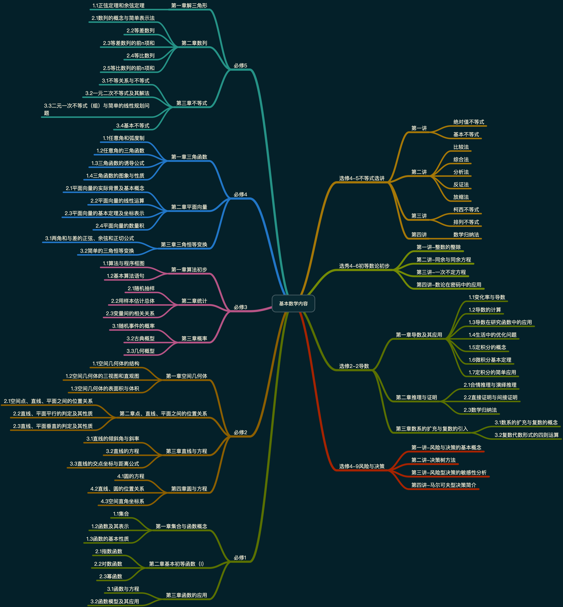
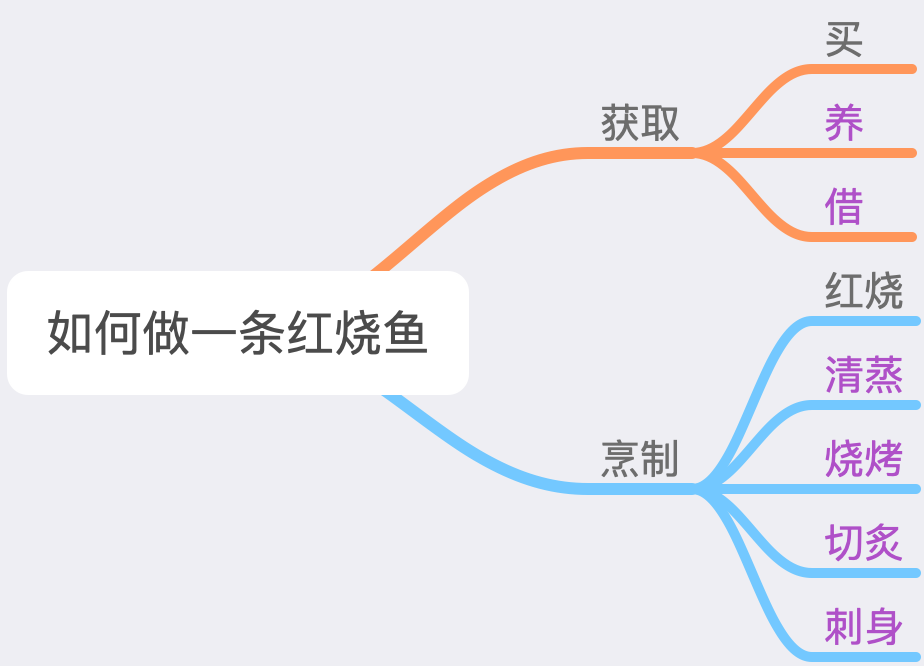

# 教育

## 内容留存

### DIKW

#### D

data，数据

数据，本身就是对一些想法的记录。可能是清晰的，也可能是脏乱的。

#### I

information，信息，数据中清晰的那一部分。

#### K

knowledge，知识，从信息中，提取`有用`的那一部分，这里的有用指的是有意义。

#### W

wisdom，智慧，`结构化`的知识。

例如，通过系统划分，能够有效总结，并`演绎`的知识。

演绎和归纳是相对的。`福尔摩斯演绎法`，对于演绎的理解就是，把经验推广并实际应用。

而`归纳`指的是将事物的共性抽取出来，总结为经验。

`结构化`，个人定义是，将知识系统化，有条理。

金字塔结构，从下到上，是DIKW。

### word和ppt，excel

word用来记录文字资料，而ppt用来演示思维。

而excel则用来记录结构化的数据。

我们在学习数据库过程中，也可以利用excel进行理解和运用。

### markdown

可以使用来记录代码

### jupyter

可以记录python代码和markdown

### 思维导图

xmind用来画图。

整理思路，和进行`复盘`。

`复盘`准确地讲，就是将知识重新整理，可能会换种角度，重新归纳和简化。

## 需要做的

### GTD（工具）

`GTD`，全称`get things done`，是一种时间规划的思路。

需要了解一下。

### 总结所有学过的课程（学习，方法论）

#### 第一步，excel留存

按照如下内容进行整理

| 序号 | 课程名         | 学期       | 课程大致内容                                                 | 前驱     | 后继         | 学分或重要性 | 掌握程度 |
| ---- | -------------- | ---------- | ------------------------------------------------------------ | -------- | ------------ | ------------ | -------- |
| 1    | 高等数学（上） | 大一（上） | 函数、极限、连续、一元微分学，一元积分学，，多元微分学，多元积分学 | 高中数学 | 高等数学下册 | 4.5          | 差       |
| 2    |                |            |                                                              |          |              |              |          |
| 3    |                |            |                                                              |          |              |              |          |

填表注意事项：

| 序号 | 项目名       | 说明                                                         | 举例           |
| ---- | ------------ | ------------------------------------------------------------ | -------------- |
| 1    | 课程名       | 课程名称                                                     | 高等数学（上） |
| 2    | 学期         | 所授课学期                                                   | 大一（上）     |
| 3    | 课程大致内容 | 按章节或内容划分填写                                         | 函数、连续     |
| 4    | 前驱         | 学习本课程前所需知识，没有或不确定填写“无”，一般来说，在书中的前言部分会声明需要学习的先期课程 |                |
| 5    | 后继         | 学习完本课程之后可进行选学的内容，没有或不确定填写“无”       | 高等数学       |
| 6    | 学分或重要性 | 按学校的规定填写                                             | 4.5            |
| 7    | 掌握程度     | 自我评估，分为优、良、中、差四个等级。挂科一律为差。         | 优             |

#### 第二步，xmind进行知识结构梳理

找出重点、难点和疑点。

#### 第三步，word和ppt进行知识详述

应该尽可能详细的保留老师的教学资料，以供后期学习参考。

word一定尽可能按照目录去编写内容，也可以使用`markdown`（推荐）

ppt则用来进行复盘，参考xmind总结的要点，进行展示，和复习。

### 考试（评估）

#### 职称考试

- 计算机二级
- 英语四六级
- 教师资格证
- 驾照
- 托福雅思

#### 观点

考试只是用来评估自己的水平，但不是目的，不要为了备考而备考。

所以，进行提高自己的水平，同时在临近考试时，可以适当地`参考`考纲，进行`目的性备考`。

那么，我们不必等到临近考试才去学习。而是常常拿起来。

### 数学和英语

这两者，一个是语言的工具，用来阅读第一手文献。

一个是思维的工具，用来了解过去和推断将来。

所以，必须掌握熟练。基于此，有以下要求：

#### 数学

有机会夯实一下初中和高中知识。重新理解数学中很多概念，例如：圆的面积为什么定义为`π*r*r`；平行四边形的面积为什么定义为`l*h`；线性代数中矩阵乘法的本质是？线性方程组，向量组，矩阵形式之间的联系？行列式的本质是什么？为什么要用秩？

通过xmind反复梳理知识结构，流线型思维。

#### 英语

这个属于语言学习，只有通过不断记忆和学习。建议初期多背单词，中期，背诵经典文选，这里推荐`新概念英语`系列。主要背诵第三册和第四册，达到背诵和默写的程度。

学习英语，主要在四个方面，听说读写。

对于语法和句法，外国人并不是特别注重，平时的交流也并非十分正式，但是我们在撰写公文、日常文件时，还是需要很多语法，所以，适当的语法是必要的。

重点是：

- 被动语态与时态
- to do不定式
- 名词性从句，如主语从句、表语从句、宾语从句，同位语从句
- 定语从句，从句做描述性，做定语
- 状语从句，让步状语从句
- 虚拟语气
- 派生词
- 倒装，如疑问倒装
- 语调

应考时：

除最近两年的真题外，将以前的真题当做课文进行学习，针对性学习，词汇，常用表达，培养语感。同时也要锻炼写作能力，掌握但不限于以下几种：

- 告示
- 道歉信
- 海报
- 议论文
- 学术报告
- 等等

对于不同的话题，也要有一定的词汇积累，常有以下关键话题：

- 生活健康
- 社会问题
- 环境保护
- 国家大事
- 学习方法
- 心理问题
- 生活压力
- 数据分析

阅读上，一定要形成语感，尽量不要刻意从英文翻译成中文再去理解，而是要尝试使用英文的思维去理解文章内容。

## 思维方式

### 线性

就像一条线，前后相连。又像一条`贪吃蛇`。

线性思维是连贯，同时每个节点的重要性大致相同。

### 树形

像一条倒立的树。

xmind绘制的图其实就是树状结构，它代表了我们可以将复杂的事物`分而治之`。

同时，我们可以进行`剪枝操作`，即，去除很多不可能性。

举例来说，我们可以解决一个大型问题`如何做一条鱼`

我们将这个主题，分为两大步骤，就适当降低了问题的难度，当我们思考如何获取时，有分为多种解决方式，去除不合适的方式（剪枝）之后，就剩下了合理的解决方案，有时候解决方案不止一种。

树状结构是一种非常重要的结构化思维方式，必须熟练掌握。

我们进行议论时，通常也是进行`总`-`分`的分治法的解决问题的步骤。

### 图状

前面两种，线性是1-1，树状是1-n

而图状结构是n-n，更为复杂。

但是更容易形象地描述出我们生活中的内容。

常见的就是人际关系图谱，这个在`关系图谱`中有非常重要的应用。

### 高维度

这个涉及到同一事件在不同维度的展开，形象地描述就是`三坐标八象限`分别在不同平面的投影。