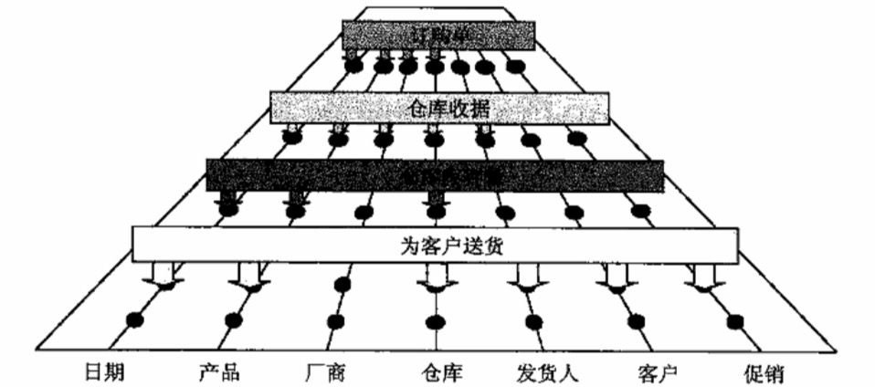

## 数据中心建设之路

### 集成和独立，该选择哪个？

​	对DW/BI整体环境的构建进行规划是一项极为重要的活动，从历史的角度来看，争议的热点主要在于应该从建立一个集中式的、规划好的架构的角度为整个企业建立数据仓库，还是为每个具体的业务单位建立小型的独立解决方案。当然，这两种方式都不怎么有效。

​	建立集中式大型数据仓库的方法需要很长一段时间的开发工作才能体现出其业务价值，因此业务用户常常会对其失去兴趣，并且最终使开发过程陷入步履艰难的境地。而另一方面，尽管建立独立的部门系统见效很快，但是由于这种方法不断地增加数据烟囱，因此很快也会出现问题。

```
面向部门的独立解决方案常常被称作数据集市，当我们在20世纪90年代使用这一术语时，我们使用它描述以过程为中心的复杂数据库，它描述的是企业整体数据架构的一个子集，和那种独立的解决方案大不相同，后来这个术语被抢去指代独立的，非体系化的部门数据库，鉴于对数据集市这一术语的定义差异很大，而且理解也不一致，我们将数据集市这一术语去掉了。
```

​	设计企业DW/BI数据架构的任务令人望而生畏，大型企业中刚任命的DW/BI项目群经理往往面临两个巨大的、看起来并不相关的挑战。一方面，项目经理必须去了解企业最复杂的资产-源数据的有关内容，包括一些遗留框架、ERP、web服务器、应用服务器和其他工作系统的内容。必须知道所有数据元素，并对数据元素进行清洗和更正。

​	但是我们必须要建设一个框架将那些独立的系统集成起来形成一个耦合的整体。无法有效地将孤立的、单独的数据烟囱式的解决方案集成到一起已经成为DW/BI系统的致命伤，这比错失进行数据分析的时机要严重得多。独立的烟囱系统是没有出路的，只能继续使用和企业不兼容的视图。烟囱式的解决方案给出的报表无法相互进行比较，正是其自身的原因使他们变成了遗留系统。烟囱式解决方案的存在严重阻碍了集成式的企业数据仓库的开发进程。

### 如果一次性创建数据仓库过于困难，需要将整个目标划分为若干独立小块予以实现，那么应该做哪些工作？

​	要解决这样一个两难问题，首先要迅速而简洁地定义整个企业DW/BI系统的数据架构。在初期的项目群层需求收集过程中，最终生成一个企业数据仓库总线矩阵。矩阵的每一行都对应机构中的一个业务过程，每一列都和一个业务维度相对应。



​	企业数据仓库总线矩阵是DW/BI系统的一个总体数据架构。矩阵给出了系统全貌的透视图，并不考虑数据库和技术参数，但是合理地识别了易于管理的开发工作。每个业务过程的实现都对整个架构进行了增量扩展。

​	通过总线矩阵开发数据架构是一种理性的方法，可以将企业数据仓库设计过程中那些令人生畏的工作分解开来。总线矩阵确立了一个架构框架，指导总体设计，在此基础上可以将整个问题分割为很多便于实现的小块。应该迭代地建立一个集成的企业数据仓库，一个业务过程一个业务过程地进行，并使用一组共享的一致性维度来确保实现系统的综合集成。这些一致性维度在整个企业范围内有统一的解释。最后，整个企业数据仓库就呈现出：一个强大的基于一致性维度的架构将一组业务过程紧密联系到一起就形成了企业数据仓库。

​	一致性维度是企业数据仓库的总线，通过为DW/BI环境提供一个标准的总线接口，可以将新的业务过程引入数据仓库，该业务过程从总线获得动力，并且和其他已经存在的业务过程和谐共存。

### 价值链的意义

​	很多业务都通过一系列业务过程步骤来监督内部活动逻辑流程。每个业务过程产生一个或多个事实表，因为业务过程中每个步骤都是一个唯一的度量事件。

​	在制造业中，一个产品的流动过程是从获取原材料到加工成成品，最终交付给客户的整个过程。从原始起点到消费终点的整个流程的管理常常被称作"供应链管理"。

### 通用矩阵常见问题

矩阵行问题

- 涉及整个部门的行和包含内容过多的行
- 以报表为中心的行和定义过窄的行

矩阵列问题

- 过于一般化的列
- 为层次结构图中的每一个层次都分配单独的列

### 坚持使用一致性维度

如果DW/BI团队成功为企业确立了一组主一致性维度，那么开发团队能否真正使用这些维度就成为非常重要的问题了。

### 维度深入

#### 日期和时间

在每个数据仓库中日期维都占有特殊的地位，这是因为几乎每个事实表都是一个观测值的时间序列，事实表总是有一个或者多个日期维。

必须将假期，工作日，结账期，作为标记的每月最后一天和其他分组或者过滤条件都植入维中。记住使用详细日期表的主要原因是为了将有关日程的所有信息彻底从BI应用程序中去除掉。日程导航应当通过日期维度表来驱动，而不是通过硬编码的应用程序逻辑来驱动。

- 代理日期键
- 时刻
- 日期/时间戳
- 多时区的情形

#### 退化维


#### 缓慢变化维

#### 杂项维

#### 雪花型和支架

#### 桥接表

